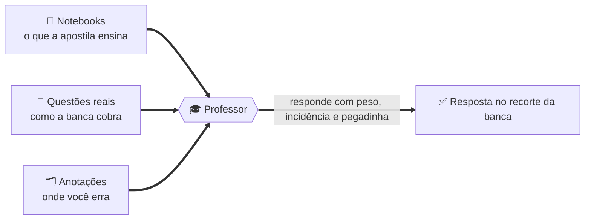
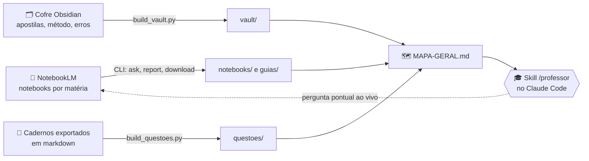
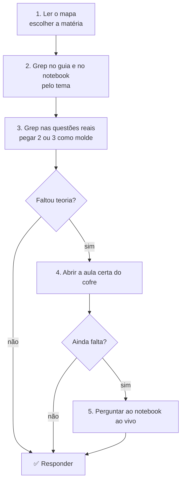
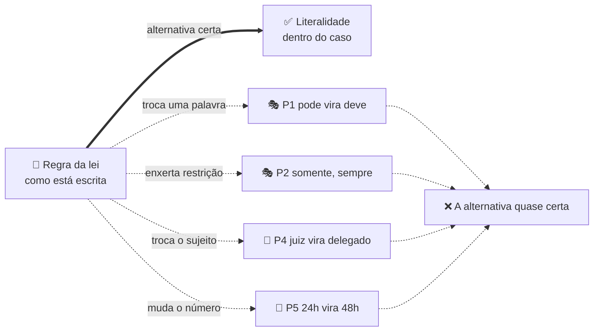
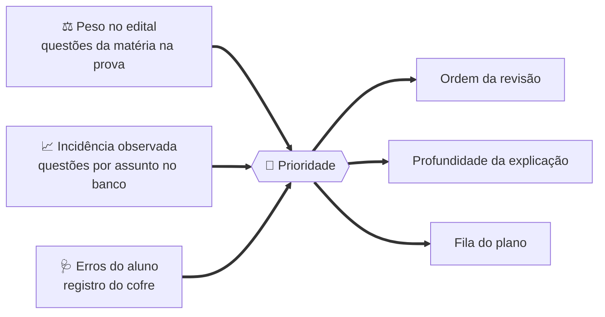
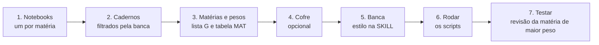
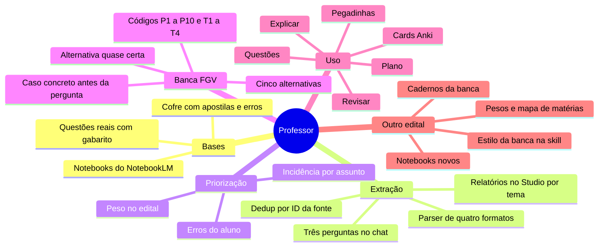

# 🎓 Professor: um tutor de concurso que aprende com o seu material

> [!IMPORTANT]
> **TL;DR.** Um professor particular para o Claude Code que lê tudo o que você juntou para um concurso, sabe o **peso de cada matéria** na prova, sabe o que a banca **mais cobra** e responde com **questões reais** como referência.
>
> Ele não decora a matéria. Ele decora **como a banca pergunta**.

> [!CAUTION]
> **Uso exclusivo para estudo. Venda proibida.** Todo o conteúdo aqui é para estudo pessoal e particular. É **expressamente proibida qualquer utilização comercial**, por qualquer pessoa, a qualquer tempo: venda, revenda, curso pago, mentoria, assinatura, grupo pago ou qualquer forma de monetização. A proibição vale para o autor e para quem receber o material. Detalhes em [AVISO-DE-USO.md](AVISO-DE-USO.md).

> [!NOTE]
> **De onde veio.** Construído para a prova de Agente de Polícia Judiciária da Polícia Civil do Paraná (Edital 01/2026, banca FGV). Por isso o exemplo é de carreira policial. A estrutura, porém, não sabe nada de polícia: ela aprende qualquer edital a partir de três coisas que todo concurseiro já tem, **notebooks com o material**, **cadernos de questões** e **as próprias anotações**. A seção "Ensinar outro edital" mostra como trocar.

---

## 🧠 A ideia central: três bases que não conversavam

Quem estuda por questões acumula material em três lugares. Cada um responde bem sobre o próprio acervo. Nenhum cruza os três.

| | 📓 Notebooks | 📝 Questões | 🗂️ Anotações |
|---|---|---|---|
| **O que tem** | Apostilas, aulas, leis | Cadernos resolvidos, com gabarito | Método, plano, erros |
| **O que responde** | "O que a apostila ensina?" | "Como a banca cobra?" | "Onde eu erro?" |
| **O que não sabe** | Como isso vira questão | O que a apostila diz | Nada da matéria |



---

## 🧩 As quatro camadas

Tudo gerado por script a partir do material do aluno. Nomes de autores, cursos e plataformas foram omitidos de propósito: para reproduzir, o que importa é o **tipo** de material e o **formato**.

| Camada | O que é | De onde vem |
|---|---|---|
| 🗺️ **Mapa** | Uma página por concurso: matérias, peso na prova, notebooks, contagens | Gerado pelos scripts |
| 📓 **Notebooks** | Um arquivo por notebook com índice hierárquico, conceitos-chave e pegadinhas, mais um guia completo por notebook e um guia por tema | 23 notebooks do NotebookLM, 819 fontes |
| 📝 **Questões reais** | 4482 questões únicas com gabarito, por matéria e assunto | Cadernos exportados de uma plataforma de questões |
| 🗂️ **Cofre** | 205 aulas em markdown, notas de método, plano e registro de erros | Cofre do Obsidian |

---

## ⚙️ Como funciona por dentro



### 📓 Extração dos notebooks

O NotebookLM não entrega o texto consolidado de um notebook. Duas estratégias foram combinadas, ambas por linha de comando:

> [!TIP]
> **Três perguntas fixas no chat.** Para cada notebook, três prompts (em `_build/`) pedem o índice hierárquico completo, os conceitos-chave por tema e as pegadinhas. As respostas viram as seções do arquivo `notebooks/<notebook>.md`.

> [!TIP]
> **Relatórios no Studio.** O chat tem teto de tamanho por resposta. O painel Studio gera relatórios em formato livre, que saem inteiros em markdown. O script pede um guia completo por notebook (`guias/<notebook>.md`, 11 KB em média) e, nos notebooks de matéria, **um guia por tema** do índice (`guias/<notebook>/NN-tema.md`). É o caminho com mais conteúdo por pedido.

O script também baixa o resumo automático, a lista de fontes, as notas salvas e os artefatos já existentes (quizzes, flashcards, mapas mentais).

### 🗂️ Índice do cofre

Um script percorre o cofre, lista cada aula com versão (resumo, simplificada, completa) e tamanho, associa cadernos e notas soltas à matéria e copia as notas curadas pequenas para consulta direta. Apostilas inteiras ficam só referenciadas por caminho.

### 🎓 A skill

A skill é um arquivo de instruções que o Claude Code carrega quando você chama `/professor` ou faz uma pergunta de matéria. Ela fixa a **ordem de consulta**:



E fixa o **jeito de responder**: profundidade proporcional ao peso da matéria, estilo da banca, pegadinhas codificadas, e sempre dizer de onde veio cada ponto.

---

## 🔍 Como as questões foram lidas, passo a passo

O banco de questões é a parte mais valiosa da base e a mais trabalhosa de montar, porque cada exportação veio de um jeito. O script `_build/build_questoes.py` faz o seguinte, nesta ordem:

**1. Localizar os arquivos.** Todos os `.md` da pasta de cadernos, da pasta de arquivo legado e da raiz do cofre, exceto hubs, inventários e prompts. Foram 44 arquivos.

**2. Detectar o formato.** Cada arquivo é classificado por marcadores no texto:

| Formato | Como reconhecer | Onde estão banca, matéria e gabarito |
|---|---|---|
| **Curado v1** | `**Q123** · banca · [ver na fonte](url)` | Banca no cabeçalho; matéria no `##` e assunto no `###` acima; gabarito em tabela `Q123 / C` no fim do bloco |
| **Curado v2** | `**Q001** · banca` e rodapé `<sub>[.../questoes/ID] · assunto</sub>` | Igual ao v1, mas link e assunto ficam no rodapé de cada questão |
| **Exportação bruta** | Link `www.../questoes/ID`, linha da banca terminando em `/ano`, linha `Matéria - Assunto`, `N)` | Tudo em linhas próprias; gabarito inline `Gabarito: X` |
| **Exportação achatada** | Tudo da questão em uma linha só | Banca, matéria, enunciado e alternativas separados por expressão regular na mesma linha |

**3. Segmentar.** O texto é cortado no link da questão na fonte (`questoes/<ID>`). Cada pedaço é uma questão; o ID vira a chave.

**4. Ler o cabeçalho.** A linha da banca traz banca, órgão, cargo e ano no padrão `FGV - Cargo (Órgão)/Órgão/Área/2025`. Ela é reconhecida por terminar em barra e quatro dígitos. Rodapés de página das exportações em PDF (`19/49`, data e hora, título do caderno) são descartados.

**5. Achar matéria e assunto.** Conforme o formato: a linha `Matéria - Assunto` após a banca, ou os títulos `##` e `###` mais próximos acima, ou o rodapé `<sub>`. Quando uma questão não tem a linha, herda a da anterior.

**6. Separar enunciado de alternativas.** Uma expressão regular reconhece o início de alternativa (`a)`, `(A)`, `- **(A)**`). Tudo antes da primeira alternativa é enunciado; linhas seguintes sem marcador são continuação da alternativa anterior. Imagens e rodapés são limpos.

**7. Achar o gabarito.** Inline (`Gabarito: B`) nas exportações brutas, ou na tabela de gabaritos do bloco da matéria nos cadernos curados, casada pelo número local da questão (`Q271`).

**8. Deduplicar.** O mesmo ID em dois arquivos vira um registro só. Quando as versões diferem, fica a que tem gabarito; em empate, a que tem mais alternativas legíveis. Dos 7870 registros lidos sobraram **4482 únicos**.

**9. Normalizar a matéria.** As fontes usavam 91 rótulos ("Direito Administrativo (Doutrina e Leis Federais)", "Direito Digital", "TI", "Análise das Demonstrações Contábeis"). Uma tabela de expressões regulares os leva para as matérias do edital; o rótulo original fica guardado em `materia_original`. Arquivos soltos sem rótulo recebem a matéria pelo nome do arquivo.

**10. Gravar.** Um `banco.json` com todos os campos, um `.md` por matéria com as questões agrupadas por assunto e gabarito logo abaixo de cada uma, e um `INDICE.md` com as contagens. O professor consulta os `.md` por Grep, pelo assunto ou por palavra-chave.

> [!WARNING]
> **O que não deu certo.** 109 questões de uma exportação achatada ficaram sem alternativas legíveis, porque as alternativas foram coladas em linhas fora de ordem. Estão no banco com enunciado e gabarito, marcadas.

---

## 🪤 Como a FGV derruba candidatos

Duas coisas aqui: o que os **números do banco** mostram sobre a forma das questões, e o **catálogo de mecanismos de erro** que o aluno montou a partir das próprias questões erradas e que o professor usa para codificar cada pegadinha.

### 📊 A forma da questão, em números

Das 4482 questões do banco, **3967 são da FGV**, a maioria de 2024 a 2026. Medidas sobre essas:

| Medida | Valor |
|---|---|
| Cinco alternativas (A a E) | 93% |
| Pede a alternativa correta | 20% |
| Pede a incorreta ou 'exceto' | 4% |
| Certo/errado ou V/F | 1% |
| Afirmativas I, II, III | 8% |
| Enunciado com caso concreto (nomes, 'nesse cenário') | 18% |
| Enunciado cita lei, artigo, súmula ou Constituição | 22% |
| Enunciado com mais de 600 caracteres | 25% |
| Tamanho mediano do enunciado | 372 caracteres |
| Tamanho médio de cada alternativa | 71 caracteres |
| Distribuição do gabarito | A 19%, B 22%, C 20%, D 20%, E 18% |

O que isso diz: a FGV quase não usa certo/errado nem "assinale a incorreta". Ela prefere **cinco alternativas**, enunciado de tamanho médio e **uma história antes da pergunta**. O gabarito é distribuído de forma quase uniforme entre A e E: **chute por letra não existe**. E a proporção de caso concreto muda muito por matéria:

| Matéria | Questões FGV | Com caso concreto | Cita lei ou artigo | Enunciado mediano |
|---|---:|---:|---:|---:|
| Língua Portuguesa | 722 | 11% | 1% | 237 car. |
| Tecnologia, Segurança Cibernética e Crimes Digitais | 392 | 17% | 34% | 413 car. |
| Ciências Forenses | 41 | 5% | 0% | 188 car. |
| Raciocínio Lógico-Matemático | 245 | 14% | 0% | 274 car. |
| Contabilidade Geral | 809 | 2% | 12% | 428 car. |
| Estatística | 409 | 6% | 0% | 289 car. |
| Legislação Estadual e Institucional | 19 | 47% | 63% | 423 car. |
| Direito Penal (com Legislação Penal Extravagante) | 224 | 56% | 32% | 438 car. |
| Direito Processual Penal | 88 | 32% | 19% | 394 car. |
| Direito Constitucional | 214 | 40% | 45% | 488 car. |
| Direito Administrativo | 601 | 33% | 63% | 449 car. |
| Direitos Humanos | 203 | 18% | 29% | 418 car. |

Em Direito Penal, seis em cada dez questões começam com uma narrativa ("João, policial civil, ...") e a pergunta só vem no fim. Em Português, o texto-base é o próprio caso. Em Ciências Forenses, a pergunta é direta e curta, e o erro mora na classificação.

### 🎭 Os mecanismos

> [!CAUTION]
> A banca raramente pergunta algo que você **não sabe**. Ela pergunta algo que você **sabe**, de um jeito que faz a memória entregar a resposta errada.

Os mecanismos abaixo foram catalogados a partir das próprias questões erradas e recebem um **código**, usado no verso de cada flashcard e nas respostas do professor.

| Código | Mecanismo | Como aparece na alternativa |
|---|---|---|
| 🎭 **P1** | Modal deôntico | "pode" vira "deve": a faculdade vira obrigação, ou o contrário |
| 🎭 **P2** | Restritivo enxertado | "somente", "sempre", "em qualquer hipótese" enfiados numa regra que tem exceção |
| 📋 **P3** | Requisito cumulativo | Some um requisito, ou troca o "e" cumulativo por "ou" |
| 📐 **P4** | Sujeito ou competência | Troca quem decreta, requisita, investiga ou julga (juiz por delegado, MP por juiz) |
| 📐 **P5** | Prazo ou número | Muda dias, frações, percentuais, idades (24 horas por 48, 1/6 por 1/3) |
| 📋 **P7** | Inversão regra e exceção | Apresenta a exceção como se fosse a regra geral |
| 🎭 **P8** | Conector condicional | "salvo se" vira "mesmo que"; "desde que" vira "independentemente de" |
| 🔀 **P9** | Deslocamento de instituto | Atribui a um conceito o regime jurídico de outro parecido (prisão temporária com prazo da preventiva) |
| 📋 **P10** | Enxerto elegante | Acrescenta uma exigência plausível que a lei não faz |
| 💻 **T1** | Sigla ou protocolo | Troca protocolo, algoritmo ou ferramenta (TCP por UDP, hash por criptografia) |
| 💻 **T2** | Pilar ou princípio | Troca confidencialidade, integridade, disponibilidade, autenticidade |
| 🧬 **T3** | Sequência | Inverte a ordem de etapas (cadeia de custódia, fases da perícia) |
| 🔀 **T4** | Classificação técnica | Troca classes de lesão, fenômenos cadavéricos, tipos de variável estatística |

Nas alternativas do banco, **8%** contêm um restritivo do tipo P2 ("somente", "apenas", "exclusivamente") e **7%** contêm um modal do tipo P1. Parece pouco, mas é onde a diferença entre a alternativa certa e a "quase certa" costuma estar.



### 📏 As regras de leitura que o professor aplica

> [!WARNING]
> **Item incompleto não é item errado.** Uma afirmação que não esgota as hipóteses continua correta, a não ser que enxerte uma restrição ("exclusivamente"). Quem marca errado porque "faltou coisa" cai.

> [!WARNING]
> **A alternativa quase certa.** Toda questão tem uma distratora que repete a regra quase inteira e troca uma palavra. Por isso o professor sempre fecha um tema com "parece / é": a frase da distratora ao lado da frase correta.

> [!WARNING]
> **Literalidade dentro do caso.** A banca cobra a letra da lei, mas dentro de uma história. Primeiro você acha qual instituto a história descreve (isso é P9), só depois lembra a regra. O parágrafo ou inciso menos lido é alvo preferido, e lei alterada recentemente é cobrada na redação nova.

Em Português o mecanismo é outro: reescrita mantendo o sentido, valor semântico dos conectivos, pronome que retoma o termo errado, vírgula que muda a função sintática. Nas questões de interpretação, a alternativa errada costuma **extrapolar o texto** ou **inverter causa e consequência**.

---

## 📊 Como a incidência decide o que importa

Três números entram na priorização, e os três vêm do material, não de opinião.



| Número | O que é | Onde está |
|---|---|---|
| ⚖️ **Peso no edital** | Quantas questões a matéria tem na prova. Na PC-PR, Português e Tecnologia têm 25 cada; cada ramo de Direito tem 3 | Lista de matérias dos scripts e no mapa |
| 📈 **Incidência observada** | Quantas questões de cada assunto existem no banco. Como os cadernos foram filtrados por banca, o volume por assunto é a incidência real daquela banca no recorte coletado | `questoes/INDICE.md`, assuntos em ordem |
| 🩺 **Erros do aluno** | Autópsia de erros e assuntos a treinar após simulado | Notas de registro do cofre |

> [!TIP]
> Um assunto com 253 questões (Interpretação de Textos) pesa mais que um com 4 (Pronomes Demonstrativos), e o professor trata os dois de acordo. Um pedido de "revisão de Português" volta com os conceitos **em ordem de incidência**; um pedido de "plano" cruza peso, incidência e erros; um tema com peso 3 recebe explicação curta, direto na literalidade que a banca cobra.

Para alimentar o professor com os assuntos mais importantes de um edital novo, basta exportar os cadernos daquela banca e rodar o parser. **A incidência se recalcula sozinha.**

---

## 📚 Cobertura atual

| Matéria | Questões na prova | Notebooks | Aulas no cofre | Questões reais no banco |
|---|---:|---|---:|---:|
| Língua Portuguesa | 25 | [PCPR 2026 — Língua Portuguesa (Apostilas)](notebooks/pcpr-2026-lingua-portuguesa-apostilas.md); [PCPR 2026 — Português](notebooks/pcpr-2026-portugues.md); [PC-PR PORTUGUÊS](notebooks/pc-pr-portugues.md) | 17 | 722 |
| Tecnologia, Segurança Cibernética e Crimes Digitais | 25 | [PC-PR TECNOLOGIA DA INFORMAÇÃO](notebooks/pc-pr-tecnologia-da-informacao.md) | 30 | 446 |
| Ciências Forenses | 10 | [PCPR 2026 — Ciências Forenses](notebooks/pcpr-2026-ciencias-forenses.md); [exame de corpo de delito](notebooks/exame-de-corpo-de-delito.md) | 11 | 72 |
| Raciocínio Lógico-Matemático | 5 | [Exatas e lógica (videoaulas)](notebooks/exatas-e-logica-videoaulas.md) | 25 | 250 |
| Realidade do Paraná | 5 | [PCPR 2026 — Realidade do Paraná](notebooks/pcpr-2026-realidade-do-parana.md) | 6 | 0 |
| Contabilidade Geral | 5 | [PCPR 2026 — Contabilidade Geral](notebooks/pcpr-2026-contabilidade-geral.md) | 12 | 809 |
| Estatística | 5 | [Estatística FGV — PCPR 2026 (Recorte de Prova)](notebooks/estatistica-fgv-pcpr-2026-recorte-de-prova.md) | 13 | 552 |
| Legislação Estadual e Institucional | 5 | [PC-PR Legislação Estadual e Institucional](notebooks/pc-pr-legislacao-estadual-e-institucional.md) | 14 | 60 |
| Direito Penal (com Legislação Penal Extravagante) | 3 | [PCPR 2026 — Direito Penal (Apostilas)](notebooks/pcpr-2026-direito-penal-apostilas.md) | 28 | 280 |
| Direito Processual Penal | 3 | [PC-PR PROCESSO PENAL](notebooks/pc-pr-processo-penal.md) | 9 | 113 |
| Direito Constitucional | 3 | [PC-PR Direito constitucional](notebooks/pc-pr-direito-constitucional.md) | 14 | 214 |
| Direito Administrativo | 3 | [PC-PR Direito Administrativo](notebooks/pc-pr-direito-administrativo.md) | 15 | 601 |
| Direitos Humanos | 3 | nenhum | 11 | 363 |
| Método de estudo, memória e mentalidade | — | [Método de estudo para concursos (videoaulas)](notebooks/metodo-de-estudo-para-concursos.md); [Ciência da Memória: Guia de Aprendizagem Ativa e Anki](notebooks/ciencia-da-memoria-guia-de-aprendizagem-ativa.md); [Estratégias de Aprendizagem e o Poder da Prática de Recuperação](notebooks/estrategias-de-aprendizagem-e-o-poder-da-prat.md); [Neurociência e Aprendizagem](notebooks/neurociencia-e-aprendizagem.md); [Guia do Palácio da Memória: Técnicas, Ciência e Tecnologia](notebooks/guia-do-palacio-da-memoria-tecnicas-ciencia-e.md); [Cognitive Toolkits for Deep Learning and Mastery](notebooks/cognitive-toolkits-for-deep-learning-and-mast.md) | — | — |
| IA e engenharia de prompts | — | [Guia Completo de Chatbots e Prompt Engineering para Educadores](notebooks/guia-completo-de-chatbots-e-prompt-engineerin.md) | — | — |
| Edital | — | [Edital 01/2026 Concurso Público Polícia Civil do Paraná](notebooks/edital-01-2026-concurso-publico-policia-civil.md) | — | — |

> [!NOTE]
> Direitos Humanos não tem notebook. A cobertura vem das apostilas do cofre e das questões do banco.

### Assuntos por matéria, em ordem de incidência

**Língua Portuguesa** (722 questões, 56 assuntos): Interpretação de Textos (Compreensão) (254); (sem assunto) (71); Tipologia e Gênero Textual (49); Coerência. Coesão (Anáfora, Catáfora, Uso dos Conectores - Pronomes Relativos, Conjunções, etc) (40); Reescrita de Frases. Substituição de Palavras ou Trechos de Texto. (37); Adjetivo (19); Pontuação (Ponto, Vírgula, Travessão, Aspas, Parênteses, etc) (15); Figuras de Linguagem (14); Acentuação (11); Sinônimos e Antônimos (11); Fatos da Língua Portuguesa (Porque, Por Que, Porquê e Por Quê; Onde, Aonde e Donde; Há e A, etc) (10); Formação e Estrutura das Palavras (10); e mais 44 assuntos.

**Tecnologia, Segurança Cibernética e Crimes Digitais** (446 questões, 73 assuntos): Disposições Preliminares (arts. 1º a 6º da Lei nº 13.709/2018 - LGPD) (114); Do Tratamento de Dados Pessoais Sensíveis (arts. 11 a 13 da Lei nº 13.709/2018 - LGPD) (33); Dos Requisitos para o Tratamento de Dados Pessoais (arts. 7º a 10 da Lei nº 13.709/2018 - LGPD) (31); Dos Direitos do Titular (arts. 17 a 22 da Lei nº 13.709/2018 - LGPD) (18); Das Regras para Tratamento de Dados Pessoais (arts. 23 a 30 da Lei nº 13.709/2018 - LGPD) (16); Redes de Computadores - Cloud Computing (Computação em Nuvem) (16); Das Sanções Administrativas (arts. 52 a 54 da Lei nº 13.709/2018 - LGPD) (12); Segurança da Informação - Conceitos, Princípios e Atributos da Segurança da Informação (11); Redes de Computadores - Máscara e Endereçamento IP (10); Segurança da Informação - Algoritmos de Criptografia (10); Da Segurança e do Sigilo de Dados (arts. 46 a 49 da Lei nº 13.709/2018 - LGPD) (9); Do Encarregado pelo Tratamento de Dados Pessoais (art. 41 da Lei nº 13.709/2018 - LGPD) (9); e mais 61 assuntos.

**Ciências Forenses** (72 questões, 9 assuntos): Fenômenos Cadavéricos (62); Criminologia (conceito, objeto, método, função, finalidade) (3); Locais de Crime (1); Resolução CNJ nº 417/2021 - Banco Nacional de Medidas Penais e Prisões (BNMP 3.0) (1); Evolução Histórica e Escolas Criminológicas (Clássica, Positiva, Terza Scuola) (1); Agronegócio (1); Provas, Vestígios e Indícios (1); Traumatologia: Energia de Ordem Mecânica (1); Identificação de Ossadas (1).

**Raciocínio Lógico-Matemático** (250 questões, 39 assuntos): Porcentagem (72); Análise Combinatória (Princípio Fundamental da Contagem, Arranjos, Combinações, Permutações) (23); Unidades de Medida (Distância, Massa, Volume, Tempo, etc) (14); Quadriláteros (Propriedades, Área, Perímetro, Soma dos Ângulos, etc) (13); Proporções. Grandezas Proporcionais. Divisão em Partes Proporcionais (11); Equivalências Lógicas (Inclui Negação de Proposições Compostas) (10); Adição, Subtração, Multiplicação e Divisão de Números Naturais (10); Divisibilidade, Números Primos, Fatores Primos, Divisor e Múltiplo Comum (MMC) (10); Frações e Dízimas Periódicas (10); Orientação no Plano, no Espaço e no Tempo (9); Associação de Informações (7); Exercícios Envolvendo Datas e Calendários (6); e mais 27 assuntos.

**Contabilidade Geral** (809 questões, 14 assuntos): Balanço Patrimonial (168); Provisões, Passivos e Ativos Contingentes (CPC 25, Lei 6.404) (130); Demonstração do Resultado do Exercício (DRE) e Destinação do Resultado (126); Índices de Liquidez. Capital Circulante Líquido (96); CPC 16 - Tratamento Contábil para os Estoques (77); Elaboração e Apresentação das Demonstrações Contábeis (CPC 26, Lei 6.404, arts. 176 e 177) (68); Demonstração de Fluxo de Caixa (DFC - CPC 03, Lei 6.404, art. 188, I) (58); Demonstração do Valor Adicionado (DVA - CPC 09, Lei 6.404, art. 188, II) (39); Demonstração Contábil Consolidada (CPC 36, Lei 6.404, art. 249 e 250) (23); Demonstração das Mutações do Patrimônio Líquido (DMPL) (11); Notas Explicativas (Contabilidade Geral) (9); Origens, Aplicações, Capital Circulante Líquido (2); e mais 2 assuntos.

**Estatística** (552 questões, 42 assuntos): Problemas Introdutórios de Probabilidade: Eventos Equiprováveis e Abordagem Frequentista (71); Cálculo de Probabilidades Usando Análise Combinatória (66); Média para Dados não Agrupados (47); Probabilidade Condicional (33); Desvio Padrão e Variância (32); Probabilidade da Intersecção (30); Quantis (Mediana, Quartil, Decil, Percentil) e Interpolação Linear da Ogiva (28); Probabilidade do Evento Complementar (22); Teorema da Probabilidade Total (22); Eventos Independentes e Eventos Mutuamente Excludentes (19); Probabilidade da União (19); Amostragem Estratificada (17); e mais 30 assuntos.

**Legislação Estadual e Institucional** (60 questões, 16 assuntos): Lei nº 14.735/2023 - Lei Orgânica Nacional das Polícias Civis (9); Do Regime Disciplinar (arts. 272 a 305 da Lei Estadual nº 6.174/1970) (9); Do Provimento dos Cargos (arts. 18 a 122 da Lei Estadual nº 6.174/1970) (8); Da Organização dos Poderes (arts. 52 a 128 da CE-PR) (6); Da Organização do Estado e dos Municípios (arts. 1º a 26 da CE-PR) (5); Dos Tributos e dos Orçamentos (arts. 129 a 138 da CE-PR) (4); Da Administração Pública (arts. 27 a 51 da CE-PR) (3); Dos Direitos, Vantagens e Concessões (arts. 128 a 254 da Lei Estadual nº 6.174/1970) (3); Da Ordem Social (arts. 165 a 226 da CE-PR) (3); Lei Complementar Estadual nº 37/2004 - Estatuto da Polícia Civil (PI) (3); Dos Cargos e da Função Gratificada (arts. 3º a 17 da Lei Estadual nº 6.174/1970) (2); Do Processo Administrativo e sua Revisão (arts. 306 a 341 da Lei Estadual nº 6.174/1970) (1); e mais 4 assuntos.

**Direito Penal (com Legislação Penal Extravagante)** (280 questões, 92 assuntos): Lei nº 12.037/2009 - Identificação Criminal (55); Lei nº 13.869/2019 - Lei de Abuso de Autoridade (antiga Lei nº 4.898/1965) (43); Imputabilidade Penal (arts. 26 a 28 do CP) (6); Peculato (art. 312 do CP) (6); Lei nº 8.072/1990 - Crimes Hediondos (6); Dos Crimes contra a Honra (arts. 138 a 145 do CP) (5); Dos Crimes contra a Liberdade Sexual e da Exposição da Intimidade Sexual (arts. 213 a 216-B do CP) (5); Da Violência Doméstica e Familiar Contra a Mulher (arts. 5º a 7º da Lei nº 11.340/2006) (5); Concurso de Crimes (arts. 69 a 76 do CP) (4); Do Roubo e da Extorsão (arts. 157 a 160 do CP) (4); Estado de Necessidade (art. 24 do CP) (4); Potencial Consciência da Ilicitude: Erro de Proibição e Descriminantes Putativas (arts. 20, §1º, e 21 do CP) (4); e mais 80 assuntos.

**Direito Processual Penal** (113 questões, 13 assuntos): Do Exame de Corpo de Delito, da Cadeia de Custódia e das Perícias em Geral (arts. 158 a 184 do CPP) (88); Inquérito Policial (arts. 4º a 23 do CPP) (5); Questões Mescladas sobre Prisão, Medidas Cautelares e Liberdade Provisória (arts. 282 a 350 do CPP) (5); Da Busca e Apreensão (arts. 240 a 250 do CPP) (2); Da Prisão em Flagrante (arts. 301 a 310 do CPP) (2); Jurisprudência dos Tribunais Superiores sobre Inquérito Policial (2); Questões Mescladas sobre a Prova (arts. 155 a 250 do CPP) (2); Teoria Geral da Prova Penal (arts. 155 a 157 do CPP) (2); Da Liberdade Provisória, com ou sem Fiança (arts. 321 a 350 do CPP) (1); Jurisprudência dos Tribunais Superiores sobre Teoria Geral da Prova Penal (1); Da Acareação (arts. 229 a 230 do CPP) (1); Da Prisão Domiciliar (arts. 317 e 318 do CPP) (1); e mais 1 assuntos.

**Direito Constitucional** (214 questões, 10 assuntos): Dos Direitos e Deveres Individuais e Coletivos (art. 5º da CF/1988) (84); União: Bens e Competências Exclusivas, Privativas, Comuns e Concorrentes (arts. 20 a 24 da CF/1988) (73); Jurisprudência dos Tribunais Superiores sobre Direitos e Deveres Individuais e Coletivos (50); Habeas Data (1); Das Atribuições do Congresso Nacional (arts. 48 a 50 da CF/1988) (1); Segurança Pública (art. 144 da CF/1988) (1); Ação Declaratória de Constitucionalidade (ADC) (1); Questões Mescladas de Ministério Público (arts. 127 a 130 da CF/1988) (1); Ação Popular (1); Perda da Nacionalidade (1).

**Direito Administrativo** (601 questões, 20 assuntos): Contratação Direta, Inexigibilidade e Dispensa (arts. 72 a 75 da Lei nº 14.133/2021) (62); Das Restrições de Acesso à Informação (arts. 21 a 31 da Lei nº 12.527/2011) (54); Do Procedimento Administrativo e do Processo Judicial (arts. 14 a 18-A da Lei nº 8.429/1992) (48); Modalidades de Licitação (arts. 28 a 32 da Lei nº 14.133/2021) (47); Do Procedimento de Acesso à Informação (arts. 10 a 20 da Lei nº 12.527/2011) (45); Terceiro Setor (OSs, OSCIPs, Sistema S e Fundações de Apoio) (45); Dos Atos de Improbidade (arts. 9º a 11 da Lei nº 8.429/1992) (41); Administração Indireta (40); Lei nº 11.079/2004 - Parceria Público-Privada (PPP) (37); Das Definições (art. 6º da Lei nº 14.133/2021) (37); Disposições Gerais (arts. 1º a 5º da Lei nº 12.527/2011) (36); Do Acesso a Informações e da sua Divulgação (arts. 6º a 9º da Lei nº 12.527/2011) (32); e mais 8 assuntos.

**Direitos Humanos** (363 questões, 61 assuntos): Disposições Gerais (arts. 1º ao 3º da Lei nº 13.146/2015) (30); Sistema Interamericano de Direitos Humanos (22); Direitos Humanos na Constituição Federal (20); Conceitos, Histórico e Gerações dos Direitos Humanos (16); Da Igualdade e da Não Discriminação (arts. 4º ao 9º da Lei nº 13.146/2015) (16); Do Direito à Saúde (arts. 15 ao 19 da Lei nº 10.741/2003) (16); Incorporação dos Tratados Internacionais de DH ao Direito Brasileiro. Posição Hierárquica. (14); Outros Temas e Tópicos Mesclados de Proteção dos Direitos Humanos (14); Do Direito à Educação (arts. 27 a 30 da Lei nº 13.146/2015) (13); Deveres dos Estados e Direitos Protegidos (arts. 1º a 32 da CADH-OAS) (12); Lei nº 8.842/1994 - Política Nacional do Idoso (12); Agenda 2030 - Desenvolvimento Sustentável (11); e mais 49 assuntos.


### Aulas disponíveis no cofre

**Língua Portuguesa** (17 aulas): Nivelamento; Ortografia e acentuação gráfica; Classes de palavras I; Classes de palavras II; Classes de palavras III; Estrutura e formação de palavras; Organização sintática das frases; Tipologia da frase e pontuação; Concordância verbal e nominal; Regência verbal e nominal e crase; Coesão e coerência; Semântica: sinônimos, antônimos e parônimos; Interpretação e compreensão de texto; Tipos textuais; Norma culta e registros de linguagem; Atos de comunicação e dicionários; Aula extra.

**Tecnologia, Segurança Cibernética e Crimes Digitais** (30 aulas): Internet, redes e tecnologias digitais; Intranet: VPN; Computação em nuvem: dispositivos e serviços em nuvem; Navegadores: cookies: cache; Correio eletrônico; Redes sociais: plataformas digitais; Segurança da informação e segurança cibernética; Vulnerabilidades: malware: ransomware: phishing; Segurança em redes: Firewall; Backup: recuperação de dados; Prevenção e resposta a incidentes de segurança; Microsoft 365 (BR) - Excel; LibreOffice-BrOffice - Calc; Microsoft 365 (BR) - Word; LibreOffice-BrOffice - Writer; Microsoft 365 (BR) - PowerPoint; LibreOffice-BrOffice - Impress; Sistemas operacionais - Windows 11 (BR); Android e iOS - instalação, configuração e segurança; Google Workspace; Fundamentos de informática - hardware e software; Noções de lógica de programação; Aplicações web, HTML; CSS; Bancos de dados; APIs; JavaScript; Legislação e ética digital - LGPD; Marco Civil da Internet (Lei 12.965-2014); Lei dos Crimes Informáticos (Lei 12.737-2012).

**Ciências Forenses** (11 aulas): Perícias Médico-Legais; Medicina Legal - Conceitos e Divisões; Antropologia Forense; Identificação Humana; Traumatologia Forense; Asfixiologia; Balística Forense; Tanatologia Forense e Cronotanatognose; Local de Crime, Vestígios e Cadeia de Custódia; Documentoscopia e Grafoscopia; Escolas e Teorias da Criminologia.

**Raciocínio Lógico-Matemático** (25 aulas): Estruturas Lógicas I; Estruturas Lógicas II; Equivalências e Negações Lógicas; Diagramas Lógicos; Lógica de Primeira Ordem; Lógica de Argumentação; Raciocínio Sequencial; Problemas de Lógica I; Problemas de Lógica II; Teoria dos Conjuntos; Conjuntos Numéricos; Operações Básicas, Potenciação e Radiciação; Unidades de Medida; Frações, Razão e Proporção; Regra de Três Simples e Composta; Porcentagem; Equações de 1º Grau; Geometria Plana; Geometria Espacial; Matrizes e Determinantes; Sistemas Lineares; Geometria Analítica; Diagramas, Tabelas e Gráficos; Análise Combinatória; Probabilidade.

**Realidade do Paraná** (6 aulas): Período Pré-Colonial e Colonial (Povos Indígenas); Geografia do Paraná - Aspectos Naturais; Geografia do Paraná - Aspectos Humanos e Econômicos; História do Paraná Colonial; História do Paraná Imperial; História do Paraná Republicano.

**Contabilidade Geral** (12 aulas): Conceitos, objetivos e finalidades; Situação Líquida e Equação Fundamental; Atos e Fatos Contábeis; Plano de Contas e Partidas Dobradas; Regime de Competência e de Caixa; Demonstrações contábeis; Balanço patrimonial: Estoques; Depreciação e Exaustão. CPC 27 - Ativo Imobilizado; CPC 01 Redução ao Valor Recuperável de Ativos; CPC 04 (R1) - Ativo Intangível. Amortização; Princípios contábeis; Movimentações Bancárias Aplicadas à Perícia Contábil.

**Estatística** (13 aulas): Apresentação de Dados; Médias; Medidas Separatrizes ou Quantis; Moda; Medidas de Variabilidade ou Dispersão; Análise Combinatória; Probabilidade; Teoria da Amostragem; Regressão Linear Simples; Séries Temporais; Números Índices; Análise Exploratória de Dados; Porcentagem.

**Legislação Estadual e Institucional** (14 aulas): Constituição do Estado do Paraná; Lei 6.174-1970 - Disposições Constitucionais aos Servidores; Lei 6.174-1970 - Provimento e Vacância; Lei 6.174-1970 - Direitos e Vantagens; Lei 6.174-1970 - Deveres, Proibições e Responsabilidades; Sindicância e Processo Administrativo Disciplinar; Ética no serviço público e sigilo funcional; Lei de Acesso à Informação (12.527-2011); LGPD (13.709-2018); Lei de Abuso de Autoridade; Legislação Institucional e Policial (parte 2); Lei Orgânica Nacional das Polícias Civis (14.735-2023); Estruturação das Carreiras da PC-PR; Lei Orgânica da Polícia Civil do Paraná.

**Direito Penal (com Legislação Penal Extravagante)** (28 aulas): Princípios do Direito Penal; Aplicação da Lei Penal; Teoria do Delito I; Teoria do Delito II; Concurso de pessoas e de crimes; Das penas: espécies e cominação; Aplicação da pena e livramento condicional; Efeitos da condenação e extinção da punibilidade; Crimes contra a pessoa; Crimes contra o patrimônio; Crimes contra a dignidade sexual; Crimes contra a fé pública; Crimes contra a administração pública I; Crimes contra a administração pública II; Crimes contra a administração pública III; Crimes em licitações e contratos; Lei de Execução Penal (7.210-1984); Lei dos Crimes Hediondos (8.072-1990); Crimes contra a ordem tributária e econômica; Lei de Interceptação Telefônica (9.296-1996); Estatuto do Desarmamento (10.826-2003); Lei Maria da Penha (11.340-2006); Lei de Drogas (11.343-2006); Lei das Organizações Criminosas (12.850-2013); Pacote Anticrime (13.964-2019); Estatuto da Advocacia e OAB (8.906-1994); Lavagem de Dinheiro (Lei 9.613-1998); Código de Trânsito Brasileiro.

**Direito Processual Penal** (9 aulas): Introdução e princípios do Processo Penal; Inquérito Policial; Processo, procedimento e relação jurídica processual; Jurisdição e competência; Sujeitos processuais; Provas I: teoria geral e preservação do local; Provas II: provas em espécie; Prisão e liberdade provisória I; Prisão e liberdade provisória II.

**Direito Constitucional** (14 aulas): Aplicabilidade das normas constitucionais; Princípios fundamentais da CF; Direitos e garantias fundamentais I; Direitos e garantias fundamentais II; Direitos sociais; Nacionalidade; Direitos políticos; Organização do Estado; Poder Executivo; Poder Legislativo; Processo Legislativo; Poder Judiciário; Segurança pública na CF (art. 144); Controle de constitucionalidade.

**Direito Administrativo** (15 aulas): Princípios do Direito Administrativo; Conceito e fontes; Administração direta e indireta: autarquias; Fundações, empresas públicas e sociedades de economia mista; Poderes administrativos; Atos administrativos; Licitações I (Lei 14.133-2021); Licitações II (Lei 14.133-2021); Contratos administrativos; Serviços públicos; Controle da Administração Pública; Responsabilidade civil do Estado; Agentes públicos: cargos, empregos e funções; Improbidade administrativa (Lei 8.429-1992); Lei de Introdução às Normas do Direito Brasileiro (LINDB).

**Direitos Humanos** (11 aulas): Teoria Geral dos Direitos Humanos; Características e evolução histórica dos Direitos Humanos; Sistemas de proteção I; Sistemas de proteção II; Tratados internacionais de proteção; Democracia, cidadania e Direitos Humanos; Grupos vulneráveis; Segurança pública e Direitos Humanos; Política Nacional de Direitos Humanos; Agenda 2030 e ODS; CF-88 e Direitos Humanos.


---

## 🎯 Como usar no dia a dia

No Claude Code, `/professor` seguido do pedido, ou só a pergunta de matéria. A skill trata cada tipo de pedido de um jeito:

| Pedido | O que o professor entrega |
|---|---|
| 💬 "me explica X" | Definição curta, regra, exceção, uma questão real resolvida, pegadinhas codificadas |
| 🔁 "revisão de X" | Conceitos-chave em ordem de incidência |
| 📝 "questões de X" | Duas reais do banco e três inéditas no mesmo molde, com gabarito comentado |
| 🪤 "pegadinhas de X" | Pares "parece / é", cada um com código do catálogo |
| 🗓️ "plano" ou "o que estudar" | Cruzamento de peso, incidência e erros registrados |
| 🃏 "cards de X" | Itens certo/errado atômicos, prontos para importar no Anki |

> [!TIP]
> Depois de algumas centenas de cards com o código no verso, a cor e o código sozinhos já avisam o tipo de erro antes de você ler a explicação.

---

## 🔁 Ensinar o professor um edital novo

O que é específico do concurso está em poucos lugares.



**Passo 1. Notebooks.** Crie um notebook no NotebookLM por matéria do novo edital e suba o material (apostilas, aulas, leis). Notebooks de método e de edital são opcionais. Rode `notebooklm list` para confirmar que aparecem.

**Passo 2. Cadernos.** Na plataforma de questões, monte um caderno por matéria filtrado pela banca do concurso e exporte em markdown. Coloque os arquivos na pasta de cadernos do cofre (ou ajuste o caminho no topo de `_build/build_questoes.py`). Se a exportação vier em outro formato, o parser precisa de um quinto ramo; os quatro atuais estão comentados no início do script.

**Passo 3. Matérias e pesos.** Edite a lista `G` em `_build/build_mapa.py` e em `_build/make_readme.py`: nome da matéria como está no edital, número de questões, IDs dos notebooks. Edite a tabela `MAT` em `_build/build_questoes.py` para mapear os rótulos da plataforma para as matérias do edital.

**Passo 4. Cofre.** Se houver apostilas em markdown, organize uma pasta por matéria com aulas nomeadas `Aula NN - Assunto - {Resumo|Simplificada|Apostila completa}.md` e uma nota-hub `00 — Hub <Matéria>.md`. Ajuste os caminhos no topo de `_build/build_vault.py`. Sem cofre, o professor funciona só com notebooks e questões.

**Passo 5. Banca.** Na `SKILL.md`, troque o trecho "Como ensinar": os pesos e a descrição do estilo da banca. A FGV usa caso concreto e literalidade aplicada; outras bancas usam certo/errado ou cobram doutrina.

> [!TIP]
> Se a banca for outra, o catálogo de pegadinhas provavelmente muda de **proporção**, não de lista. P1, P2, P4 e P5 aparecem em qualquer banca que trabalhe com lei seca.

**Passo 6. Rodar.**

```bash
python _build/rebuild.py            # extrai os notebooks
python _build/gerar_guias.py        # dispara os guias completos no Studio
python _build/gerar_guias_temas.py  # dispara um guia por tema
python _build/baixar_guias.py 9     # baixa o que ficou pronto (repetir)
python _build/baixar_guias_temas.py 9
python _build/build_questoes.py     # banco de questões
python _build/build_vault.py        # índice do cofre
python _build/build_mapa.py         # mapa geral
```

**Passo 7. Testar.** Peça "revisão de <matéria de maior peso>". Se a ordem dos conceitos bater com os assuntos mais cobrados no `questoes/INDICE.md`, o professor aprendeu o edital.

---

## 🛠️ Instalação e reconstrução

```bash
pip install "notebooklm-py[browser]"
notebooklm login                       # autentica no Google uma vez
notebooklm auth check --test --json    # tem que devolver "token_fetch": true

mkdir -p ~/.claude/skills/professor && cp ferramenta/SKILL.md ~/.claude/skills/professor/
cp ferramenta/agent-professor.md ~/.claude/agents/professor.md
```

Os caminhos dentro da skill apontam para `C:\Users\USER\Professor`. Quem clonar em outro lugar precisa ajustar.

```
MAPA-GERAL.md          ponto de entrada: matérias, pesos, notebooks, contagens
notebooks/             um arquivo por notebook (índice, conceitos, pegadinhas, fontes)
guias/                 guia completo por notebook e, nos de matéria, um guia por tema
questoes/INDICE.md     contagem de questões por matéria e assunto (a incidência)
vault/INDICE-VAULT.md  aulas, cadernos e notas do cofre, por matéria
materiais/             guias de estudo, quizzes, flashcards, mapas mentais gerados
ferramenta/            SKILL.md e agent-professor.md para o Claude Code
_build/                scripts e prompts
```

Os arquivos com as questões na íntegra e as notas pessoais do cofre ficam fora do repositório. Só os índices sobem.

---

## ⚠️ Limitações

> [!WARNING]
> - As sínteses e os guias são gerados por modelo de linguagem a partir das fontes. Podem omitir detalhes; por isso a skill consulta o notebook ao vivo quando os arquivos não bastam.
> - Cada relatório do Studio tem teto de tamanho. Por isso existe um guia por tema, não só um por notebook.
> - O comando `notebooklm ask --new` **apaga o histórico de chat** do notebook. Nenhum script deste repositório usa a opção.
> - Pedidos muito longos ao chat falham com `RPCResponseTooLargeError`, um erro de streaming da ferramenta que não depende do tamanho do notebook. Os scripts tentam de novo com um prompt compacto.
> - 109 questões vieram sem alternativas legíveis por causa de exportações achatadas; estão no banco marcadas.
> - O banco reflete o recorte coletado pelo aluno, não o universo de questões da banca.

---

## 🗺️ Mapa



---

## 📌 Cola rápida

| Pilar | Em uma frase |
|---|---|
| 🎓 **O que é** | Um tutor no Claude Code que responde a partir do seu material, no recorte da banca |
| 🧩 **Bases** | Notebooks, questões reais e anotações, cruzados num mapa por matéria |
| ⚖️ **Prioridade** | Peso no edital × incidência por assunto × seus erros |
| 🪤 **Banca** | Cinco alternativas, história antes da pergunta, e uma "quase certa" que troca uma palavra |
| 🔍 **Questões** | 44 arquivos, 4 formatos, dedup por ID, 13 matérias, 4482 questões únicas |
| 🔁 **Outro edital** | Notebooks novos, cadernos da banca, lista de pesos, estilo na skill, rodar os scripts |
| 🛠️ **Ferramentas** | NotebookLM por CLI, Obsidian, Claude Code, Anki, Python padrão |

---

## 📄 Licença e uso do conteúdo

> [!CAUTION]
> **Proibida a venda.** Este material é para **estudo pessoal e particular**. Nenhuma pessoa pode vendê-lo, revendê-lo, incluí-lo em curso, mentoria, assinatura, grupo pago ou qualquer produto comercial, nem monetizá-lo de forma direta ou indireta. A proibição vale para o autor deste repositório e para qualquer pessoa que obtenha o material. Leia o [AVISO-DE-USO.md](AVISO-DE-USO.md).

> [!NOTE]
> **Pode:** ler, copiar para uso próprio, adaptar ao seu concurso e compartilhar com outros estudantes, sempre sem cobrança.
>
> **Scripts e skill** (`_build/`, `ferramenta/`) seguem a mesma licença: use de graça para montar a sua própria base a partir do seu próprio material, mas **sem uso comercial**, inclusive sem embutir em produto ou serviço pago.
>
> **Origem:** os arquivos em `notebooks/`, `guias/`, `materias/` e `materiais/` são sínteses geradas por modelo de linguagem a partir do material de estudo do autor. Não reproduzem apostilas, aulas nem questões na íntegra. Apostilas de curso, enunciados completos e anotações pessoais não estão no repositório.
>
> **Sem garantia:** síntese gerada por modelo pode conter erro. Confira na fonte primária antes de decidir por ela.

## 🔎 Palavras-chave

Para quem chegou aqui procurando: professor de concurso com inteligência artificial, tutor de concurso público, estudo por questões, engenharia reversa de banca, estudo reverso FGV, como a FGV cobra, pegadinhas da FGV, incidência de assuntos por banca, NotebookLM para concursos, NotebookLM CLI, Claude Code skill, Obsidian para concurso, Anki para concurso, flashcards certo ou errado, carreiras policiais, Polícia Civil do Paraná, PC-PR 2026, agente de polícia judiciária, banco de questões em markdown, plano de estudo por incidência.

`#concurso` `#concursopublico` `#professordeconcurso` `#estudoporquestoes` `#engenhariareversa` `#estudoreverso` `#FGV` `#pegadinhasFGV` `#NotebookLM` `#ClaudeCode` `#Obsidian` `#Anki` `#carreiraspoliciais` `#PCPR2026` `#policiacivil` `#bancodequestoes` `#incidencia` `#tutorIA`

Extração e montagem feitas em 05/09/2026.
