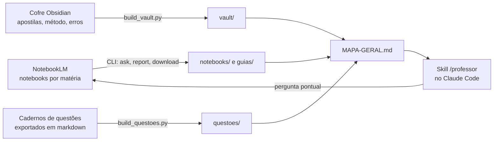

# Professor: um tutor de concurso que aprende com o seu material

> Um professor particular para o Claude Code que lê tudo o que você juntou para um concurso, entende o peso de cada matéria na prova, sabe o que a banca mais cobra e responde com questões reais como referência.

Foi construído para a prova de Agente de Polícia Judiciária da Polícia Civil do Paraná (Edital 01/2026, banca FGV) e por isso o exemplo aqui é de carreira policial. A estrutura, porém, não sabe nada de polícia: ela aprende qualquer edital a partir de três coisas que todo concurseiro já tem, notebooks com o material, cadernos de questões resolvidas e as próprias anotações. A seção 9 explica como trocar de concurso.

**Sumário**

1. [Para quem é](#1-para-quem-é)
2. [O que ele sabe](#2-o-que-ele-sabe)
3. [Como funciona por dentro](#3-como-funciona-por-dentro)
4. [Como as questões foram lidas, passo a passo](#4-como-as-questões-foram-lidas-passo-a-passo)
5. [Como a FGV derruba candidatos](#5-como-a-fgv-derruba-candidatos)
6. [Como a incidência decide o que importa](#6-como-a-incidência-decide-o-que-importa)
7. [Cobertura atual](#7-cobertura-atual)
8. [Como usar no dia a dia](#8-como-usar-no-dia-a-dia)
9. [Ensinar o professor um edital novo](#9-ensinar-o-professor-um-edital-novo)
10. [Instalação e reconstrução](#10-instalação-e-reconstrução)
11. [Limitações](#11-limitações)
12. [Ferramentas](#12-ferramentas)

## 1. Para quem é

Para quem estuda por questões e cansou de ter o material espalhado. As apostilas ficam em um lugar, as questões em outro, o plano e os erros em um terceiro, e nenhuma ferramenta cruza as três coisas.

O caso de uso original é concurso de carreira policial (agente, investigador, escrivão, papiloscopista, perito, delegado), onde a prova mistura Direito, tecnologia, ciências forenses e legislação estadual e a banca cobra literalidade de lei aplicada a caso concreto. Mas o mesmo esqueleto serve para qualquer certame com edital, matérias com peso e histórico de questões: tribunais, fiscal, administrativo, bancário, militar.

## 2. O que ele sabe

O professor combina quatro camadas de conhecimento, todas geradas por script a partir do material do aluno:

| Camada | O que é | De onde vem |
|---|---|---|
| Mapa | Uma página por concurso com matérias, peso na prova, notebooks e contagens | Gerado pelos scripts |
| Notebooks | Um arquivo por notebook com índice hierárquico, conceitos-chave e pegadinhas, mais um guia completo por notebook e um guia por tema | {n_notebooks} notebooks do NotebookLM, {n_fontes} fontes |
| Questões reais | {n_questoes} questões únicas com gabarito, por matéria e assunto | Cadernos exportados de uma plataforma de questões |
| Cofre | {n_aulas} aulas em markdown, notas de método, plano e registro de erros | Cofre do Obsidian |

Nomes de autores, cursos e plataformas foram omitidos de propósito. O que importa para reproduzir é o tipo de material e o formato.

## 3. Como funciona por dentro



### 3.1 Extração dos notebooks

O NotebookLM não entrega o texto consolidado de um notebook. Duas estratégias foram combinadas, ambas por linha de comando:

**Três perguntas fixas no chat.** Para cada notebook, três prompts (em `_build/`) pedem o índice hierárquico completo, os conceitos-chave por tema e as pegadinhas. As respostas viram as seções do arquivo `notebooks/<notebook>.md`.

**Relatórios no Studio.** O chat tem teto de tamanho por resposta. O painel Studio gera relatórios em formato livre, que saem inteiros em markdown. O script pede um guia completo por notebook (`guias/<notebook>.md`, {guias_kb} KB em média) e, nos notebooks de matéria, um guia por tema do índice (`guias/<notebook>/NN-tema.md`). É o caminho com mais conteúdo por pedido.

Além disso o script baixa o resumo automático, a lista de fontes, as notas salvas e os artefatos já existentes (quizzes, flashcards, mapas mentais).

### 3.2 Extração das questões

Os cadernos viram um banco estruturado por um parser próprio. O processo inteiro está na seção 4.

### 3.3 Índice do cofre

Um script percorre o cofre, lista cada aula com versão (resumo, simplificada, completa) e tamanho, associa cadernos e notas soltas à matéria e copia as notas curadas pequenas para consulta direta. Apostilas inteiras ficam só referenciadas por caminho.

### 3.4 A skill

A skill é um arquivo de instruções que o Claude Code carrega quando o usuário chama `/professor` ou faz uma pergunta de matéria. Ela fixa a ordem de consulta:

1. Ler o mapa e escolher a matéria.
2. Buscar o tema no guia completo e no arquivo do notebook.
3. Buscar o assunto no arquivo de questões e pegar duas ou três questões reais como molde.
4. Se faltar teoria, abrir a aula certa do cofre.
5. Se ainda faltar, perguntar ao notebook ao vivo.

E fixa o jeito de responder: profundidade proporcional ao peso da matéria, estilo da banca, pegadinhas codificadas, e sempre dizer de onde veio cada ponto.

## 4. Como as questões foram lidas, passo a passo

O banco de questões é a parte mais valiosa da base e a mais trabalhosa de montar, porque cada exportação veio de um jeito. O script `_build/build_questoes.py` faz o seguinte, nesta ordem:

**1. Localizar os arquivos.** Todos os `.md` da pasta de cadernos, da pasta de arquivo legado e da raiz do cofre, exceto hubs, inventários e prompts. Foram 44 arquivos.

**2. Detectar o formato.** Cada arquivo é classificado por marcadores no texto:

| Formato | Como reconhecer | Onde estão banca, matéria e gabarito |
|---|---|---|
| Curado v1 | `**Q123** · banca · [ver na fonte](url)` | Banca no cabeçalho; matéria no `##` e assunto no `###` acima; gabarito em tabela `Q123 / C` no fim do bloco da matéria |
| Curado v2 | `**Q001** · banca` e rodapé `<sub>[.../questoes/ID] · assunto</sub>` | Igual ao v1, mas o link e o assunto ficam no rodapé de cada questão |
| Exportação bruta | Link `www.../questoes/ID`, linha da banca terminando em `/ano`, linha `Matéria - Assunto`, `N)` | Tudo em linhas próprias; gabarito inline `Gabarito: X` logo após as alternativas |
| Exportação achatada | Tudo da questão em uma linha só | Banca, matéria, enunciado e alternativas separados por expressão regular na mesma linha |

**3. Segmentar.** O texto é cortado no link da questão na fonte (`questoes/<ID>`). Cada pedaço é uma questão; o ID vira a chave.

**4. Ler o cabeçalho.** A linha da banca traz banca, órgão, cargo e ano no padrão `FGV - Cargo (Órgão)/Órgão/Área/2025`. Ela é reconhecida por terminar em barra e quatro dígitos. Rodapés de página das exportações em PDF (`19/49`, data e hora, título do caderno) são descartados por padrão próprio.

**5. Achar matéria e assunto.** Conforme o formato: a linha `Matéria - Assunto` após a banca, ou os títulos `##` e `###` mais próximos acima, ou o rodapé `<sub>`. Quando uma questão não tem a linha, herda a da anterior.

**6. Separar enunciado de alternativas.** Uma expressão regular reconhece o início de alternativa (`a)`, `(A)`, `- **(A)**`, com ou sem negrito). Tudo antes da primeira alternativa é enunciado; linhas seguintes sem marcador são continuação da alternativa anterior. Imagens e rodapés são limpos.

**7. Achar o gabarito.** Inline (`Gabarito: B`) nas exportações brutas, ou na tabela de gabaritos do bloco da matéria nos cadernos curados, casada pelo número local da questão (`Q271`).

**8. Deduplicar.** O mesmo ID que aparece em dois arquivos vira um registro só. Quando as versões diferem, fica a que tem gabarito; em empate, a que tem mais alternativas legíveis. Dos {n_lidas} registros lidos sobraram {n_questoes} únicos.

**9. Normalizar a matéria.** As fontes usavam 91 rótulos ("Direito Administrativo (Doutrina e Leis Federais)", "Direito Digital", "TI", "Análise das Demonstrações Contábeis"). Uma tabela de expressões regulares os leva para as matérias do edital; o rótulo original fica guardado no campo `materia_original`. Arquivos soltos sem rótulo recebem a matéria pelo nome do arquivo.

**10. Gravar.** Um `banco.json` com todos os campos, um `.md` por matéria com as questões agrupadas por assunto e gabarito logo abaixo de cada uma, e um `INDICE.md` com as contagens. O professor consulta os `.md` por Grep, pelo assunto ou por palavra-chave.

O que não deu certo: {n_sem_alt} questões de uma exportação achatada ficaram sem alternativas legíveis, porque as alternativas foram coladas em linhas fora de ordem. Estão no banco com enunciado e gabarito, marcadas.

## 5. Como a FGV derruba candidatos

Esta seção junta duas coisas: o que os números do banco mostram sobre a forma das questões, e o catálogo de mecanismos de erro que o aluno montou a partir das próprias questões erradas e que o professor usa para codificar cada pegadinha.

### 5.1 A forma da questão, em números

Das {n_questoes} questões do banco, {n_fgv} são da FGV, a maioria de 2024 a 2026. Medidas sobre essas:

{stats_fgv}

O que isso diz: a FGV quase não usa certo/errado nem "assinale a incorreta". Ela prefere cinco alternativas com um enunciado de tamanho médio e uma história antes da pergunta. O gabarito é distribuído de forma quase uniforme entre A e E, então chute por letra não existe. E a proporção de caso concreto muda muito por matéria:

{stats_materia}

Em Direito Penal, seis em cada dez questões começam com uma narrativa ("João, policial civil, ...") e a pergunta só vem no fim. Em Português, o texto-base é o próprio caso. Em Ciências Forenses, a pergunta é direta e curta, e o erro mora na classificação.

### 5.2 Os mecanismos

A banca raramente pergunta algo que o candidato não sabe. Ela pergunta algo que ele sabe, de um jeito que faz a memória entregar a resposta errada. Os mecanismos abaixo foram catalogados pelo aluno a partir das próprias questões erradas e recebem um código, usado no verso de cada flashcard e nas respostas do professor.

| Código | Mecanismo | Como aparece na alternativa |
|---|---|---|
| P1 | Modal deôntico | "pode" vira "deve": a faculdade vira obrigação, ou o contrário |
| P2 | Restritivo enxertado | "somente", "sempre", "em qualquer hipótese" enfiados numa regra que tem exceção |
| P3 | Requisito cumulativo | Some um requisito, ou troca o "e" cumulativo por "ou" |
| P4 | Sujeito ou competência | Troca quem decreta, requisita, investiga ou julga (juiz por delegado, MP por juiz) |
| P5 | Prazo ou número | Muda dias, frações, percentuais, idades (24 horas por 48, 1/6 por 1/3) |
| P7 | Inversão regra e exceção | Apresenta a exceção como se fosse a regra geral |
| P8 | Conector condicional | "salvo se" vira "mesmo que"; "desde que" vira "independentemente de" |
| P9 | Deslocamento de instituto | Atribui a um conceito o regime jurídico de outro parecido (prisão temporária com prazo da preventiva) |
| P10 | Enxerto elegante | Acrescenta uma exigência plausível que a lei não faz |
| T1 | Sigla ou protocolo | Troca protocolo, algoritmo ou ferramenta (TCP por UDP, hash por criptografia) |
| T2 | Pilar ou princípio | Troca confidencialidade, integridade, disponibilidade, autenticidade |
| T3 | Sequência | Inverte a ordem de etapas (cadeia de custódia, fases da perícia) |
| T4 | Classificação técnica | Troca classes de lesão, fenômenos cadavéricos, tipos de variável estatística |

Nas alternativas do banco, {alt_restritivo} contêm um restritivo do tipo P2 ("somente", "apenas", "exclusivamente") e {alt_modal} contêm um modal do tipo P1. Parece pouco, mas é onde a diferença entre a alternativa certa e a "quase certa" costuma estar.

### 5.3 As regras de leitura que o professor aplica

Além dos códigos, três regras da banca governam como o professor explica e como monta questão inédita:

**Item incompleto não é item errado.** Uma afirmação que não esgota as hipóteses continua correta, a não ser que enxerte uma restrição ("exclusivamente"). O candidato que marca errado porque "faltou coisa" cai.

**A alternativa quase certa.** Toda questão tem uma alternativa distratora que repete a regra quase inteira e troca uma palavra. Por isso o professor sempre fecha um tema com "parece / é": a frase da distratora ao lado da frase correta.

**Literalidade dentro do caso.** A banca cobra a letra da lei, mas dentro de uma história. O candidato precisa primeiro achar qual instituto a história descreve (isso é P9) e só depois lembrar a regra. O parágrafo ou inciso menos lido é alvo preferido, e lei alterada recentemente é cobrada na redação nova.

Em Português, o mecanismo é outro: reescrita mantendo o sentido, valor semântico dos conectivos, pronome que retoma o termo errado, e vírgula que muda a função sintática. Nas questões de interpretação, a alternativa errada costuma extrapolar o texto ou inverter causa e consequência.

## 6. Como a incidência decide o que importa

Três números entram na priorização, e os três vêm do material, não de opinião:

**Peso no edital.** Quantas questões a matéria tem na prova. Na PC-PR, Português e Tecnologia têm 25 cada; cada ramo de Direito tem 3. Isso está na lista de matérias dos scripts e no mapa.

**Incidência observada.** Quantas questões de cada assunto existem no banco. Como os cadernos foram filtrados por banca, o volume por assunto é a incidência real daquela banca no recorte coletado. `questoes/INDICE.md` lista os assuntos de cada matéria nessa ordem. Um assunto com 253 questões (Interpretação de Textos) pesa mais que um com 4 (Pronomes Demonstrativos), e o professor trata os dois de acordo.

**Erros do aluno.** As notas de registro do cofre (autópsia de erros, assuntos a treinar após simulado) dizem onde a pessoa erra. Quando o tema pedido está lá, a explicação começa por esse ponto.

Na prática: um pedido de "revisão de Português" volta com os conceitos em ordem de incidência; um pedido de "plano" cruza peso, incidência e erros; uma explicação de tema com peso 3 é curta e vai direto na literalidade que a banca cobra.

Para alimentar o professor com os assuntos mais importantes de um edital novo, basta exportar os cadernos daquela banca e rodar o parser. A incidência se recalcula sozinha.

## 7. Cobertura atual

{tabela_cobertura}

Direitos Humanos não tem notebook. A cobertura vem das apostilas do cofre e das questões do banco.

### 7.1 Assuntos por matéria, em ordem de incidência

{assuntos_por_materia}

### 7.2 Aulas disponíveis no cofre

{aulas_por_materia}

## 8. Como usar no dia a dia

No Claude Code, `/professor` seguido do pedido, ou só a pergunta de matéria. A skill trata cada tipo de pedido de um jeito:

| Pedido | O que o professor entrega |
|---|---|
| "me explica X" | Definição curta, regra, exceção, uma questão real resolvida, pegadinhas codificadas |
| "revisão de X" | Conceitos-chave em ordem de incidência |
| "questões de X" | Duas reais do banco e três inéditas no mesmo molde, com gabarito comentado |
| "pegadinhas de X" | Pares "parece / é", cada um com código do catálogo |
| "plano" ou "o que estudar" | Cruzamento de peso, incidência e erros registrados |
| "cards de X" | Itens certo/errado atômicos, prontos para importar no Anki |

O catálogo de pegadinhas é do próprio aluno e tem códigos fixos: P1 a P10 para pegadinhas jurídicas (troca de "pode" por "deve", restritivo enxertado, requisito cumulativo, sujeito ou competência, prazo ou número, inversão de regra e exceção, conector condicional, deslocamento de instituto, enxerto elegante) e T1 a T4 para técnicas (sigla ou protocolo, pilar, sequência, classificação). Depois de algumas centenas de cards, o código sozinho já avisa o tipo de erro.

## 9. Ensinar o professor um edital novo

O que é específico do concurso está em poucos lugares. O roteiro completo:

**Passo 1. Notebooks.** Crie um notebook no NotebookLM por matéria do novo edital e suba o material (apostilas, aulas, leis). Notebooks de método e de edital são opcionais. Rode `notebooklm list` para confirmar que aparecem.

**Passo 2. Cadernos.** Na plataforma de questões, monte um caderno por matéria filtrado pela banca do concurso e exporte em markdown. Coloque os arquivos na pasta de cadernos do cofre (ou ajuste o caminho no topo de `_build/build_questoes.py`). Se a exportação vier em outro formato, o parser precisa de um quinto ramo; os quatro atuais estão comentados no início do script.

**Passo 3. Matérias e pesos.** Edite a lista `G` em `_build/build_mapa.py` e em `_build/make_readme.py`: nome da matéria como está no edital, número de questões, IDs dos notebooks. Edite a tabela `MAT` em `_build/build_questoes.py` para mapear os rótulos da plataforma para as matérias do edital.

**Passo 4. Cofre.** Se houver apostilas em markdown, organize uma pasta por matéria com aulas nomeadas `Aula NN - Assunto - {Resumo|Simplificada|Apostila completa}.md` e uma nota-hub `00 — Hub <Matéria>.md`. Ajuste os caminhos no topo de `_build/build_vault.py`. Sem cofre, o professor funciona só com notebooks e questões.

**Passo 5. Banca.** Na `SKILL.md`, troque o trecho "Como ensinar": os pesos e a descrição do estilo da banca. A FGV usa caso concreto e literalidade aplicada; outras bancas usam certo/errado ou cobram doutrina. Se a banca for outra, o catálogo de pegadinhas provavelmente muda de proporção, não de lista.

**Passo 6. Rodar.**

```bash
python _build/rebuild.py            # extrai os notebooks
python _build/gerar_guias.py        # dispara os guias completos no Studio
python _build/gerar_guias_temas.py  # dispara um guia por tema
python _build/baixar_guias.py 9     # baixa o que ficou pronto (repetir)
python _build/baixar_guias_temas.py 9
python _build/build_questoes.py     # banco de questões
python _build/build_vault.py        # índice do cofre
python _build/build_mapa.py         # mapa geral
```

**Passo 7. Testar.** Peça "revisão de <matéria de maior peso>". Se a ordem dos conceitos bater com os assuntos mais cobrados no `questoes/INDICE.md`, o professor aprendeu o edital.

## 10. Instalação e reconstrução

```bash
pip install "notebooklm-py[browser]"
notebooklm login                       # autentica no Google uma vez
notebooklm auth check --test --json    # tem que devolver "token_fetch": true

mkdir -p ~/.claude/skills/professor && cp ferramenta/SKILL.md ~/.claude/skills/professor/
cp ferramenta/agent-professor.md ~/.claude/agents/professor.md
```

Os caminhos dentro da skill apontam para `C:\Users\USER\Professor`. Quem clonar em outro lugar precisa ajustar.

Estrutura do repositório:

```
MAPA-GERAL.md          ponto de entrada: matérias, pesos, notebooks, contagens
notebooks/             um arquivo por notebook (índice, conceitos, pegadinhas, fontes)
guias/                 guia completo por notebook e, nos de matéria, um guia por tema
questoes/INDICE.md     contagem de questões por matéria e assunto (a incidência)
vault/INDICE-VAULT.md  aulas, cadernos e notas do cofre, por matéria
materiais/             guias de estudo, quizzes, flashcards, mapas mentais gerados
ferramenta/            SKILL.md e agent-professor.md para o Claude Code
_build/                scripts e prompts
```

Os arquivos com as questões na íntegra e as notas pessoais do cofre ficam fora do repositório. Só os índices sobem.

## 11. Limitações

- As sínteses e os guias são gerados por modelo de linguagem a partir das fontes. Podem omitir detalhes; por isso a skill consulta o notebook ao vivo quando os arquivos não bastam.
- Cada relatório do Studio tem teto de tamanho. Por isso existe um guia por tema, não só um por notebook.
- O comando `notebooklm ask --new` apaga o histórico de chat do notebook. Nenhum script deste repositório usa a opção.
- Pedidos muito longos ao chat falham com `RPCResponseTooLargeError`, um erro de streaming da ferramenta que não depende do tamanho do notebook. Os scripts tentam de novo com um prompt compacto.
- {n_sem_alt} questões vieram sem alternativas legíveis por causa de exportações achatadas; estão no banco marcadas.
- O banco reflete o recorte coletado pelo aluno, não o universo de questões da banca.

## 12. Ferramentas

- Google NotebookLM, pela linha de comando `notebooklm-py` v0.8.1.
- Obsidian, como cofre de notas em markdown.
- Claude Code, onde a skill roda.
- Anki, destino dos flashcards.
- Python 3, biblioteca padrão apenas.

Extração e montagem feitas em 05/09/2026.
