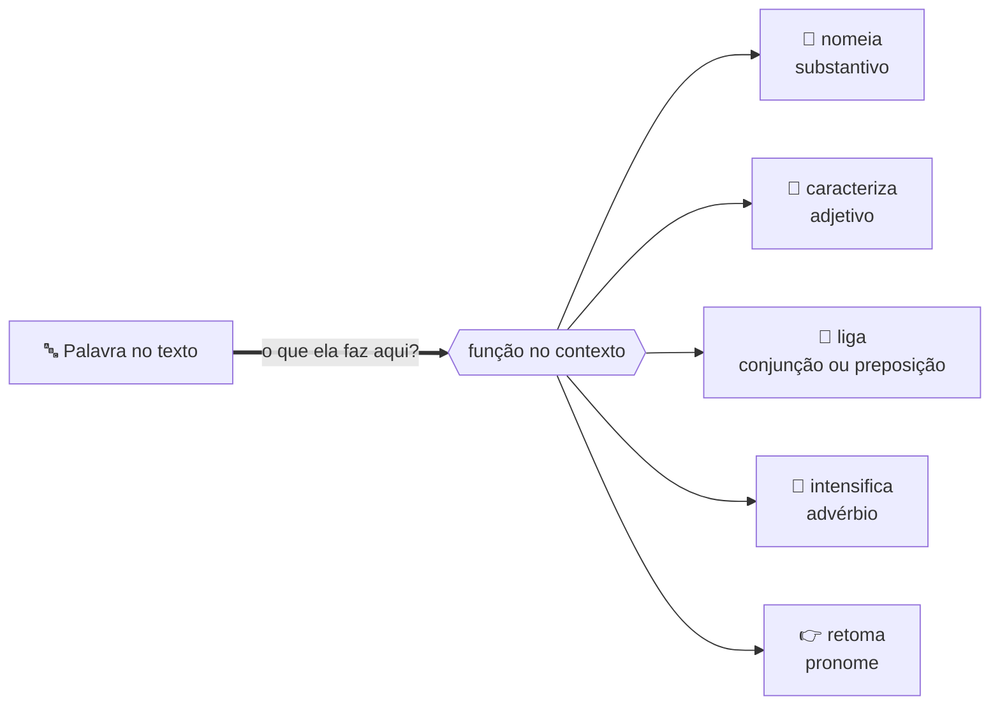
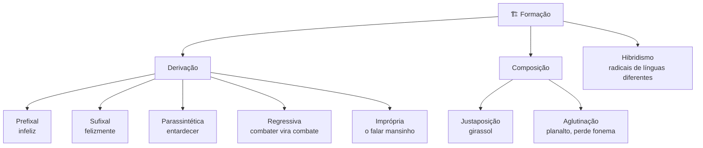
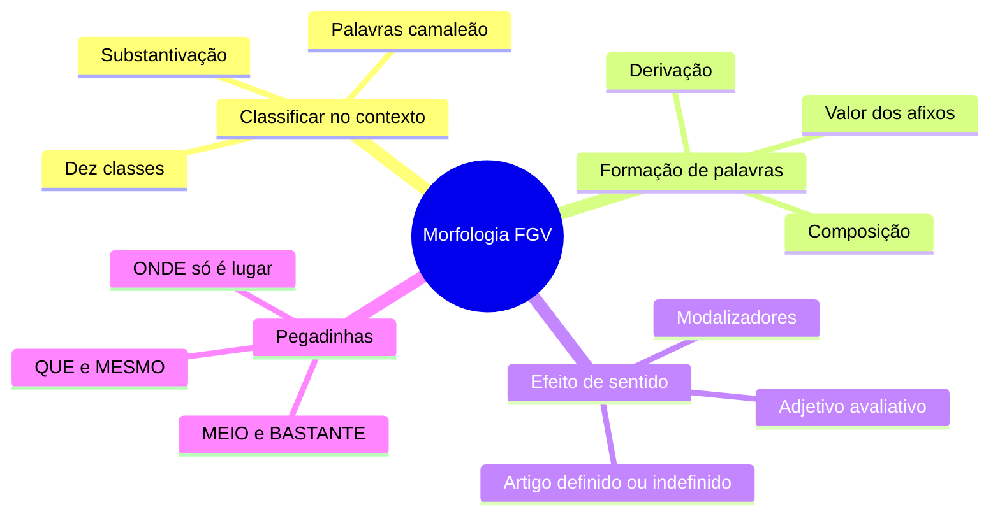

# 🧬 Morfologia na banca FGV

> [!abstract] TL;DR — classe é função, não etiqueta
> A FGV não pergunta *"o que é essa palavra"*. Pergunta **o que ela está fazendo ali**.
>
> Três frentes: classificar **no contexto**, ler o **valor semântico** de prefixos e sufixos, e identificar o **efeito argumentativo** da classe no texto.

> [!info] De onde veio
> Fonte **"Morfologia na banca FGV"** do notebook *Português para Concursos — Banca FGV* (17 fontes, uma por tema do edital).

---

## 🧠 As três frentes da banca

| Frente | O que a FGV pergunta | Enunciado típico |
|---|---|---|
| **Classificação contextual** | a mesma palavra muda de classe conforme a função | "A palavra X, no segmento, pertence à classe..." |
| **Formação de palavras** | derivação, composição e o **valor** do afixo | "O sufixo -oso em *perigoso* indica..." |
| **Efeito de sentido** | o que a classe produz na argumentação | "A troca de X por Y altera a classe e o sentido porque..." |

---

## 🔤 As dez classes — o que importa em cada uma

- **Substantivo** — nomeia. Cuidado com a **substantivação**: qualquer palavra com artigo vira substantivo (*o jantar, o porquê, um não*).
- **Adjetivo** — caracteriza. **Explicativo** (qualidade inerente: *fogo quente*) × **restritivo** (delimita: *aluno estudioso*). Locução adjetiva: *de ouro* = áureo, *de pai* = paterno.
- **Artigo** — o definido **individualiza** e pressupõe conhecimento prévio; o indefinido **apresenta o novo**. Trocar *o* por *um* muda a leitura.
- **Numeral** — cardinal, ordinal, multiplicativo, fracionário.
- **Pronome** — a classe mais cobrada, porque cruza com **coesão** (anáfora e catáfora).
- **Verbo** — a banca cobra o **valor dos tempos**: presente atemporal, futuro do pretérito como hipótese, imperfeito como hábito.
- **Advérbio** — modifica verbo, adjetivo ou outro advérbio. Os **modalizadores** (*felizmente, evidentemente, talvez*) revelam a opinião do enunciador — tema predileto.
- **Preposição** — relaciona e cria sentido (causa, fim, meio, instrumento). Anda com regência.
- **Conjunção** — o coração das questões de coesão.
- **Interjeição** — emoção.

---

## 🏗️ Formação de palavras

> [!tip] O teste da parassíntese
> Prefixo **e** sufixo ao mesmo tempo, sem os quais a palavra **não existe**. Em *entardecer*, tire `en-` ou `-ecer` e a palavra morre → parassíntese. Em *infelizmente*, tire `in-` e sobra *felizmente* → prefixação e sufixação **independentes**.

> [!example] Valor dos afixos que mais caem
> - `-oso` → abundância ("cheio de") · `-vel` → possibilidade · `-ada` → golpe, conjunto, porção
> - `-ismo` → doutrina · `-ista` → adepto · `-dade`/`-eza`/`-ura` → qualidade abstrata
> - `des-` → **negação** (*desonesto*) **ou** ação contrária (*desfazer*) — a FGV explora essa polissemia
> - `a-` privativo (*amoral* = sem moral) ≠ `in-` negativo (*imoral* = contrário à moral)

---

## ⚠️ As pegadinhas clássicas

> [!warning] Palavras camaleão
> - **QUE** → pronome relativo, conjunção integrante, conjunção consecutiva, partícula expletiva, substantivo ou advérbio de intensidade.
> - **MESMO** → advérbio (*até mesmo*), adjetivo (*o mesmo texto*), demonstrativo. Como **substituto de pronome** (*"o aluno chegou e o mesmo sentou"*) é **erro** pela norma culta — cai em reescrita.
> - **MEIO** → *meia dúzia* (numeral, varia) × *meio cansada* (advérbio, invariável).
> - **BASTANTE** → *bastantes motivos* (pronome, varia) × *estudou bastante* (advérbio).

> [!danger] ONDE só é lugar físico
> Para tempo, use *em que* ou *quando*. Para noção abstrata, *em que*. Nunca *"a situação onde..."*.

---

## 📝 Questões comentadas

> [!example] Cinco no estilo da banca
> **1.** *"Foi um discurso **deveras** inflamado."* → **advérbio** de intensidade: é invariável e intensifica o adjetivo.
>
> **2.** *"resultados **des**iguais"* → `des-` aqui é **negação** (não iguais), não ação contrária.
>
> **3.** Parassíntese entre *infelizmente, entardecer, guarda-chuva, combate, planalto* → **entardecer**. Os outros: sufixação+prefixação, justaposição, regressiva e aglutinação.
>
> **4.** *"a inflação, **galopante**"* → adjetivo com valor **metafórico**, caracterizando a rapidez. A FGV cobra o *efeito*, não só a classe.
>
> **5.** *"um problema"* × *"o problema"* → o indefinido apresenta como **informação nova**; o definido **pressupõe** que o leitor já conhece.

---

## 🎯 Como aplicar

> [!success] Checklist de resolução
> 1. **Nunca** classifique a palavra isolada — leia o segmento inteiro.
> 2. Pergunte o que ela **está fazendo** ali: nomeia, caracteriza, liga, intensifica, retoma?
> 3. Teste a **variabilidade**: se flexiona em gênero e número, não é advérbio.
> 4. Em formação, tente retirar prefixo e sufixo **separadamente**.
> 5. Em questões de sentido, pergunte que **juízo de valor** a palavra carrega e a favor de que tese ela joga.

---

## 🗺️ Mapa

---

## 📌 Cola rápida

| Pilar | Em uma frase |
|---|---|
| 🔍 **Contexto manda** | Classe se decide pela função, nunca pela palavra solta |
| 🏗️ **Parassíntese** | Tire um afixo: se a palavra morre, é parassíntese |
| 🎭 **Afixo tem valor** | `des-` nega *ou* inverte; `a-` priva, `in-` contraria |
| 📢 **Modalizador entrega o autor** | *Felizmente, talvez, evidentemente* revelam opinião |
| 🚫 **ONDE** | Só lugar físico — o resto é *em que* |
