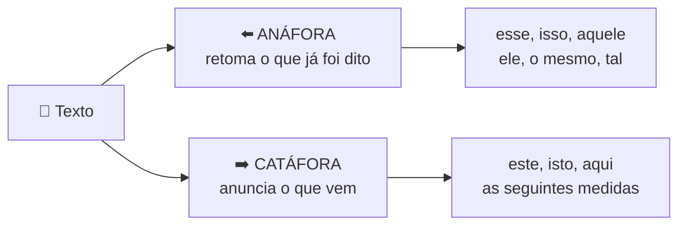
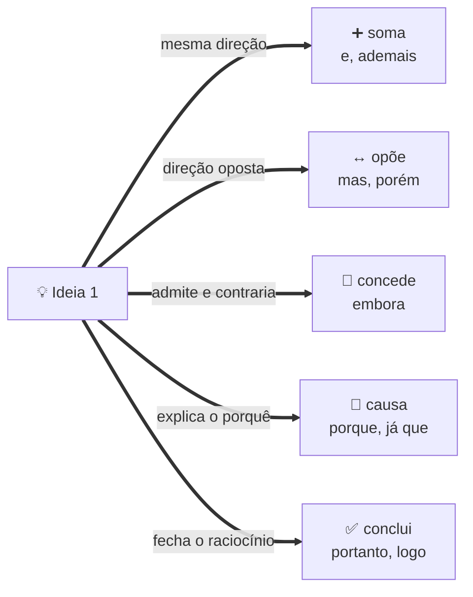
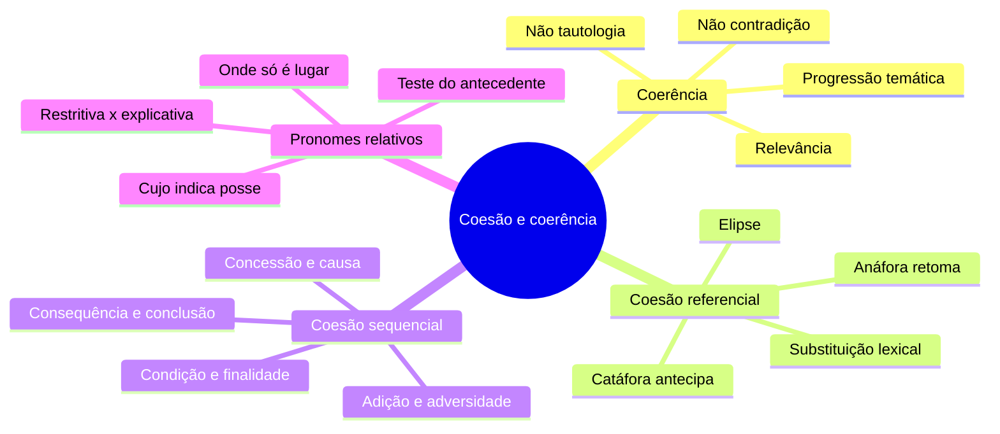

# 🔗 Coerência e coesão na banca FGV

> [!abstract] TL;DR — o tema que mais cai
> A FGV é uma banca **textual**: mais de um terço da prova gira em torno de coesão e coerência.
>
> **Coerência = sentido** (a lógica das ideias). **Coesão = forma** (os fios que amarram). Quem domina isso domina a prova.

> [!info] De onde veio
> Fonte **"Coerência e coesão (anáfora, catáfora e conectores)"** do notebook *Português para Concursos — Banca FGV*.

---

## 🧠 A distinção fundamental

| | 🧩 Coerência | 🔗 Coesão |
|---|---|---|
| **Natureza** | fenômeno de **sentido** | fenômeno de **forma** |
| **O que garante** | as ideias não se contradizem e progridem | os mecanismos linguísticos amarram as partes |
| **Falha típica** | *"Ele é vegetariano convicto, por isso comeu picanha"* | pronome sem referente claro, conectivo trocado |
| **Subdivisões** | não contradição, não tautologia, relevância, progressão | referencial e sequencial |

> [!warning] Gramática perfeita não salva
> Um texto pode estar **impecável** na norma e ser **incoerente**. Coerência se julga pelo sentido, não pela sintaxe.

---

## 👉 Coesão referencial — quem retoma o quê

> [!tip] A regra de ouro dos demonstrativos
> **ESTE / ISTO / AQUI** apontam para frente (catáfora) ou para o que está próximo do falante.
> **ESSE / ISSO** apontam para trás (anáfora).
>
> *"Disse **isso**"* (retoma) × *"Digo **isto**:"* (antecipa).

Outros mecanismos referenciais:

- **Elipse** — omissão recuperável pelo contexto (*"João saiu; [João] voltou tarde"*).
- **Substituição lexical** — sinônimo, hiperônimo ou expressão nominal (*o presidente… o chefe do Executivo*). ⚠️ A expressão nominal costuma carregar **juízo de valor**: *o político… o demagogo*.
- **Pronomes e numerais anafóricos** — *o primeiro/o segundo, ambos*; **aquele** retoma o mais distante, **este**, o mais próximo.

> [!danger] "O mesmo" como pronome
> *"O aluno chegou e **o mesmo** sentou"* é condenado pela norma culta. A FGV cobra isso em **reescrita**.

---

## 🧭 Coesão sequencial — o mapa dos conectores

Memorize por **valor**, não por lista.

| Valor | Conectores |
|---|---|
| ➕ **Adição** | e, além disso, ademais, outrossim, não só… mas também |
| ↔️ **Adversidade** | mas, porém, todavia, contudo, entretanto, no entanto, não obstante |
| 🤝 **Concessão** | embora, ainda que, mesmo que, conquanto, se bem que |
| 🎯 **Causa** | porque, pois *(antes do verbo)*, já que, uma vez que, visto que, como *(inicial)* |
| ➡️ **Consequência** | então, de modo que, tanto que, tão… que |
| ✅ **Conclusão** | portanto, logo, pois *(posposto)*, assim, dessa forma |
| 💡 **Explicação** | pois, porque, que *(após imperativo)* |
| 🔀 **Condição** | se, caso, desde que, contanto que, a menos que |
| 🏁 **Finalidade** | para que, a fim de que, com o intuito de |
| 📐 **Conformidade** | conforme, segundo, consoante, como |
| ⚖️ **Proporção** | à medida que, ao passo que, quanto mais… mais |
| ⏱️ **Tempo** | quando, enquanto, assim que, logo que, mal, antes que |
| 🔁 **Reformulação** | ou seja, isto é, aliás, ou melhor |

> [!warning] As quatro armadilhas de conectivo
> 1. Trocar **causa por consequência** na reescrita.
> 2. Confundir **POIS causal** (antes do verbo) com **POIS conclusivo** (depois do verbo, entre vírgulas).
> 3. Confundir **concessão** com **adversidade** — *"Estudou muito, **mas** não passou"* × *"**Embora** tenha estudado muito, não passou"*.
> 4. Usar **"à medida que"** (proporção) no lugar de **"na medida em que"** (causa).

---

## 🎓 Pronomes relativos — o subtema mais FGV de todos

| Relativo | Uso |
|---|---|
| **que** | o mais geral — pessoa ou coisa |
| **quem** | só pessoa e **sempre** com preposição |
| **o qual** | desfaz ambiguidade; obrigatório após preposição com 2+ sílabas (*sob o qual, mediante o qual*) |
| **cujo** | **posse**; concorda com o termo **posterior**; **nunca** admite artigo depois |
| **onde** | só lugar físico — *aonde* com verbo de movimento, *donde* para origem |
| **quando / como / quanto** | tempo / modo / precedido de *tudo, todos* |

> [!tip] Técnica de ouro para a regência do relativo
> **Substitua o relativo pelo antecedente** e veja qual preposição o verbo exige.
> *O filme a que assisti* → assistir **a** um filme. *O livro de que preciso* → precisar **de**.

> [!danger] Restritiva × explicativa muda tudo
> *"Os alunos **que** estudaram passaram"* → só **alguns** passaram (restritiva, sem vírgula).
> *"Os alunos**,** que estudaram**,** passaram"* → **todos** passaram (explicativa, entre vírgulas).

---

## 📝 Questões comentadas

> [!example] Cinco no estilo da banca
> **1.** *"A crise se agravou; **ademais**, o governo perdeu apoio."* → **adição**. Trocar por *no entanto* quebra a coerência: as ideias caminham na mesma direção.
>
> **2.** *"**Embora** os índices tenham melhorado, a população não sentiu efeito."* → **concessão**. Equivale a *"Os índices melhoraram, **mas** a população não sentiu efeito"*.
>
> **3.** *"medida **cujos** efeitos se desconhecem"* → concorda com *efeitos* (termo posterior) e indica posse: os efeitos **da medida**.
>
> **4.** *"Não passou, **pois**, no concurso."* → *pois* **conclusivo** (posposto, entre vírgulas). Antes do verbo seria causal.
>
> **5.** *"**Isso** posto, seguimos."* → demonstrativo **anafórico**: recupera tudo o que veio antes.

---

## 🎯 Como aplicar

> [!success] Checklist de resolução
> 1. Ache o **referente exato** do pronome e **substitua no texto** — se ficar estranho, a alternativa está errada.
> 2. Antes de escolher o conectivo, identifique a **direção argumentativa**: soma, opõe, explica ou conclui?
> 3. Em reescrita com conectivo, verifique se a ordem **causa → consequência** foi preservada.
> 4. Em relativos, aplique o **teste da substituição pelo antecedente**.
> 5. Em vírgula com adjetiva, pergunte: delimita um subgrupo (restritiva) ou comenta o todo (explicativa)?

---

## 🗺️ Mapa

---

## 📌 Cola rápida

| Pilar | Em uma frase |
|---|---|
| 🧩 **Coerência** | É sentido: as ideias não podem se contradizer nem parar de progredir |
| 🔗 **Coesão** | É forma: os fios linguísticos que amarram as partes |
| ⬅️➡️ **Anáfora × catáfora** | *Esse* olha para trás, *este* olha para frente |
| 🧭 **Conectivo** | Escolha pela **direção argumentativa**, não pela memória da lista |
| 🎓 **Cujo** | Posse, concorda com o que vem depois, jamais com artigo |
| ✂️ **Vírgula na adjetiva** | Com vírgula = todos; sem vírgula = só alguns |
