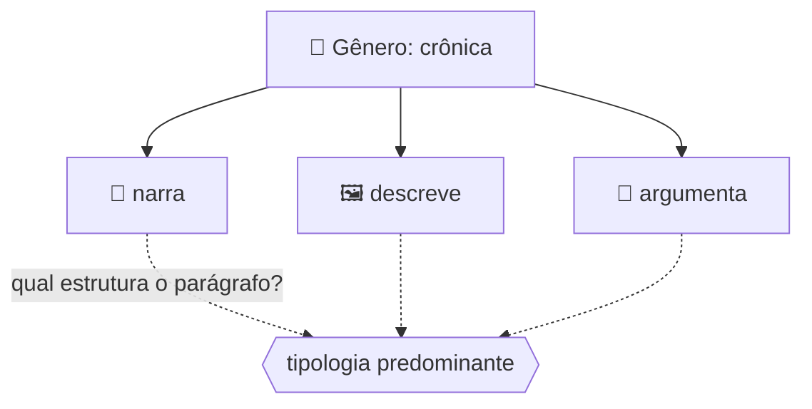
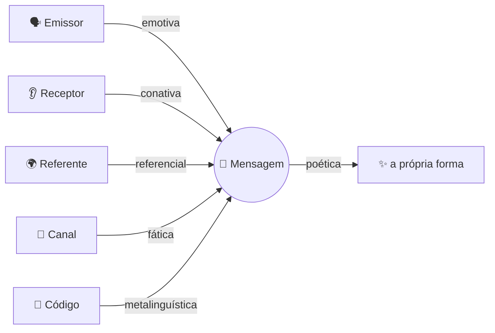
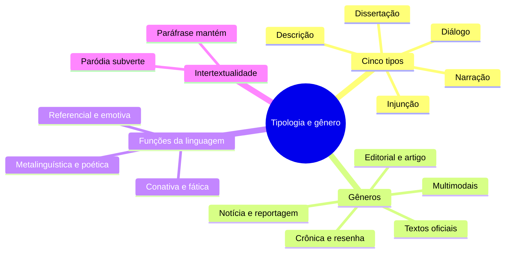

# 📚 Tipologia e gênero textual na banca FGV

> [!abstract] TL;DR — cinco tipos, infinitos gêneros
> **Tipo textual** é categoria **fechada** (são só cinco), definida pela estrutura linguística. **Gênero** é categoria **aberta** e social, definida pela função comunicativa e pelo suporte.
>
> Um mesmo gênero mistura vários tipos — por isso a FGV pergunta pela tipologia **predominante**.

> [!info] De onde veio
> Fonte **"Tipologia e gênero textual"** do notebook *Português para Concursos — Banca FGV*.

---

## 🧠 A distinção que resolve metade das questões

| | 🔒 Tipo textual | 🌍 Gênero textual |
|---|---|---|
| **Categoria** | fechada — apenas 5 | aberta, histórica, social |
| **Definido por** | estrutura linguística interna | função comunicativa e suporte |
| **Exemplos** | narração, descrição, dissertação, injunção, diálogo | e-mail, edital, receita, crônica, editorial, ata, meme |
| **Muda com o tempo?** | não | sim, o tempo todo |

---

## 🧩 Os cinco tipos e suas marcas

| Tipo | Pergunta-chave | Marcas linguísticas |
|---|---|---|
| 📖 **Narração** | *o que aconteceu depois?* | verbos de ação no pretérito perfeito, advérbios de tempo, personagens, narrador |
| 🖼️ **Descrição** | *como é?* | verbos de estado (*ser, estar, parecer, haver*), adjetivos, presente/imperfeito, sem progressão temporal |
| 💭 **Dissertação** | *o que se defende e com que argumentos?* | presente atemporal, 3ª pessoa, conectivos lógicos, abstrações, modalizadores |
| 🛠️ **Injunção** | *como fazer?* | **imperativo** ou infinitivo, etapas, linguagem objetiva |
| 💬 **Diálogo** | *quem fala com quem?* | travessão ou aspas, marcas de oralidade |

> [!tip] Exposição × argumentação
> **Expositivo** apenas apresenta a informação, em tom neutro. **Argumentativo** tem **tese** e busca convencer. O divisor é a presença de posição + operadores argumentativos.

---

## 📰 Gêneros que mais aparecem

> [!example] Como identificar cada um
> - **Editorial** → opinião do jornal, **sem assinatura** individual, tom impessoal e assertivo.
> - **Artigo de opinião** → **assinado**, tese explícita, 1ª pessoa possível.
> - **Notícia** → relato factual, **lide** (quem, o quê, quando, onde, como, por quê), pirâmide invertida.
> - **Reportagem** → mais longa, com apuração, fontes e contexto.
> - **Crônica** → curta, ancorada no cotidiano, tom subjetivo, fecho irônico ou reflexivo.
> - **Resenha** → descreve **e avalia** uma obra.
> - **Verbete** → definição objetiva, linguagem técnica.
> - **Textos oficiais** (ofício, memorando, ata, parecer, relatório) → impessoalidade, formalidade, pronomes de tratamento.
> - **Tirinha, charge, meme** → **multimodalidade**: o sentido nasce da relação imagem + texto, geralmente por quebra de expectativa.

> [!warning] Suporte não é gênero
> O suporte é o **veículo** (jornal, site, mural). O gênero é o **formato social** do texto. A banca troca um pelo outro nas alternativas.

---

## 🎭 Conceitos que vêm junto

**Funções da linguagem** — pelo foco da mensagem:

**Intertextualidade** — citação, **paráfrase** (mantém o sentido), **paródia** (subverte o sentido), epígrafe, alusão.

**Intenção comunicativa** — informar, convencer, instruir, emocionar, entreter.

---

## 📝 Questões comentadas

> [!example] Cinco no estilo da banca
> **1.** *"Bata as claras em neve, acrescente o açúcar e leve ao forno."* → tipologia **injuntiva** (imperativo em etapas); gênero **receita**.
>
> **2.** Texto com dados sobre desmatamento **sem** posição → **expositivo**. Passou a defender mudança de política → **argumentativo**.
>
> **3.** *"A sala tinha paredes altas, janelas estreitas e um cheiro antigo de mofo."* → **descrição**: verbos de estado e ausência de progressão temporal.
>
> **4.** Tirinha em que a fala contradiz a imagem → humor por **quebra de expectativa** (multimodalidade).
>
> **5.** Texto sem assinatura, em jornal, defendendo a posição do veículo sobre uma lei → **editorial**, não artigo de opinião.

---

## 🎯 Como aplicar

> [!success] Checklist de resolução
> 1. Pergunte primeiro a **finalidade**: informar, convencer, instruir ou narrar?
> 2. Olhe os **verbos** — imperativo → injunção; pretérito perfeito → narração; presente atemporal → dissertação; verbos de estado → descrição.
> 3. Gênero se identifica pelo **conjunto** (suporte, público, formato, função), nunca por uma frase solta.
> 4. Se o enunciado pede a tipologia **predominante**, veja o que estrutura o **parágrafo**, não o que aparece em uma linha.
> 5. Nunca confunda tipo (5, fechado) com gênero (aberto, social).

---

## 🗺️ Mapa

---

## 📌 Cola rápida

| Pilar | Em uma frase |
|---|---|
| 🔒 **Tipo** | Cinco, fechado, definido pela estrutura linguística |
| 🌍 **Gênero** | Aberto e social, definido pela função e pelo suporte |
| 🛠️ **Imperativo** | Denuncia injunção — receita, manual, bula, edital |
| 📰 **Editorial** | Sem assinatura, voz do jornal; artigo de opinião é assinado |
| 🎭 **Função predominante** | Descubra para onde aponta o foco da mensagem |
