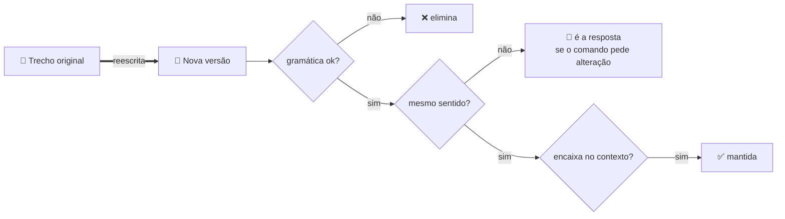
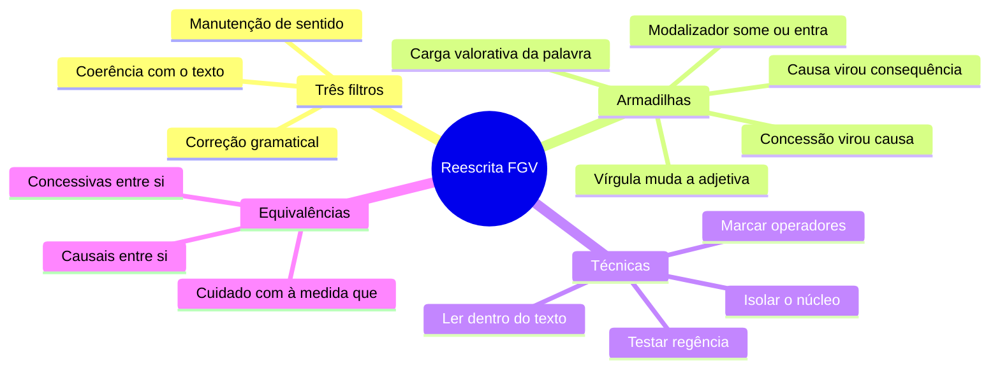

# ✍️ Reescrita de frases — a questão-assinatura da FGV

> [!abstract] TL;DR — ache a mudança mínima
> Nenhuma banca cobra reescrita como a FGV. Em geral **quatro alternativas estão corretas** e uma tem um desvio sutil.
>
> O jogo não é achar a versão mais bonita — é achar a **única que mexeu em alguma coisa**.

> [!info] De onde veio
> Fonte **"Reescrita de frases e substituição de palavras ou trechos"** do notebook *Português para Concursos — Banca FGV*.

---

## 🧠 Os três filtros simultâneos

| Filtro | O que checar |
|---|---|
| 📏 **Correção gramatical** | regência, concordância, crase, colocação pronominal, pontuação |
| 🎯 **Manutenção de sentido** | não pode acrescentar, retirar nem inverter informação |
| 🧵 **Coerência com o texto** | a nova versão precisa continuar encaixando na argumentação |

> [!danger] A alternativa pode estar gramaticalmente perfeita e ainda assim ser a resposta
> Basta que ela **mude o sentido**. Leia sempre pelos três filtros, nunca só pelo primeiro.

---

## ⚠️ As armadilhas mais frequentes

> [!warning] Lista de conferência
> - **Inversão causa ↔ consequência**: *"Choveu, por isso a rua alagou"* × *"Choveu porque a rua alagou"*.
> - **Concessão virando causa**: *"Embora chovesse, saiu"* = *"Chovia, **mas** saiu"* ≠ *"**Como** chovia, saiu"*.
> - **Mudança de modalidade**: *pode ocorrer* (possibilidade) ≠ *ocorre* (fato) ≠ *deve ocorrer* (probabilidade/obrigação).
> - **Restritiva × explicativa**: acrescentar vírgulas muda de "alguns" para "todos".
> - **Ativa ↔ passiva**: legítima, mas se o **agente desaparece**, houve perda de informação.
> - **Reduzida × desenvolvida**: *"Ao chegar, avisou"* pode ser temporal **ou** causal — só o contexto decide.
> - **Carga valorativa**: *econômico → avarento*, *firme → teimoso*, *grupo → facção*. Mesmo referente, outra avaliação.
> - **Hipônimo → hiperônimo**: *rosa → flor* mantém a referência, perde a precisão.
> - **Posição do adjetivo**: *um **grande** homem* (valoroso) × *um homem **grande*** (de porte).
> - **Escopo de "apenas/somente"**: *"**Apenas ele** falou disso"* × *"Ele falou **apenas disso**"*.
> - **Nominalização**: *"porque os preços subiram"* → *"pela subida dos preços"* costuma exigir ajuste de preposição.

---

## 🧰 As cinco técnicas

> [!tip] Como atacar a questão
> 1. **Isolar o núcleo**: quem faz o quê, com que circunstância. Compare núcleo a núcleo.
> 2. **Marcar os operadores**: conectivos, modalizadores, quantificadores (*todos, alguns, nenhum*) e negações. Mexeu neles? Suspeite.
> 3. **Testar a regência** na nova estrutura: *obedecer **a***, *assistir **a*** (ver), *visar **a*** (ter por objetivo), *implicar* (sem preposição), *preferir… **a***.
> 4. **Ler a alternativa dentro do texto**, nunca isolada.
> 5. **Desconfiar da mais elegante** — a FGV premia a reescrita **fiel**, não a bonita.

---

## 🔁 Equivalências para ter na ponta da língua

| Grupo | Equivalem entre si |
|---|---|
| 🤝 **Concessão** | embora, ainda que, mesmo que, conquanto, se bem que ≈ *apesar de* + infinitivo |
| 🎯 **Causa** | uma vez que, já que, visto que, como *(inicial)*, porquanto ≈ *por* + infinitivo |
| ➡️ **Consequência** | de modo que, de sorte que, tanto que |
| 🏁 **Finalidade** | a fim de que, para que ≈ *a fim de* + infinitivo |
| 🔀 **Condição** | caso, se, desde que, contanto que |
| ↔️ **Adversidade** | porém, todavia, contudo, entretanto |

> [!danger] Os pares que NÃO se trocam
> **À medida que** = proporção · **na medida em que** = causa.
> **Não obstante** = *mesmo assim* (concessivo), e **não** "não sendo obstáculo a".

---

## 📝 Questões comentadas

> [!example] Cinco no estilo da banca
> **1.** *"O relatório, que foi entregue ontem, apontou falhas."* → tirar as vírgulas **altera o sentido**: de explicativa (só há um relatório) para restritiva (há vários; só o de ontem apontou).
>
> **2.** *"É preciso que se estudem os dados"* = *"É preciso estudar os dados"*. ❌ *"É preciso que se estude os dados"* — a passiva sintética exige concordância com *os dados*.
>
> **3.** *"Ele visava **ao** cargo"* = *"Ele tinha o cargo como objetivo"*. *"Visava **o** cargo"* só valeria no sentido de mirar/pôr visto.
>
> **4.** *"**Talvez** a medida funcione"* → trocar por *"A medida funcionará"* **altera**: elimina a modalização e transforma hipótese em certeza.
>
> **5.** *"Ao ver o resultado, comemorou"* → equivale a *"Quando viu…"* (sucessão) **ou** *"Porque viu…"* (motivo). Só o contexto decide.

---

## 🎯 Como aplicar

> [!success] Checklist de resolução
> 1. Compare **informação por informação**, não a impressão geral.
> 2. Vigie conectivos, modalizadores, quantificadores e negações.
> 3. Cheque **regência e concordância** da nova estrutura.
> 4. Verifique se **vírgulas** foram acrescentadas ou retiradas.
> 5. Releia a alternativa **dentro do parágrafo original** antes de marcar.

---

## 🗺️ Mapa

---

## 📌 Cola rápida

| Pilar | Em uma frase |
|---|---|
| 🔍 **Mudança mínima** | Quatro alternativas estão certas; ache a que mexeu num detalhe |
| 🎭 **Modalizador** | *Talvez, pode, deve* — tirar ou pôr um deles muda tudo |
| ↔️ **Direção lógica** | Causa e consequência não se invertem sem alterar o sentido |
| ✂️ **Vírgula** | Entrou ou saiu numa adjetiva? O sentido mudou |
| 💎 **Fiel > bonita** | A banca premia a versão fiel, não a mais elegante |
