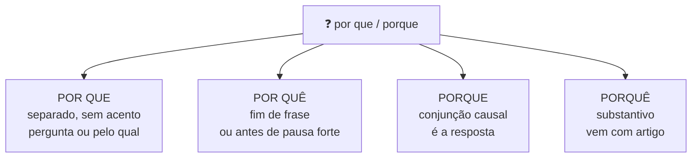
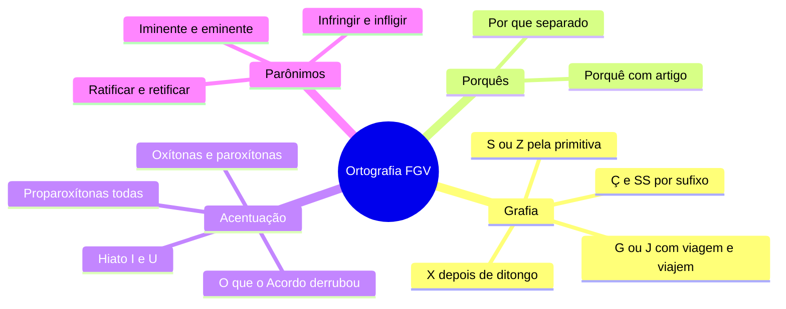

# 🔠 Ortografia e acentuação na banca FGV

> [!abstract] TL;DR — grafia é sentido
> A FGV cobra ortografia **contextualizada**: a palavra certa depende do que o texto quer dizer.
>
> Os dois campeões de questão: **parônimos** (*ratificar × retificar*) e as palavras que **mudaram com o Acordo Ortográfico**.

> [!info] De onde veio
> Fonte **"Ortografia e acentuação"** do notebook *Português para Concursos — Banca FGV*.

---

## 🧠 As regras que resolvem a maioria

### S ou Z

- Sufixos **-ês, -esa, -isa** de origem, título ou profissão → *português, marquesa, poetisa*.
- Sufixo **-oso/-osa** → *gostoso, formoso*.
- Depois de **ditongo**, geralmente S → *coisa, lousa*.
- Verbos derivados de palavra com S **mantêm o S** → *análise → analisar*; *liso → alisar*.
- **-izar** quando a primitiva **não** tem S → *civil → civilizar*.
- **-ez / -eza** formando abstrato de adjetivo → *rigidez, beleza, altivez*.

> [!warning] Pares que caem
> *co**z**er* (cozinhar) × *co**s**er* (costurar) · *tra**z*** (verbo) × *trá**s*** (atrás)

### G ou J

- **G** em **-agem, -igem, -ugem** (*viagem, origem, ferrugem*) — exceções: *pajem, lambujem*; e em *-ágio, -égio, -ígio, -ógio, -úgio*.
- **J** em palavras indígenas, africanas e árabes (*pajé, jiboia, canjica*) e nos verbos em **-jar**.

> [!danger] Via**g**em × via**j**em
> *Viagem* com **G** é **substantivo**. *Viajem* com **J** é **verbo**: *"espero que eles viajem"*. Cai sempre.

### X ou CH

- Depois de **ditongo** → *caixa, peixe, ameixa* (exceção: *recauchutar*).
- Depois de **en-** → *enxada, enxergar* (exceção: *encher* e derivados, que vêm de *cheio*).
- Depois de **me-** → *mexer, mexerica* (exceção: *mecha*).

### Ç, SS, C, SC

- Verbos em **-ceder** → substantivo em **-cessão** (*conceder → concessão*).
- Verbos em **-tir** → **-são** (*converter → conversão*; *discutir → discussão*).
- Verbos em **-mitir** → **-missão** (*admitir → admissão*).
- **Ç** nunca inicia palavra nem aparece antes de E e I.

---

## ❓ Os porquês

> [!tip] Teste rápido
> Troque por **"por qual motivo"** → *por que*. Por **"pelo qual"** → *por que*. Por **"pois"** → *porque*. Por **"o motivo"** → *o porquê*.

---

## 🎯 Outros pares que a banca ama

| Par | Diferença |
|---|---|
| **mal × mau** | *mal* é advérbio (× bem) ou conjunção temporal; *mau* é adjetivo (× bom) |
| **a fim de × afim** | finalidade × semelhante (*áreas afins*) |
| **se não × senão** | *caso não* × *caso contrário, exceto, defeito* |
| **haja vista** | invariável nessa forma |

---

## 〽️ Acentuação — o essencial pós-Acordo

| Classe | Regra |
|---|---|
| **Oxítonas** | acentuam-se em **A(s), E(s), O(s), EM/ENS** e ditongos abertos **ÉI, ÉU, ÓI** |
| **Paroxítonas** | acentuam-se em **R, L, N, X, PS, Ã(s), ÃO(s), I(s), U(s), UM/UNS**, ditongo |
| **Proparoxítonas** | **todas**, sem exceção |
| **Monossílabos tônicos** | em **A, E, O** → *pá, pé, pó* |

> [!danger] O que o Acordo derrubou — e a FGV cobra
> - Caiu o **trema** (salvo nomes próprios estrangeiros).
> - Caiu o acento de **ÉI e ÓI em paroxítonas**: *ideia, jiboia, assembleia, heroico*. **Permanece** nas oxítonas: *herói, papéis*.
> - Caiu o acento do hiato **OO / EE**: *voo, enjoo, creem, leem, veem, deem*.
> - Caiu o **acento diferencial**, salvo **pôde** (pretérito) × **pode**, **pôr** (verbo) × **por**; facultativo em *fôrma*.
> - **Hiato I/U**: acentua quando forma sílaba sozinho ou com S (*saída, país, baú*), mas **não** depois de ditongo em paroxítona (*feiura, baiuca*) nem antes de **NH** (*rainha, bainha*).

---

## 👯 Parônimos e homônimos

> [!example] A lista que mais rende
> **ratificar** (confirmar) × **retificar** (corrigir) · **iminente** (prestes) × **eminente** (ilustre) · **deferir** (conceder) × **diferir** (adiar, divergir) · **descriminar** (tirar o caráter de crime) × **discriminar** (distinguir) · **infringir** (violar) × **infligir** (aplicar pena) · **emergir** (vir à tona) × **imergir** (afundar) · **comprimento** × **cumprimento** · **tráfego** (trânsito) × **tráfico** (comércio ilícito) · **vultoso** (volumoso) × **vultuoso** (rosto congesto) · **absolver** (inocentar) × **absorver** (sorver) · **prescrever** × **proscrever** (banir) · **flagrante** × **fragrante** · **estada** (de pessoa) × **estadia** (de veículo) · **censo** × **senso** · **cessão** (ceder) × **sessão** (reunião) × **seção** (divisão)

---

## 📝 Questões comentadas

> [!example] Cinco no estilo da banca
> **1.** *"Espero que vocês ______ em paz."* → **viajem** (verbo, com J).
>
> **2.** *"O tribunal ______ a decisão, corrigindo o erro material."* → **retificou**. *Ratificar* seria confirmar — sentido oposto ao contexto.
>
> **3.** Única corretamente acentuada entre *ideia, heroi, jibóia, voô, êle* → **ideia**. As outras perderam ou nunca tiveram acento; *herói* (oxítona) mantém.
>
> **4.** *"Não fez ______ reclamar."* → **senão** (equivale a *a não ser*).
>
> **5.** *"Ele não sabe ______ foi demitido."* → **por que** (interrogativa indireta = *por qual motivo*).

---

## 🎯 Como aplicar

> [!success] Checklist de resolução
> 1. Em parônimos, **substitua pela definição** e veja se a frase continua fazendo sentido.
> 2. Em acentuação, classifique primeiro a **sílaba tônica**; depois aplique a regra da classe.
> 3. Nos porquês, teste as quatro substituições.
> 4. Em S/Z e G/J, procure a **palavra primitiva** — a grafia costuma vir dela.
> 5. Desconfie das palavras que **mudaram com o Acordo**: são as prediletas da banca.

---

## 🗺️ Mapa

---

## 📌 Cola rápida

| Pilar | Em uma frase |
|---|---|
| 🔤 **Primitiva manda** | A grafia do derivado vem da palavra de origem |
| ✈️ **Viagem × viajem** | Substantivo com G, verbo com J |
| ❓ **Porquês** | Teste com *por qual motivo, pelo qual, pois, o motivo* |
| 〽️ **Acordo** | *Ideia, jiboia, voo, leem* perderam acento; *herói* manteve |
| 👯 **Parônimo** | Troque pela definição — o contexto revela qual é |
