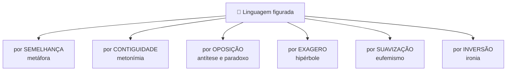
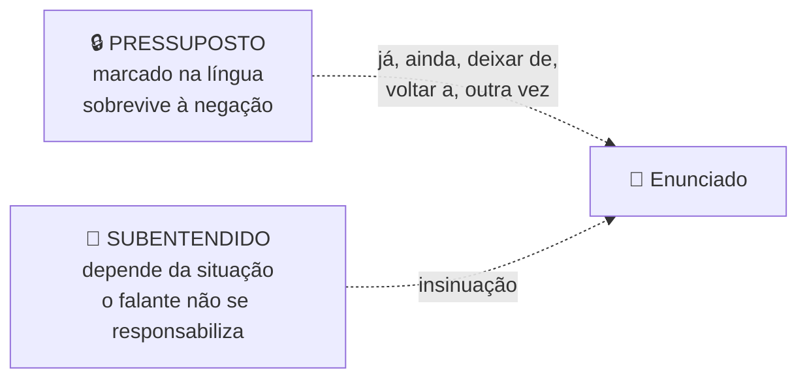
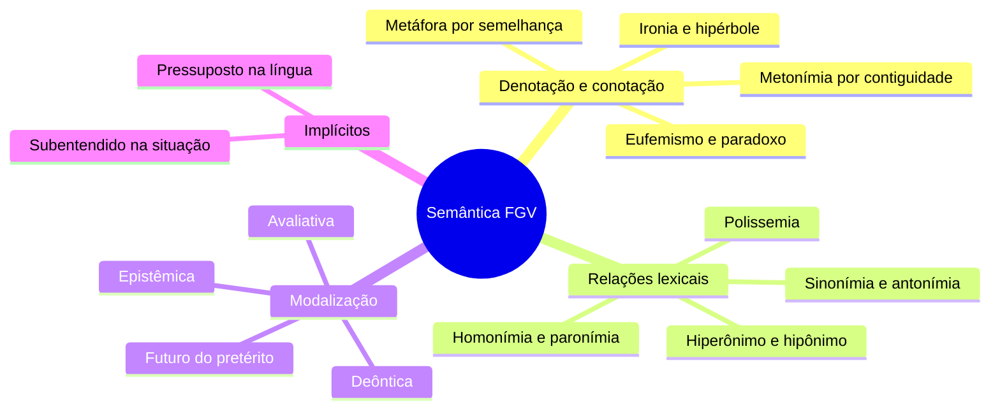

# 💡 Semântica na banca FGV

> [!abstract] TL;DR — sentido é contexto, não dicionário
> Para a FGV, semântica quase nunca é lista de sinônimos. É a análise do **sentido em contexto** e do **efeito argumentativo** das escolhas lexicais.
>
> O subtema que mais rende: **modalização** — as marcas que revelam o quanto o autor se compromete com o que diz.

> [!info] De onde veio
> Fonte **"Semântica"** do notebook *Português para Concursos — Banca FGV*.

---

## 🎭 Denotação × conotação

| | 📖 Denotação | 🎨 Conotação |
|---|---|---|
| **Sentido** | literal, dicionarizado, objetivo | figurado, construído no contexto |
| **Onde vive** | texto técnico, científico, oficial | literário, publicitário, opinativo |

> [!example] O catálogo de figuras
> - **Metáfora** — comparação implícita (*"a inflação é um monstro"*).
> - **Metonímia** — troca por contiguidade: autor pela obra (*"li Machado"*), continente pelo conteúdo, parte pelo todo, marca pelo produto.
> - **Catacrese** — metáfora cristalizada, sem alternativa (*pé da mesa, braço do rio*).
> - **Hipérbole** (exagero) · **Eufemismo** (suaviza) · **Disfemismo** (agrava).
> - **Ironia** — dizer o contrário do que se quer significar. Muito explorada em crônicas.
> - **Personificação**, **antítese** (ideias opostas), **paradoxo** (contraditórias na mesma unidade).
> - **Pleonasmo** — vício quando desnecessário, figura quando expressivo.
> - **Sinestesia** (*voz áspera*) · **Gradação** (intensidade crescente ou decrescente).

---

## 🔗 Relações de sentido entre palavras

| Relação | O que é | Cuidado da banca |
|---|---|---|
| **Sinonímia** | sentido próximo | sinônimo perfeito quase não existe — muda registro e carga valorativa |
| **Antonímia** | oposição | gradual (*quente/frio*), complementar (*vivo/morto*), conversa (*comprar/vender*) |
| **Homonímia** | mesma forma, sentidos diversos | *manga* da camisa × *manga* fruta |
| **Paronímia** | formas parecidas | *tráfego / tráfico* |
| **Polissemia** | a mesma palavra, sentidos vários | base do humor em tirinhas |
| **Hiperonímia** | generalidade | *flor* é hiperônimo de *rosa* — serve à coesão |
| **Campo semântico** | domínio comum | a banca pergunta qual palavra **não** pertence |

---

## 🎚️ Modalização — o tema que a FGV mais ama

Modalizar é marcar **o grau de comprometimento** do enunciador com o que diz.

| Tipo | Marcas |
|---|---|
| 🔍 **Epistêmico** (certeza/dúvida) | certamente, sem dúvida, talvez, possivelmente, ao que parece |
| ⚖️ **Deôntico** (obrigação/permissão) | é preciso, deve-se, é obrigatório, pode-se |
| ❤️ **Avaliativo/afetivo** | felizmente, infelizmente, lamentavelmente, curiosamente |
| 📐 **Delimitador** | de certo modo, praticamente, em termos gerais |

> [!tip] Os tempos também modalizam
> O **futuro do pretérito** é a marca jornalística de distanciamento: *"o ministro **teria** recebido"* — o enunciador **não assume** a informação. Verbos modais: *poder, dever, parecer, precisar*.

---

## 🕵️ Pressuposto × subentendido

> [!example] Na prática
> *"João **deixou de** fumar"* → **pressupõe** que ele fumava. Negue a frase: o pressuposto continua de pé.
>
> *"Está frio aqui"* → pode **subentender** um pedido para fechar a janela. Depende do contexto, e o falante pode negar a intenção.

---

## 📝 Questões comentadas

> [!example] Seis no estilo da banca
> **1.** *"O deputado **ainda** não respondeu às acusações."* → *ainda* **pressupõe** que se espera resposta. Tirá-lo elimina a pressuposição.
>
> **2.** *"A empresa **teria** fraudado o balanço."* → futuro do pretérito: o enunciador **não assume** o fato; é distanciamento jornalístico.
>
> **3.** *"Aquele político é uma raposa."* → **metáfora** (semelhança: astúcia), não metonímia.
>
> **4.** *"Ele mora num palacete de dois cômodos."* → a incompatibilidade produz **ironia**.
>
> **5.** *"Li Drummond inteiro."* → **metonímia**: autor pela obra.
>
> **6.** *"**Felizmente**, a lei foi aprovada."* → o modalizador revela avaliação positiva: o texto deixa de ser neutro.

---

## 🎯 Como aplicar

> [!success] Checklist de resolução
> 1. Pergunte se a palavra está no sentido **do dicionário** ou **construído pelo contexto**.
> 2. Em figuras, identifique o **mecanismo**: semelhança, contiguidade, oposição, exagero.
> 3. **Cace os modalizadores** — eles revelam a posição do autor e são resposta frequente.
> 4. Para pressuposto, **negue a frase**: o que sobrevive à negação é pressuposto.
> 5. Em substituição lexical, verifique **registro, precisão e carga valorativa**, não só o significado central.

---

## 🗺️ Mapa

---

## 📌 Cola rápida

| Pilar | Em uma frase |
|---|---|
| 🎨 **Conotação** | Sentido construído no contexto, não o do dicionário |
| 🔍 **Metáfora × metonímia** | Semelhança × contiguidade — é sempre essa a pergunta |
| 🎚️ **Modalizador** | Mede o quanto o autor se compromete com o que afirma |
| 📰 **Teria feito** | Futuro do pretérito = o enunciador não assume o fato |
| 🔒 **Pressuposto** | Sobrevive à negação; subentendido depende da situação |
