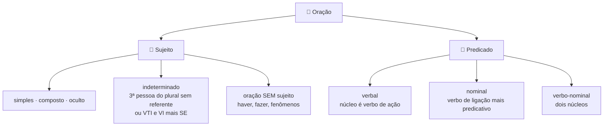
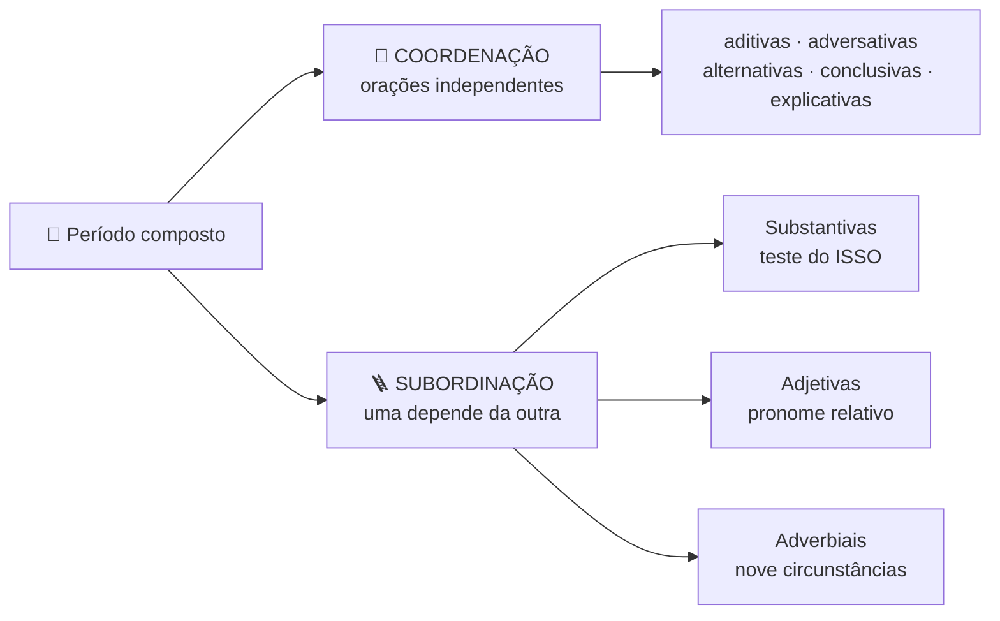
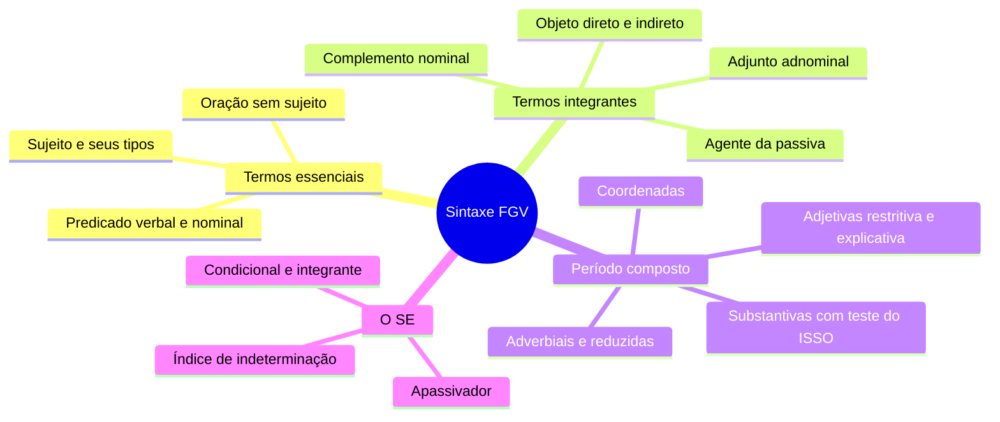

# 🏛️ Sintaxe na banca FGV

> [!abstract] TL;DR — sintaxe é a base de tudo
> A FGV usa sintaxe como **ferramenta de interpretação** e como **justificativa** de vírgula, concordância, regência e reescrita.
>
> Toda dúvida nesses temas se resolve com análise sintática — nunca com intuição.

> [!info] De onde veio
> Fonte **"Sintaxe"** do notebook *Português para Concursos — Banca FGV*.

---

## 🧠 Termos essenciais

> [!danger] Oração sem sujeito → verbo no singular
> **Haver** (existir/ocorrer), **fazer** (tempo) e fenômenos da natureza são **impessoais**: *"**Havia** muitos alunos"*, *"**Faz** dez anos"*.

---

## 🧩 Termos integrantes

| Termo | Marca |
|---|---|
| **Objeto direto** | completa VTD, sem preposição (existe o *preposicionado* por ênfase: *"Amava a Deus"*) |
| **Objeto indireto** | preposição exigida pelo verbo |
| **Complemento nominal** | completa **substantivo abstrato, adjetivo ou advérbio**, com preposição — indica o **alvo** |
| **Agente da passiva** | introduzido por **por** ou **de** |

> [!warning] Complemento nominal × adjunto adnominal — o par que mais cai
> Se o termo preposicionado é **paciente** (sofre a ação) → **complemento nominal**.
> Se é **agente** ou **possuidor** → **adjunto adnominal**.
>
> *"A prisão **do bandido**"* → o bandido é preso → **complemento nominal**.
> *"A prisão **do delegado**"* → o delegado prendeu (ou é dono) → **adjunto adnominal**.

---

## 🎀 Termos acessórios e vocativo

- **Adjunto adnominal** — modifica substantivo (artigo, adjetivo, locução adjetiva, pronome adjetivo, numeral).
- **Adjunto adverbial** — circunstância. É o campeão em questões de **vírgula**: deslocado e longo, vem entre vírgulas.
- **Aposto** — explica, resume, enumera ou especifica; entre vírgulas, travessões ou após dois-pontos.
- **Vocativo** — chamamento; **sempre** isolado e **fora** da estrutura da oração.

---

## 🔀 Período composto

> [!tip] O teste do ISSO
> Para orações **substantivas**, substitua a oração por **ISSO** e veja que função *isso* exerce.
> *"É necessário **que estudem**"* → *"**Isso** é necessário"* → **subjetiva**.

**As substantivas**: subjetiva, objetiva direta, objetiva indireta, completiva nominal, predicativa e apositiva. Introduzidas pelas integrantes **que** e **se**.

**As adjetivas**: **restritivas** (sem vírgula, delimitam) e **explicativas** (entre vírgulas, comentam o todo).

**As adverbiais**: causal, consecutiva, condicional, concessiva, comparativa, conformativa, final, proporcional e temporal.

**As reduzidas** (infinitivo, gerúndio, particípio) vêm **sem conectivo** — a FGV pede o desenvolvimento com a conjunção adequada: *"Ao chegar"* (temporal ou causal), *"Terminada a prova"* (temporal), *"Estudando, você passa"* (condicional).

> [!warning] Explicativa × causal
> **Explicativa** (coordenada) justifica uma afirmação, em geral após imperativo: *"Feche a janela, **pois** está frio"*.
> **Causal** (subordinada) indica a causa real do fato: *"A rua alagou **porque** choveu"*.

---

## 🔎 O famoso "SE" — sete funções

> [!example] Todas as caras do SE
> 1. **Pronome apassivador** — com VTD; o sujeito paciente concorda: *"Vendem-**se** casas"*.
> 2. **Índice de indeterminação** — com VTI, VI ou VL: *"Precisa-**se** de ajuda"*.
> 3. **Parte integrante do verbo** — pronominais: *queixar-**se***, *arrepender-**se***.
> 4. **Reflexivo** (*"Ele **se** feriu"*) ou **recíproco** (*"Eles **se** abraçaram"*).
> 5. **Conjunção condicional** — *"**Se** chover, fico"*.
> 6. **Conjunção integrante** — *"Não sei **se** virá"*.
> 7. **Partícula expletiva / de realce** — *"Foi-**se** embora"*.

---

## 📝 Questões comentadas

> [!example] Cinco no estilo da banca
> **1.** *"Aluga-se salas."* ❌ — *alugar* é VTD, o SE é apassivador e *salas* é sujeito: **"Alugam-se salas"**.
>
> **2.** *"Houveram muitos protestos"* ❌ — *haver* = existir é impessoal: **"Houve muitos protestos"**.
>
> **3.** *"Foi bom **que você viesse**."* → subordinada substantiva **subjetiva** (*"**Isso** foi bom"*).
>
> **4.** *"O ministro, **cansado das críticas**, renunciou."* → **predicativo do sujeito deslocado**, e não aposto.
>
> **5.** *"**Terminado o expediente**, todos saíram."* → adverbial **temporal reduzida de particípio** = *"Quando o expediente terminou…"*.

---

## 🎯 Como aplicar

> [!success] Checklist de resolução
> 1. Ache primeiro o **verbo**; depois pergunte quem pratica (sujeito) e o que se completa (objeto).
> 2. Verifique a **transitividade** antes de classificar qualquer complemento.
> 3. Substantivas → **teste do ISSO**.
> 4. Adjetivas → ache o **pronome relativo** e seu **antecedente**.
> 5. Adverbiais → pergunte a circunstância: *quando, por quê, para quê, sob que condição*.
> 6. Vírgula, concordância e crase se resolvem **por análise sintática**.

---

## 🗺️ Mapa

---

## 📌 Cola rápida

| Pilar | Em uma frase |
|---|---|
| 🔨 **Comece pelo verbo** | Transitividade primeiro, classificação depois |
| ⚖️ **CN × adjunto** | Paciente é complemento nominal; agente ou dono é adjunto |
| 🧪 **Teste do ISSO** | Resolve toda oração substantiva |
| 🚫 **Haver e fazer** | Impessoais: verbo sempre no singular |
| 🔎 **SE** | Com VTD apassiva e concorda; com VTI indetermina e fica no singular |
