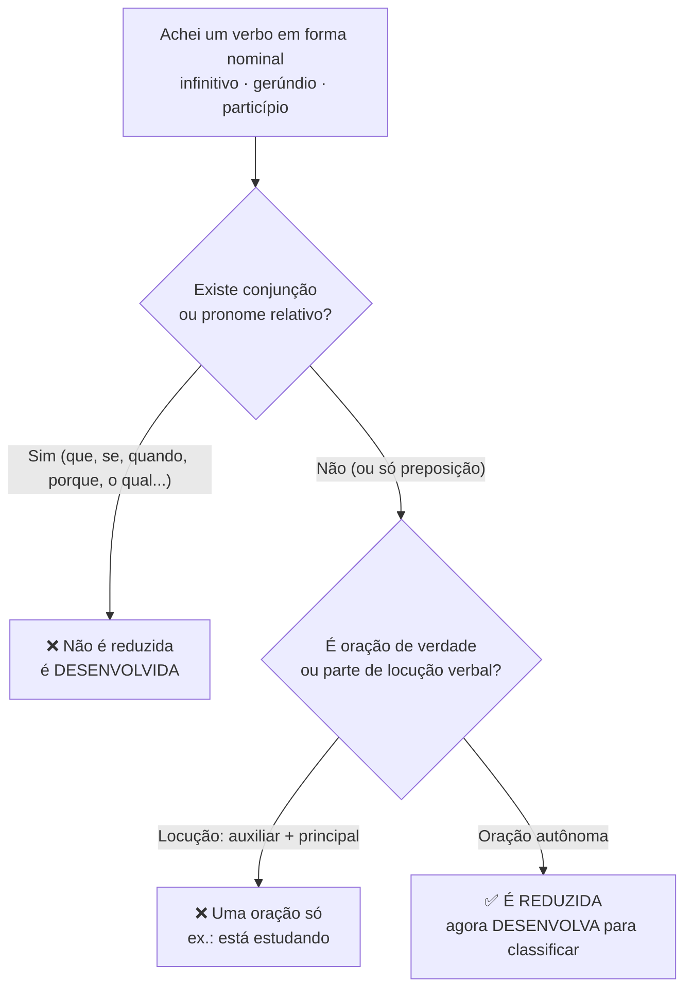
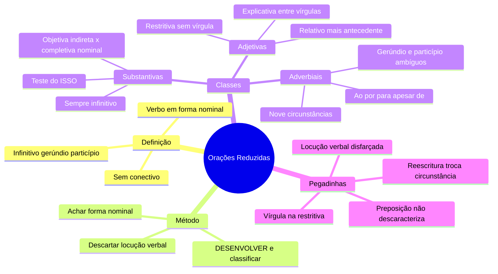

# 🪜 Orações Reduzidas — Sintaxe FGV

> [!abstract] TL;DR
> **Reduzida = oração subordinada SEM conectivo, com o verbo em forma nominal** (infinitivo, gerúndio ou particípio).
>
> Ela continua sendo substantiva, adjetiva ou adverbial — só perdeu a conjunção. Para descobrir **qual** delas é, você não olha para a forma nominal: você **DESENVOLVE** a oração, devolvendo o conectivo, e classifica pelo conectivo que couber.
>
> A FGV cobra isso quase sempre embutido em **pontuação** e em **reescritura de frases**.

---

## 📊 Incidência — o que a fonte realmente diz

> [!info] Base estatística disponível
> A apostila da Aula 07 informa: amostra de **198 questões**, banca **FGV**, nível superior, período **2020–2026**.
>
> - Assunto **"Relação de coordenação e subordinação das orações; pontuação"**: **4,5%** de incidência → classificação da própria apostila: **importância MÉDIA** (faixa de 2% a 4,9%).
> - Subassuntos tabulados: **Pontuação — 66,7%** do assunto · **Orações Subordinadas Substantivas — 11,1%** do assunto.

> [!warning] Limite honesto do dado
> A apostila **não isola** um percentual para "orações reduzidas". O que o dado permite concluir é operacional, não estatístico:
>
> 1. Dois terços do assunto viram **questão de vírgula** → estudar reduzida sem estudar a pontuação dela é estudar pela metade.
> 2. O único tipo de oração com percentual próprio é a **substantiva** → as **reduzidas de infinitivo com função substantiva** são o recorte de maior retorno.
>
> Não há base para afirmar percentual de cobrança das reduzidas em si.

---

## 🧠 Ideia central

Toda oração subordinada tem duas roupas possíveis:

| | **Desenvolvida** | **Reduzida** |
|---|---|---|
| **Conectivo** | tem (conjunção ou pronome relativo) | **não tem** |
| **Forma do verbo** | modo finito (indicativo/subjuntivo) | **forma nominal** (infinitivo, gerúndio, particípio) |
| **Exemplo** | É importante **que ressaltem** o valor das boas ações | É importante **ressaltar** o valor das boas ações |
| **Classe** | substantiva subjetiva | substantiva subjetiva **reduzida de infinitivo** |

> [!danger] A regra de ouro que decide tudo
> **Conjunção descaracteriza a reduzida. Preposição, NÃO.**
>
> - *"Não há dúvida **sobre sermos** persistentes"* → `sobre` é **preposição** → continua **reduzida** (completiva nominal de infinitivo).
> - *"O projeto visa **a resgatar** valores humanos"* → `a` é **preposição** exigida por *visar* → continua **reduzida** (objetiva indireta).
> - *"É importante **que ressaltem**..."* → `que` é **conjunção integrante** → é **desenvolvida**, não reduzida.
>
> A FGV monta alternativa dizendo que a oração "não é reduzida porque tem preposição". É falso.

---

## 🎯 Método de reconhecimento — 3 passos

> [!tip] O caminho rápido
> **1. ACHE** a forma nominal (terminação `-r` / `-ndo` / `-do`).
> **2. ISOLE** — confirme que é oração (tem sujeito próprio ou complemento próprio) e não locução verbal.
> **3. DESENVOLVA** — reescreva com conectivo. **O conectivo que couber revela a classe.**

| Ao desenvolver, coube... | Então a reduzida é... |
|---|---|
| **que / se** (conjunção integrante) e cabe trocar tudo por **ISSO** | **Substantiva** |
| **que / o qual / cujo** (pronome relativo, referido a um substantivo anterior) | **Adjetiva** |
| **quando, porque, se, embora, para que, à medida que...** | **Adverbial** (a circunstância dá o subtipo) |

---

## 🧩 Substantivas reduzidas — o recorte de maior retorno

Sempre de **infinitivo**. O teste continua sendo o **teste do ISSO**.

| Exemplo (apostila) | Desenvolvimento | Classificação |
|---|---|---|
| É importante **ressaltar o valor das boas ações** | É importante **que se ressalte**... → *É importante **isto*** | subjetiva reduzida de infinitivo |
| Todos afirmam **haver solução para a corrupção** | Todos afirmam **que há**... → *Todos afirmam **isto*** | objetiva direta reduzida de infinitivo |
| O projeto visa **a resgatar valores humanos** | O projeto visa **a que resgate**... → *O projeto visa **a isso*** | objetiva indireta reduzida de infinitivo |
| Não há dúvida **sobre sermos persistentes** | Não há dúvida **de que sejamos**... → *Não há dúvida **sobre isso*** | completiva nominal reduzida de infinitivo |
| Os alunos tinham um grande objetivo: **passar no concurso** | ...objetivo: **que passassem**... | apositiva reduzida de infinitivo |

> [!warning] Objetiva indireta × completiva nominal — o par que a FGV adora
> A preposição existe nos dois. O que decide é **quem** pede a preposição:
> - pediu um **VERBO** (*visar a*, *insistir em*, *lembrar-se de*) → **objetiva indireta**;
> - pediu um **NOME** (*dúvida de*, *impressão de*, *ordem de*, *certeza de*) → **completiva nominal**.

---

## 🎀 Adjetivas reduzidas

Aparecem nas **três** formas nominais. Desenvolvem-se com **pronome relativo**.

| Exemplo (apostila) | Desenvolvimento |
|---|---|
| Vi o homem **correr**. | Vi o homem **que corria**. *(infinitivo)* |
| O homem, **correndo rapidamente**, fugiu do local. | O homem, **que corria rapidamente**, fugiu do local. *(gerúndio)* |
| ...só achei um projeto de lei **vetado pelo Governador**. | ...um projeto de lei **que foi vetado** pelo Governador. *(particípio)* |

> [!danger] Vírgula nas adjetivas — vale igual na reduzida
> **Restritiva → SEM vírgula** (limita o ser: *"Deve-se punir o administrador que desvia dinheiro público"*).
> **Explicativa → ENTRE vírgulas** (comenta o todo: *"A Lei Maria da Penha atingirá as mulheres brasileiras, que merecem tratamento digno"*).
>
> Reduzir a oração **não** muda essa regra. Colocar vírgula numa restritiva reduzida altera o sentido — e é exatamente esse o erro que a banca oferece.

---

## 🌐 Adverbiais reduzidas — tabela de marcas

> [!info] Origem deste bloco
> A apostila lista as nove circunstâncias adverbiais e traz o exemplo *"**Ao parir meu filho**, senti uma mistura de dor e alegria"*, mas **não tabula** as marcas das reduzidas. A tabela abaixo é a sistematização gramatical padrão do subtema — use-a como método, não como citação da fonte.

| Marca | Circunstância mais provável | Exemplo · desenvolvimento |
|---|---|---|
| **Ao** + infinitivo | **temporal** (às vezes causal) | *Ao chegar, avisou* → *Quando chegou, avisou* |
| **Por** + infinitivo | **causal** | *Por ter estudado, passou* → *Porque estudou, passou* |
| **Para / a fim de** + infinitivo | **final** | *Estudou para passar* → *...para que passasse* |
| **Apesar de / mesmo** + inf./ger. | **concessiva** | *Apesar de chover, saiu* → *Embora chovesse, saiu* |
| **A** + infinitivo | **condicional** | *A continuar assim, perderemos* → *Se continuarmos assim...* |
| **Sem** + infinitivo | **condicional negativa** | *Sem estudar, não passa* → *Se não estudar, não passa* |
| **Gerúndio** solto | tempo · causa · condição · concessão · modo | *Estudando, você passa* → *Se estudar, você passa* |
| **Particípio** absoluto | **temporal** (mais comum) · causal · condicional | *Terminada a prova, saíram* → *Quando a prova terminou, saíram* |

> [!danger] O gerúndio e o particípio são AMBÍGUOS por natureza
> É aí que mora a questão. *"Estudando, você passa"* pode ser **condicional** (*se estudar*) ou **temporal** (*quando estuda*). Quem decide **não é a forma verbal — é o contexto**. A FGV escolhe justamente os casos em que a reescritura muda o sentido.

---

## ⚖️ Confundir com o quê — os três pares críticos

> [!example] Par 1 — Locução verbal × reduzida de gerúndio
> *"Ele **está estudando** para o concurso."* → `estar` é **auxiliar**: uma oração só, **não há reduzida**.
> *"**Estudando** para o concurso, ele melhorou."* → gerúndio com valor próprio: **reduzida adverbial**.
> **Discriminador:** se o verbo em forma nominal está preso a um auxiliar (ser, estar, ter, haver, ir, vir + forma nominal), é **locução**, e período simples.

> [!example] Par 2 — Particípio adjetivo × reduzida de particípio
> *"Comprei um carro **usado**."* → `usado` é **qualidade** do carro → **adjetivo / adjunto adnominal**.
> *"Comprei um carro **usado por um colecionador**."* → tem **agente da passiva** e desenvolve em *que foi usado por...* → **reduzida adjetiva**.
> **Discriminador:** se o particípio carrega **agente, complemento ou circunstância** e aceita desenvolvimento com relativo + verbo, é **oração**.

> [!example] Par 3 — Gerúndio adjetivo × gerúndio adverbial
> *"O homem, **correndo rapidamente**, fugiu."* → modifica **o homem** (substantivo) → **adjetiva**.
> *"**Correndo rapidamente**, ele fugiu."* → modifica **o modo de fugir** (o verbo) → **adverbial modal**.
> **Discriminador:** pergunte se o gerúndio responde *"qual homem?"* (adjetiva) ou *"fugiu como/quando/por quê?"* (adverbial).

---

## 🎣 Pegadinhas da FGV

> [!danger] As seis armadilhas
> 1. **"Não é reduzida porque tem preposição."** ❌ Só **conjunção** descaracteriza. Preposição não.
> 2. **Reescritura que troca a circunstância.** A alternativa desenvolve *"Por ter chovido, o jogo foi adiado"* como *"Quando choveu, o jogo foi adiado"* — trocou **causa por tempo**. Muda o sentido → item errado.
> 3. **Vírgula na adjetiva restritiva reduzida.** Inserir vírgula transforma restritiva em explicativa e **altera o sentido**, mesmo que a frase continue "soando bem".
> 4. **Vírgula separando substantiva reduzida da principal.** Subjetiva, objetiva direta, objetiva indireta, completiva nominal e predicativa **não** se separam por vírgula — nem desenvolvidas, nem reduzidas. **Exceção: a apositiva**, que aceita vírgula, dois-pontos ou travessão.
> 5. **Chamar locução verbal de oração reduzida** (ou dizer que o período é composto quando é simples).
> 6. **Classificar pela forma nominal.** "Gerúndio = adverbial" é falso — existe adjetiva de gerúndio. A forma nominal diz **como** reduziu, nunca **qual** é a classe.

---

## ✍️ Exemplo resolvido — passo a passo

> [!example] Período com três reduzidas de classes diferentes
> *"**Terminada a inspeção**, o delegado, **querendo evitar vazamentos**, determinou **lacrar a sala**."*
>
> **Passo 1 — achar as formas nominais:** `Terminada` (particípio) · `querendo` (gerúndio) · `lacrar` (infinitivo).
>
> **Passo 2 — conferir se há conectivo:** nenhuma tem conjunção nem pronome relativo → as três são **reduzidas**. Nenhuma está presa a auxiliar → não são locuções.
>
> **Passo 3 — desenvolver, uma a uma:**
>
> | Trecho | Desenvolvimento | Classificação |
> |---|---|---|
> | Terminada a inspeção | **Quando** a inspeção terminou | adverbial **temporal** reduzida de **particípio** |
> | querendo evitar vazamentos | o delegado, **que queria** evitar vazamentos | adjetiva **explicativa** reduzida de **gerúndio** |
> | lacrar a sala | determinou **que se lacrasse** a sala → *determinou **isso*** | substantiva **objetiva direta** reduzida de **infinitivo** |
>
> **Passo 4 — checar a pontuação:** o particípio absoluto está deslocado → vírgula **obrigatória**. A adjetiva é explicativa (o delegado é único e determinado) → **entre vírgulas**. A objetiva direta é complemento do verbo → **nunca** se separa por vírgula. ✅ A pontuação do período está correta.

---

## ✅ Checklist de resolução

> [!success] Seis passos, nessa ordem
> 1. Localize a **forma nominal** (`-r`, `-ndo`, `-do`).
> 2. Descarte **locução verbal** (auxiliar + forma nominal = uma oração só).
> 3. Confirme que **não há conjunção nem pronome relativo** (preposição pode haver).
> 4. **DESENVOLVA** com conectivo — nunca classifique pela forma nominal.
> 5. Classifique pelo conectivo: `que/se + ISSO` → substantiva · relativo + antecedente → adjetiva · circunstância → adverbial.
> 6. Só então resolva a **vírgula**, e confira se a reescritura da alternativa **manteve a circunstância original**.

---

## 🔑 Frase-âncora

> [!quote] Grave isto
> **"A forma nominal diz COMO reduziu. Só o conectivo que você devolve diz O QUE ela é."**
>
> E o par: **"Conjunção descaracteriza. Preposição, não."**

---

## 🔁 Revisão relâmpago

| Pilar | Em uma frase |
|---|---|
| 🪜 **Definição** | Subordinada sem conectivo, verbo em forma nominal |
| 🔓 **Método** | Desenvolver é obrigatório; classificar pela forma nominal é erro |
| 🚫 **Falso critério** | Preposição não impede a reduzida — só conjunção impede |
| ✂️ **Vírgula** | Substantivas não se separam (exceto apositiva); adjetiva só a explicativa |
| 🎣 **Armadilha-mãe** | Reescritura que troca causa por tempo (ou condição por concessão) |
| 🧱 **Falso positivo** | Locução verbal não é oração reduzida |

---

## ❓ Questão de recuperação ativa

> [!question] Sem gabarito — responda antes de conferir na fonte
> No período *"**Ao serem notificados**, os servidores, **advertidos pela corregedoria**, decidiram **recorrer da decisão**"*:
>
> 1. Classifique cada uma das três reduzidas e indique a forma nominal de cada uma.
> 2. Desenvolva as três, devolvendo o conectivo adequado.
> 3. A vírgula depois de *"servidores"* é obrigatória, facultativa ou proibida? Justifique **pela função sintática**, não pelo ritmo da frase.
> 4. Se a segunda reduzida fosse reescrita como *"que foram advertidos pela corregedoria"*, o sentido do período mudaria? E se perdesse as vírgulas?

---

## 🗺️ Mapa

