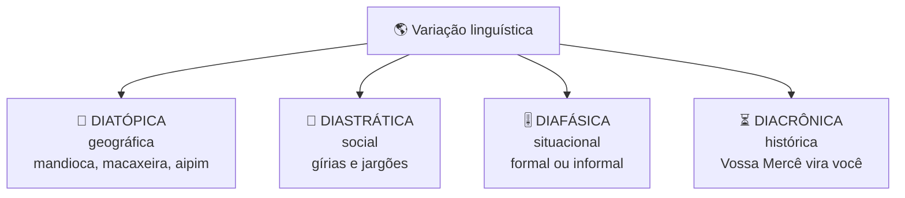
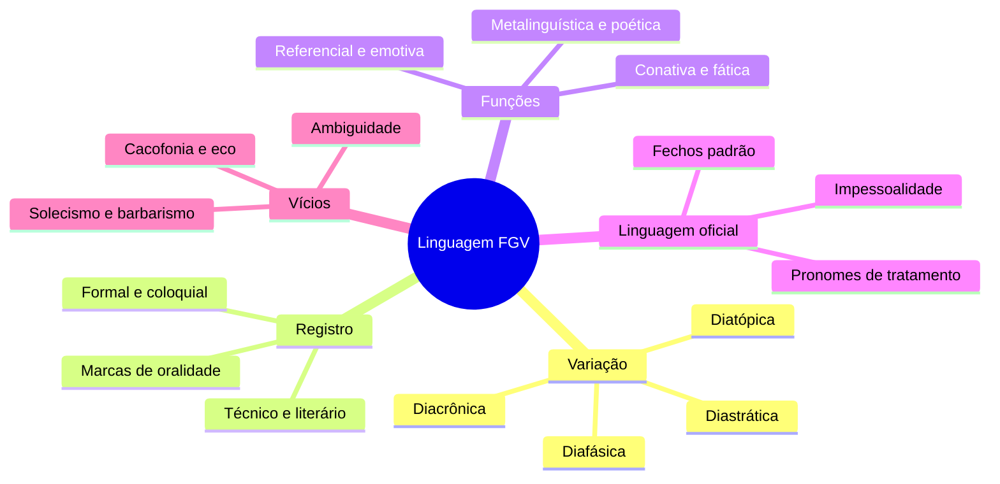

# 🗣️ Linguagem, variação e registro na banca FGV

> [!abstract] TL;DR — não existe variedade errada
> A FGV usa "linguagem" para avaliar sensibilidade ao **registro** e à **adequação**.
>
> O princípio que a banca endossa: **não existe variedade errada, existe inadequação ao contexto**. Alternativa que trata fala popular como "erro" ou "corrupção da língua" costuma ser a incorreta.

> [!info] De onde veio
> Fonte **"Linguagem: variação, registro e funções da linguagem"** do notebook *Português para Concursos — Banca FGV*.

---

## 🌎 Os quatro tipos de variação

> [!tip] Norma-padrão × norma culta
> A **norma-padrão** é o modelo idealizado descrito na gramática normativa. A **norma culta** é o uso **real** dos falantes escolarizados. Nem sempre coincidem — e a FGV sabe disso.

---

## 🎚️ Níveis e marcas de registro

| Registro | Marcas |
|---|---|
| 🎩 **Formal** | vocabulário preciso, período mais longo, colocação conforme a norma, impessoalidade |
| 👕 **Informal/coloquial** | contração (*tá, pra*), gíria, frases curtas, *a gente*, marcadores (*né, aí, tipo*), pronome oblíquo iniciando frase |
| 🔬 **Técnico/científico** | termos monossêmicos, denotação, voz passiva, dados |
| 🎨 **Literário** | conotação, figuras, ritmo, subjetividade |
| 📣 **Publicitário** | função conativa, imperativo, trocadilhos, intertextualidade |

> [!danger] Marcas de oralidade em crônica NÃO são erro
> Reticências, interjeições, *a gente*, redundância — numa crônica são **recurso estilístico** de aproximação com o leitor. Alternativas que chamam isso de "desvio a ser corrigido" costumam ser as erradas.

---

## 🎭 As seis funções da linguagem

| Função | Foco | Marcas típicas |
|---|---|---|
| 🌍 **Referencial** | referente | 3ª pessoa, objetividade — notícia, texto científico |
| ❤️ **Emotiva** | emissor | 1ª pessoa, interjeições, adjetivos avaliativos |
| 📣 **Conativa** | receptor | imperativo, vocativo, 2ª pessoa — propaganda |
| 📡 **Fática** | canal | *alô, entende?, né?* |
| 🔡 **Metalinguística** | código | dicionário, gramática, poema sobre poesia |
| ✨ **Poética** | mensagem/forma | rimas, aliterações, ordem inversa — slogans |

> [!warning] Quase sempre há mais de uma
> A FGV pede a **predominante**, definida pela **finalidade** do texto.

---

## 🏛️ Linguagem oficial (muito cobrado em concursos)

> [!tip] Os atributos
> Impessoalidade · clareza · concisão · formalidade · uniformidade · norma-padrão.
>
> **Evite**: adjetivação excessiva, jargão burocrático arcaico, ambiguidade, 1ª pessoa do singular em documento institucional.

| Pronome de tratamento | Para quem |
|---|---|
| **Vossa Excelência** | autoridades de alto escalão dos três poderes |
| **Vossa Senhoria** | demais autoridades e particulares |
| **Vossa Magnificência** | reitores |

> [!danger] Concordância com pronome de tratamento
> **Sempre em 3ª pessoa**: *"Vossa Excelência enviou **seu** parecer"* — nunca *"vosso"*.
>
> Fecho: **Respeitosamente** para superiores; **Atenciosamente** para os demais.

---

## 🚫 Vícios de linguagem

| Vício | O que é |
|---|---|
| **Ambiguidade / anfibologia** | duplo sentido involuntário |
| **Pleonasmo vicioso** | *subir para cima, elo de ligação* |
| **Cacofonia** | som desagradável na junção (*por cada, boca dela*) |
| **Barbarismo** | erro de forma, grafia ou pronúncia (*mendingo*) |
| **Solecismo** | erro de sintaxe (*Fazem dois anos*) |
| **Eco** | repetição de terminações próximas |
| **Obscuridade** | período longo demais que impede a compreensão |
| **Colisão** | repetição de consoantes que trava a leitura |

---

## 📝 Questões comentadas

> [!example] Cinco no estilo da banca
> **1.** *"Tá tudo dominado, meu chapa."* → variação **diafásica/informal**: adequada à fala de personagem, inadequada a um ofício.
>
> **2.** *"Compre já! Não perca esta chance!"* → função **conativa** (imperativo dirigido ao receptor).
>
> **3.** *"Substantivo é a palavra que nomeia seres."* → função **metalinguística**.
>
> **4.** *"Vossa Excelência deve apresentar **vosso** relatório."* ❌ → **"seu relatório"** (3ª pessoa).
>
> **5.** Numa crônica, *a gente* e reticências são **recurso de aproximação**, não erro.

---

## 🎯 Como aplicar

> [!success] Checklist de resolução
> 1. Identifique o **gênero e o público** — o registro adequado depende deles.
> 2. Para funções, pergunte **para onde aponta o foco**: emissor, receptor, referente, código, canal ou forma.
> 3. **Nunca** marque alternativa que trate variedade popular como erro de língua.
> 4. Em texto oficial, cheque impessoalidade, tratamento em 3ª pessoa e ausência de subjetividade.
> 5. Em vícios, **leia em voz alta** — cacofonia, eco e colisão se detectam pelo som.

---

## 🗺️ Mapa

---

## 📌 Cola rápida

| Pilar | Em uma frase |
|---|---|
| 🌎 **Variação** | Não há variedade errada, há inadequação ao contexto |
| 🎚️ **Registro** | Quem define é o gênero e o público, não o gosto |
| 🎭 **Função** | Descubra o foco da mensagem e a predominante aparece |
| 🏛️ **Tratamento** | Vossa Excelência pede sempre 3ª pessoa e *seu* |
| 👂 **Vício** | Leia em voz alta: cacofonia e eco se ouvem antes de se ver |
