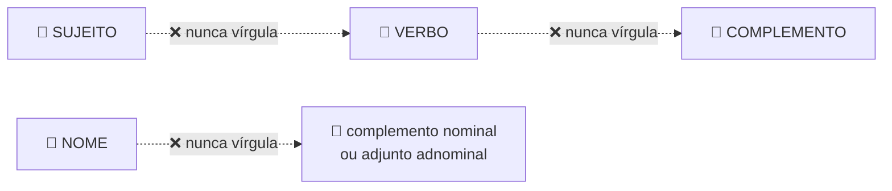
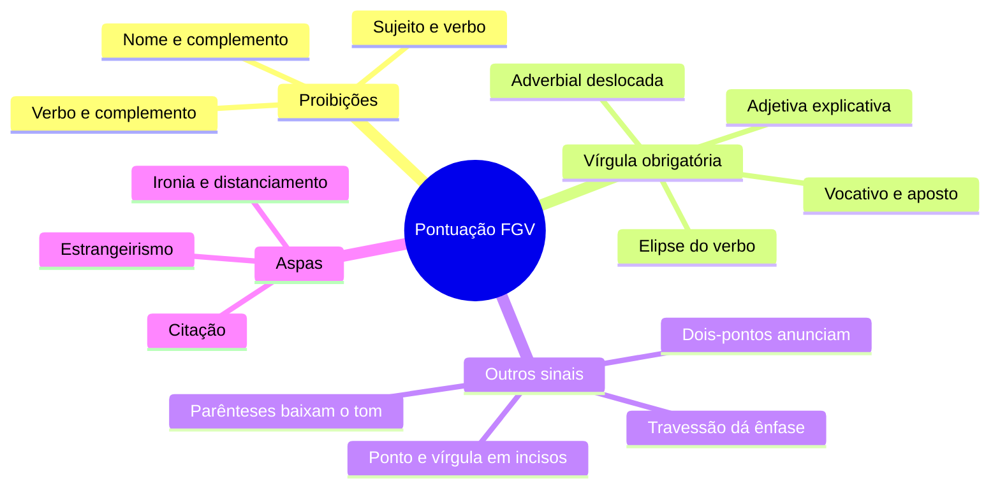

# ❕ Pontuação na banca FGV

> [!abstract] TL;DR — pontuação é sintaxe aplicada
> A FGV **não** pergunta *"onde falta vírgula"*. Ela pergunta a **justificativa**: *"a vírgula em X se justifica por…"*, *"a retirada das vírgulas alteraria o sentido porque…"*.
>
> Sem análise sintática, não se acerta.

> [!info] De onde veio
> Fonte **"Pontuação"** do notebook *Português para Concursos — Banca FGV*.

---

## 🚫 As três proibições absolutas

Na ordem direta, **nunca** separe:

> [!danger] A pegadinha número um da banca
> Um **sujeito muito extenso** seguido de vírgula.
> ❌ *"Os alunos aprovados no concurso do ano passado**,** receberão o certificado"*.
> Por mais longo que seja o sujeito, a vírgula é proibida.

---

## ✅ Usos obrigatórios da vírgula

| Situação | Exemplo |
|---|---|
| Enumeração | *estudou, revisou e passou* |
| **Vocativo** | *"Senhores, atenção."* |
| **Aposto explicativo** | *"Machado, autor de Dom Casmurro, morreu em 1908."* |
| **Oração adjetiva explicativa** | sem as vírgulas ela vira restritiva e **muda o sentido** |
| **Elipse do verbo** (zeugma) | *"Uns colhiam frutos; outros, flores."* |
| Expressões e conectivos intercalados | *isto é, ou seja, por exemplo, portanto, no entanto, aliás* |
| Coordenadas assindéticas | *"Chegou, sentou, começou."* |
| Antes de adversativa, conclusiva e explicativa | *"Chegou tarde, mas trouxe a solução."* |
| Antes de **e** | quando os sujeitos são diferentes, há valor adversativo ou polissíndeto |
| **Adjunto adverbial deslocado** de certa extensão | *"Na manhã seguinte, o ministro renunciou."* (curto → facultativa) |
| **Adverbial anteposta** | *"Se chover, ficaremos."* (posposta, em geral sem vírgula) |
| Data e local | *"Rio de Janeiro, 18 de agosto de 2026."* |

---

## 🎛️ Os outros sinais — e o que cada um comunica

> [!tip] O espectro do isolamento
> **Vírgula** = isolamento **neutro**.
> **Parênteses** = baixam o tom — informação acessória, quase um sussurro.
> **Travessão** = levanta o tom — destaque, ênfase dramática.
>
> Essa gradação é exatamente o que a FGV cobra em questões de substituição de sinal.

**Ponto e vírgula** — separa coordenadas extensas que já têm vírgulas internas; separa **incisos** de leis e editais (muito cobrado em concurso); marca contraste paralelo. Onde cabe ponto e vírgula, em geral caberia ponto — a escolha indica que o autor quer as ideias **mais unidas**.

**Dois-pontos** — anunciam enumeração, citação, explicação, esclarecimento ou consequência. Podem ser trocados por travessão, ponto e vírgula ou conectivo explicativo.

**Travessão** — (a) fala do personagem; (b) isola aposto ou comentário com **destaque**; (c) simples, no fim do período, introduz conclusão, síntese ou suspense.

**Parênteses** — informação acessória, comentário, referência, sigla. O que está entre parênteses **pode ser retirado** sem prejuízo sintático. Se a informação é essencial à argumentação, parênteses são má escolha.

**Aspas** — citação literal · estrangeirismo, neologismo ou gíria · **ironia e distanciamento** · títulos de obras.

> [!warning] Aspas de ironia
> *"O **'especialista'** errou tudo."* → as aspas sinalizam que o enunciador **não assume** o termo como próprio. É a função mais cobrada pela banca.

**Reticências** — suspensão, hesitação, continuidade, supressão em citação.
**Exclamação** — emoção, ênfase, apelo (função emotiva ou conativa).
**Interrogação** — pergunta direta; a **retórica** não espera resposta e funciona como recurso argumentativo.
**Colchetes** — intervenção do autor dentro de citação alheia.

---

## 📝 Questões comentadas

> [!example] Seis no estilo da banca
> **1.** *"Os candidatos, que estudaram, foram aprovados."* → **todos** estudaram e passaram. Sem vírgulas: **só** os que estudaram.
>
> **2.** *"O relatório que o ministro apresentou ontem à comissão, foi rejeitado."* ❌ → vírgula separando **sujeito de verbo**. Remova.
>
> **3.** *"Faltou o essencial: coragem."* → dois-pontos anunciam **esclarecimento**; poderiam virar travessão.
>
> **4.** *"Ele é um 'gênio' das finanças."* → aspas de **ironia** e distanciamento.
>
> **5.** *"Uns queriam ficar; outros, partir."* → a vírgula marca a **elipse do verbo**.
>
> **6.** *"Chegou tarde, mas trouxe a solução."* → vírgula **obrigatória** antes de adversativa.

---

## 🎯 Como aplicar

> [!success] Checklist de resolução
> 1. Antes de pontuar, identifique **sujeito, verbo e complemento** — na ordem direta não há vírgula entre eles.
> 2. Pergunte se o termo está **deslocado** ou **intercalado**; se sim, isole.
> 3. Em adjetivas, decida antes se é **restritiva ou explicativa** — a vírgula segue o sentido.
> 4. Para substituição de sinais, pergunte o **efeito**: neutro (vírgula), discreto (parênteses), enfático (travessão).
> 5. Em aspas, teste se há **citação, destaque ou ironia**.

---

## 🗺️ Mapa

---

## 📌 Cola rápida

| Pilar | Em uma frase |
|---|---|
| 🚫 **Ordem direta** | Sujeito, verbo e complemento nunca se separam por vírgula |
| ✂️ **Adjetiva** | Com vírgula comenta o todo; sem vírgula delimita um subgrupo |
| 🎚️ **Gradação** | Parênteses sussurram, vírgula é neutra, travessão grita |
| 💬 **Aspas** | Podem ser citação, destaque ou ironia — o contexto decide |
| 📜 **Ponto e vírgula** | Separa itens de incisos e coordenadas que já têm vírgula |
