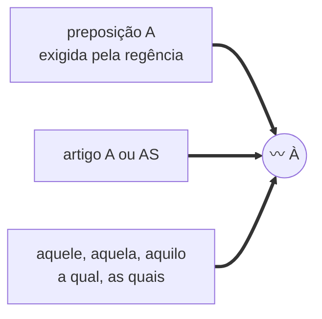
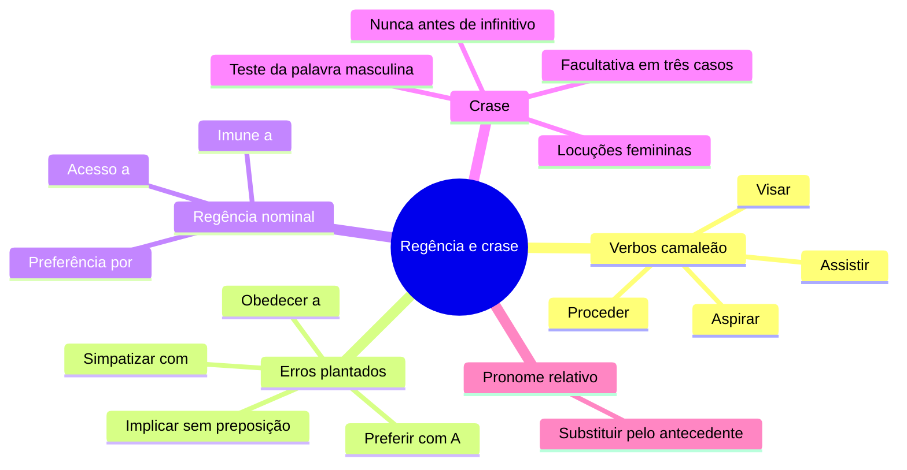

# 🧲 Regência e crase na banca FGV

> [!abstract] TL;DR — crase é consequência de regência
> Quem sabe **regência** acerta **crase**, acerta **pronome relativo** e acerta **reescrita**. Os três dependem da mesma pergunta: *qual preposição esse verbo (ou nome) exige?*
>
> Descubra a **transitividade** antes de decidir qualquer outra coisa.

> [!info] De onde veio
> Fonte **"Regência verbal e nominal (e crase)"** do notebook *Português para Concursos — Banca FGV*.

---

## 🔀 Os verbos que mudam de regência conforme o sentido

| Verbo | Sentido A | Sentido B |
|---|---|---|
| **assistir** | ver, presenciar → VTI com **a** (*assisti **ao** filme*) | ajudar → VTD (*o médico assistiu **o** paciente*); caber/pertencer → **a**; morar → **em** |
| **visar** | mirar / dar visto → VTD (*visou **o** alvo*) | ter por objetivo → VTI com **a** (*visa **ao** cargo*) |
| **aspirar** | sorver, inalar → VTD (*aspirou **o** ar*) | almejar → VTI com **a** (*aspira **ao** cargo*) |
| **proceder** | ter fundamento → VI (*o argumento não procede*) | originar-se → **de**; dar início → **a** (*procedeu **à** leitura*) |
| **esquecer / lembrar** | sem pronome → VTD (*esqueci o nome*) | com pronome → **de** (*esqueci-**me do** nome*) |
| **querer** | desejar → VTD | estimar → VTI com **a** (*quero muito **a** meus pais*) |

> [!danger] Os erros mais plantados
> - **implicar** (acarretar) é **VTD**, sem preposição: *"implicou **aumento** de custos"* — nunca *"implicou **em**"*.
> - **preferir** é VTDI: prefere-se algo **a** outro — sem *mais*, *do que* ou *antes*: *"Prefiro teatro **a** cinema"*.
> - **obedecer / desobedecer** → VTI com **a**.
> - **chegar / ir** pedem **a**, não *em*: *"Chegou **ao** trabalho"*.
> - **namorar** é VTD: *"namora Maria"*, não *"com Maria"*.
> - **simpatizar / antipatizar** → **com**, e **não são pronominais**: nunca *"me simpatizo"*.
> - **custar** (ser difícil) tem a oração como sujeito: *"**Custou-me** acreditar"*.

> [!example] Mais regências que caem
> **informar, avisar, certificar, notificar** → VTDI (algo **a** alguém, ou alguém **de** algo) · **pagar / perdoar** → algo (direto) **a** alguém (indireto) · **responder a** · **precisar, gostar, depender, discordar, consistir** → **de**.

**Regência nominal essencial**: acesso **a** · aversão **a/por** · apto **a** · ávido **de/por** · capacidade **de/para** · compatível **com** · dúvida **sobre/em** · empenho **em** · fiel **a** · horror **a** · imune **a** · incompatível **com** · necessidade **de** · obediência **a** · preferência **por** · propenso **a** · respeito **a/com/por** · útil **a**.

---

## 〰️ Crase — a consequência

> [!tip] O teste infalível
> Troque a palavra feminina por uma **masculina** equivalente.
> Apareceu **AO** → tem crase. Apareceu só **A** ou **O** → não tem.
>
> *"Assisti **à** peça"* → *"Assisti **ao** filme"* ✅

| ✅ HÁ crase | ❌ NÃO há crase |
|---|---|
| palavra feminina que admite artigo, com termo que exige **a** | palavra **masculina** (salvo *à moda de*) |
| locuções femininas: *à noite, às pressas, à vontade, à toa, à medida que, à espera de* | antes de **verbo no infinitivo** |
| horas determinadas: *às 14h* | pronomes que não admitem artigo: *ela, esta, essa, você, alguém, quem, cuja* |
| *àquele, àquela, àquilo* | cidades sem artigo: *Vou **a** Brasília* |
| *à moda de / à maneira de*, mesmo subentendida: *bife à milanesa* | palavras repetidas: *cara a cara, dia a dia* |
| | numeral cardinal: *de 10 a 20 páginas* |
| | *casa* (sem especificação) e *terra* (oposto a bordo) |

> [!warning] Crase facultativa
> Antes de **nome próprio feminino** (*a/à Maria*), de **possessivo feminino** (*a/à minha amiga*) e após **até** (*até a/à porta*).

> [!example] O teste da volta
> *"Volto **da** Bahia"* → *"Vou **à** Bahia"* (tem crase).
> *"Volto **de** Brasília"* → *"Vou **a** Brasília"* (não tem).
> E o determinante cria o artigo: *"Vou **a** Roma"* × *"Vou **à** Roma de Fellini"*.

---

## 🎓 Regência + pronome relativo

> [!tip] Substitua o relativo pelo antecedente
> Monte a frase completa e veja a preposição que o verbo exige — ela vai **antes** do relativo.
>
> *O filme **a que** assisti* (assistir a) · *O cargo **a que** aspiro* · *O livro **de que** preciso* · *A pessoa **em que** confio* · *A meta **a que** visamos*.

---

## 📝 Questões comentadas

> [!example] Seis no estilo da banca
> **1.** *"A reforma implicará **em** aumento."* ❌ → *"implicará aumento"*.
>
> **2.** *"Prefiro estudar **do que** trabalhar."* ❌ → *"Prefiro estudar **a** trabalhar"*.
>
> **3.** *"Assistimos **o** jogo."* ❌ (sentido de ver) → *"Assistimos **ao** jogo"*.
>
> **4.** *"Ele obedeceu **as** ordens."* ❌ → *"obedeceu **às** ordens"* (com crase).
>
> **5.** *"Cheguei **em** casa."* → a forma padrão é *"Cheguei **a** casa"*; *"às três horas"* está certo.
>
> **6.** *"Vou **a** Roma"* × *"Vou **à** Roma de Fellini"* → o determinante faz surgir o artigo.

---

## 🎯 Como aplicar

> [!success] Checklist de resolução
> 1. Descubra a **transitividade** antes de decidir preposição, crase ou relativo.
> 2. Aplique o **teste da troca por palavra masculina** para crase.
> 3. Para relativos, **substitua pelo antecedente** e monte a frase completa.
> 4. Lembre: *assistir, aspirar, visar, proceder* mudam de regência com o sentido — **leia o contexto**.
> 5. Em reescrita, verifique se a nova estrutura exige **outra preposição**.

---

## 🗺️ Mapa

---

## 📌 Cola rápida

| Pilar | Em uma frase |
|---|---|
| 🧭 **Transitividade primeiro** | Sem ela não se decide preposição, crase nem relativo |
| 🔀 **Verbo camaleão** | *Assistir, visar, aspirar, proceder* mudam de regência com o sentido |
| 〰️ **Teste da crase** | Troque por masculino: apareceu *ao*, tem crase |
| 🚫 **Nunca crase** | Antes de masculino, infinitivo, pronome sem artigo e palavra repetida |
| 🎓 **Relativo** | Substitua pelo antecedente e a preposição aparece sozinha |
