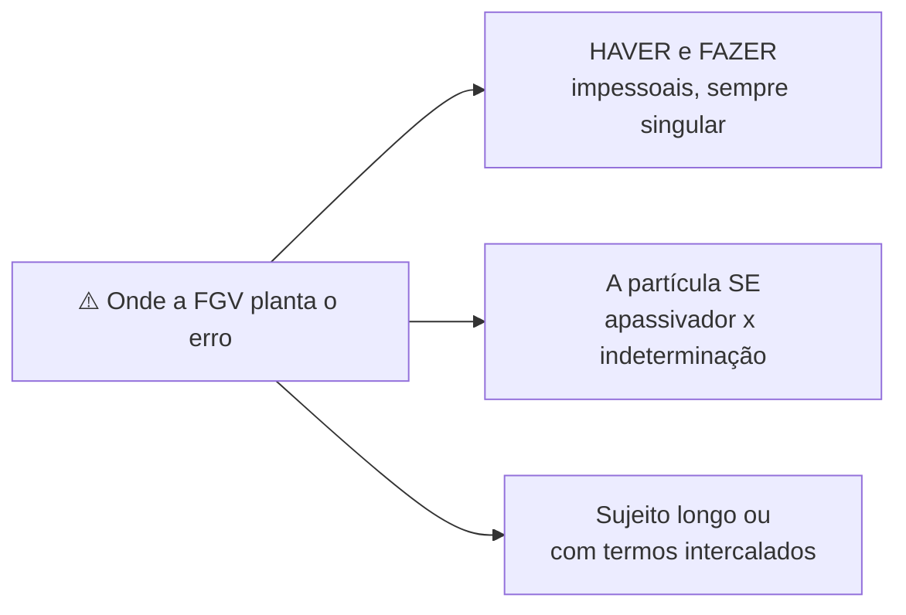
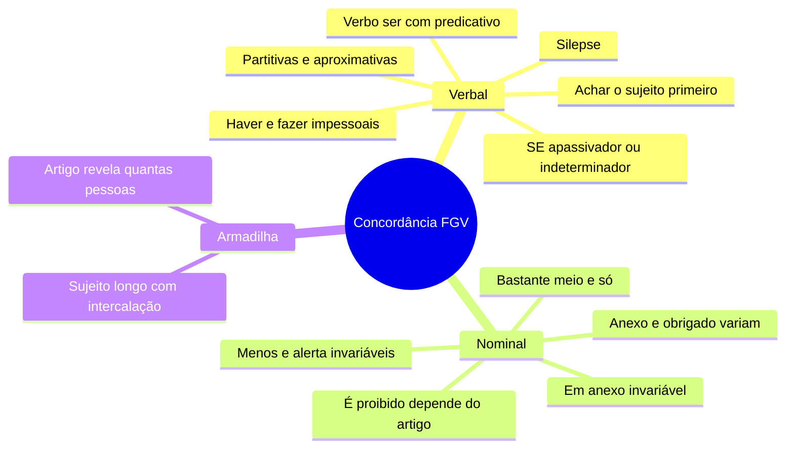

# ⚖️ Concordância verbal e nominal na banca FGV

> [!abstract] TL;DR — o erro está longe do verbo
> A FGV testa concordância dentro de **períodos longos**, com sujeito deslocado, oração intercalada ou voz passiva sintética.
>
> O trabalho todo é **achar o sujeito**. Ache o sujeito e a questão se resolve sozinha.

> [!info] De onde veio
> Fonte **"Concordância verbal e nominal"** do notebook *Português para Concursos — Banca FGV*.

---

## 🎯 Os três grandes geradores de erro

> [!danger] Haver e fazer são impessoais
> *"**Havia** dez candidatos"* · *"**Faz** cinco anos"* · *"**Deve haver** problemas"* (nunca *devem haver*).
>
> Com **ter** ou **existir**, a concordância é normal: *"**Existiam** dez candidatos"*.

> [!danger] A partícula SE
> Com **VTD** → **apassivador**, e o verbo concorda com o sujeito paciente: *"**Vendem-se** casas"*, *"**Alugaram-se** as salas"*.
> Com **VTI, VI ou VL** → **índice de indeterminação**, verbo no **singular**: *"**Precisa-se** de funcionários"*, *"**Trata-se** de questões complexas"*.

---

## 👤 Concordância verbal — os casos que caem

| Caso | Regra |
|---|---|
| Sujeito composto **anteposto** | plural |
| Sujeito composto **posposto** | plural **ou** com o mais próximo |
| Pessoas diferentes | prevalece a 1ª sobre a 2ª e a 3ª (*eu e ele iremos*) |
| **Partitivas** (*a maioria de, grande parte de, metade de*) | singular **ou** plural — as duas valem |
| **Aproximativas** (*cerca de, mais de, menos de*) | concordam com o numeral (*mais de **um** candidato **se inscreveu***) |
| **Um dos que** | o padrão pede **plural** (*foi um dos que mais **colaboraram***) |
| **que × quem** | *que* concorda com o antecedente (*fui eu **que paguei***); *quem* vai à 3ª do singular (*fui eu quem **pagou***) |
| **Verbo SER** | concorda com o **predicativo** quando o sujeito é pronome neutro, quantidade ou coisa (*Tudo **são** flores*; *Três quilos **é** pouco*); datas e horas concordam com o numeral (*São 14 horas*) |
| **Coletivo** | singular (*A multidão **gritou***) |
| Nomes só no plural | sem artigo → singular (*Estados Unidos **é** grande*); com artigo → plural |

> [!tip] Silepse — a concordância com a ideia
> **De número**: *"A turma saiu; **estavam** eufóricos"*.
> **De gênero**: *"Vossa Excelência está **preocupado**"*.
> **De pessoa**: *"Os brasileiros **somos** otimistas"*.

---

## 🎨 Concordância nominal — os casos especiais

| Palavra | Como se comporta |
|---|---|
| **anexo, incluso, obrigado, mesmo, próprio, leso** | **variam** (*Seguem **anexas** as cópias*; ***Obrigada***, diz a mulher) |
| **em anexo** | locução **invariável** |
| **é proibido, é necessário, é bom, é permitido** | invariáveis **sem** determinante (*É proibido entrada*); variáveis **com** determinante (*É proibid**a a** entrada*) |
| **menos** e **alerta** | **sempre** invariáveis (nunca *menas*) |
| **bastante** | varia como pronome (*bastantes razões*); invariável como advérbio |
| **meio** | *meia dúzia* (numeral) × *meio cansada* (advérbio) |
| **só** | *sós* = sozinhos; invariável quando é *somente* |
| **possível** | concorda com o artigo do superlativo (*o mais rápido **possível*** / *os mais rápidos **possíveis***) |
| **tal qual** | *tal* concorda com o antecedente; *qual*, com o consequente |

> [!warning] Adjetivo e a posição
> **Anteposto** a vários substantivos → concorda com o **mais próximo** (*belas casas e prédios*).
> **Posposto** → concorda com o mais próximo **ou** vai ao plural masculino.

> [!warning] O artigo denuncia quantas pessoas são
> *"**o** diretor e **o** gerente"* → duas pessoas.
> *"**o** diretor e gerente"* → uma só. A FGV explora essa distinção.

---

## 📝 Questões comentadas

> [!example] Nove no estilo da banca
> **1.** *"**Fazem** dez anos."* ❌ → **Faz** dez anos.
> **2.** *"**Haviam** muitas dúvidas."* ❌ → **Havia** muitas dúvidas.
> **3.** *"**Devem haver** soluções."* ❌ → **Deve haver** soluções.
> **4.** *"**Aluga-se** apartamentos."* ❌ → **Alugam-se** apartamentos.
> **5.** *"**Tratam-se** de casos isolados."* ❌ → **Trata-se** de casos isolados.
> **6.** *"Seguem **anexo** os documentos."* ❌ → Seguem **anexos**.
> **7.** *"É **proibida a** entrada de pessoas não autorizadas."* ✅ — há determinante, o adjetivo varia.
> **8.** *"A maioria dos deputados **votou** contra."* ✅ — *votaram* também é aceito.
> **9.** *"Fui eu quem **resolveu** o problema."* ✅ — *"Fui eu que **resolvi**"* também.

---

## 🎯 Como aplicar

> [!success] Checklist de resolução
> 1. **Isole o sujeito** antes de olhar o verbo; ignore termos intercalados entre vírgulas.
> 2. Desconfie de **haver, fazer e SE** — os três maiores geradores de erro.
> 3. Em partitivas e aproximativas, lembre-se de que costuma haver **duas respostas aceitáveis**.
> 4. Em concordância nominal, verifique se há **determinante** antes de decidir se o adjetivo varia.
> 5. Cheque sempre a **posição do adjetivo** em relação aos substantivos coordenados.

---

## 🗺️ Mapa

---

## 📌 Cola rápida

| Pilar | Em uma frase |
|---|---|
| 👤 **Ache o sujeito** | Metade das questões morre aqui |
| 🚫 **Haver e fazer** | Impessoais: singular sempre, inclusive no auxiliar |
| 🔎 **SE** | VTD apassiva e concorda; VTI indetermina e fica no singular |
| 📎 **Anexo** | É adjetivo e varia; *em anexo* é locução e não varia |
| 🚪 **É proibida a entrada** | Com determinante o adjetivo varia; sem ele, fica invariável |
