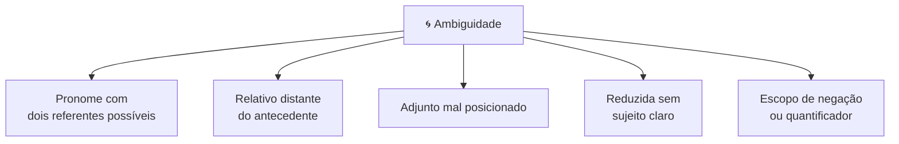
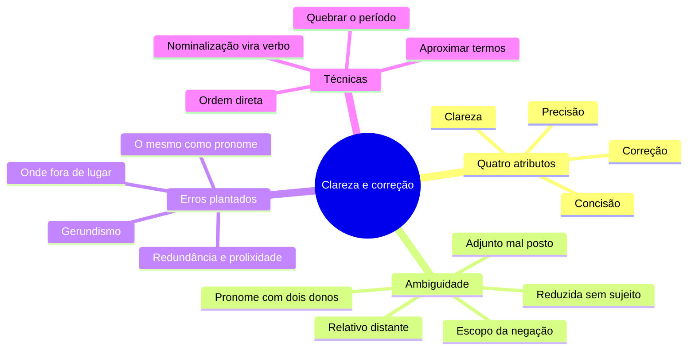

# 🔍 Clareza e correção na banca FGV

> [!abstract] TL;DR — correto não basta, precisa ser inequívoco
> A FGV tem questões inteiras sobre a **qualidade da frase**: *"assinale a que apresenta problema de clareza"*, *"a ambiguidade decorre de…"*.
>
> Um período precisa de quatro coisas: **clareza, precisão, concisão e correção**. Falhar em qualquer uma já derruba a alternativa.

> [!info] De onde veio
> Fonte **"Clareza e correção"** do notebook *Português para Concursos — Banca FGV*.

---

## 🧠 Os quatro atributos

| Atributo | O que significa |
|---|---|
| 🔍 **Clareza** | uma única leitura possível |
| 🎯 **Precisão** | a palavra exata, sem vaguidão |
| ✂️ **Concisão** | sem palavras inúteis — não é frase curta, é ausência de sobra |
| 📏 **Correção** | obediência à norma-padrão |

---

## 🌀 As cinco fontes de ambiguidade

> [!warning] Cada uma na prática
> **1. Pronome ambíguo** — *"O diretor falou com o gerente sobre **seu** relatório."* De quem? → *"o relatório **dele**"* ou reordene.
>
> **2. Relativo distante** — *"Comprei o livro do autor **que** foi premiado."* → use *o qual* ou reordene.
>
> **3. Adjunto mal posicionado** — *"Vi o homem no carro com binóculos."* → aproxime o adjunto do termo a que se refere.
>
> **4. Reduzida sem sujeito claro** — *"**Ao entrar** na sala, o quadro caiu."* Quem entrou? → desenvolva: *"Quando **eu** entrei…"*.
>
> **5. Escopo** — *"**Nem todos** foram aprovados"* × *"**Todos** não foram aprovados"* (a segunda é ambígua).
>
> **Bônus**: sujeito elíptico trocado no meio do período — *"O ministro recebeu o assessor e saiu irritado."*

---

## 🧨 Problemas de correção que a FGV planta

> [!danger] Lista de conferência
> - Quebra de **paralelismo** sintático ou semântico.
> - Quebra de **regência ou concordância** no meio de período longo.
> - **Vírgula separando sujeito de verbo**.
> - **"Onde"** para o que não é lugar.
> - **"O mesmo"** substituindo pronome.
> - **Gerundismo**: *"vou estar enviando"*.
> - **Truncamento**: começa uma estrutura e termina outra.
> - **Cruzamento de construções**: *"Prefiro mais isso do que aquilo"*.
> - **Redundância**: *elo de ligação, planejar antecipadamente, certeza absoluta, manter o mesmo*.
> - **Subordinação encaixada em excesso**, que apaga o fio da frase.
> - **Excesso de nominalizações**: *"a efetivação da realização da avaliação"*.

---

## 🛠️ As sete técnicas de reescrita

> [!tip] Como devolver clareza a um período
> 1. Volte à **ordem direta**: sujeito → verbo → complemento → adjunto.
> 2. **Aproxime** termos que se relacionam: adjetivo perto do substantivo, advérbio perto do verbo, relativo perto do antecedente.
> 3. **Quebre** períodos longos em dois — a FGV valoriza o período que se entende numa leitura.
> 4. Troque **nominalização por verbo**: *fazer a análise* → *analisar*.
> 5. Prefira **voz ativa**, salvo quando o agente for irrelevante ou desconhecido.
> 6. **Repita o substantivo** em vez de usar pronome ambíguo — repetição clara vale mais que elegância obscura.
> 7. Corte intensificadores vazios: *muito, bastante, realmente, de fato, sobremaneira*.

---

## 📝 Questões comentadas

> [!example] Seis no estilo da banca
> **1.** *"O professor disse ao aluno que **ele** havia errado."* → ambíguo. Corrija com discurso direto ou reordenando.
>
> **2.** *"**Ao chegar** em casa, a chuva começou."* → o sujeito da reduzida não é o da principal. → *"**Quando cheguei** em casa, a chuva começou."*
>
> **3.** *"uma situação **onde** não há saída"* → *onde* só é lugar. → *"**em que** não há saída"*.
>
> **4.** *"A empresa comunicou aos funcionários **sobre** a mudança."* → regência: comunicar algo **a** alguém. → *"comunicou aos funcionários **a mudança**"*.
>
> **5.** *"…os resultados, os quais foram obtidos após a realização da execução dos testes."* → prolixidade. → *"…resultados obtidos após os testes"*.
>
> **6.** *"Vou estar transferindo sua ligação."* → gerundismo. → *"Vou transferir sua ligação"*.

---

## 🎯 Como aplicar

> [!success] Checklist de resolução
> 1. Leia perguntando: **existe mais de uma leitura possível?** Se sim, é ambígua.
> 2. Cheque a quem se refere **cada pronome** — se você hesitou, o examinador previu essa hesitação.
> 3. Verifique se o **sujeito da reduzida** é o mesmo da principal.
> 4. Corte tudo o que pode sair **sem perda de informação**.
> 5. Depois de reescrever, releia: **clareza não pode custar sentido**.

---

## 🗺️ Mapa

---

## 📌 Cola rápida

| Pilar | Em uma frase |
|---|---|
| 🌀 **Ambiguidade** | Se cabe duas leituras, a frase já falhou |
| 🔗 **Aproxime** | Termos que se referem um ao outro devem ficar vizinhos |
| 👤 **Reduzida** | O sujeito dela precisa ser o mesmo da oração principal |
| ✂️ **Concisão** | Corte o que sai sem perder informação, e só isso |
| 🔁 **Repetir é melhor** | Repetir o substantivo vence o pronome ambíguo |
