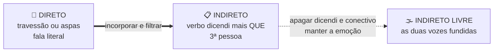
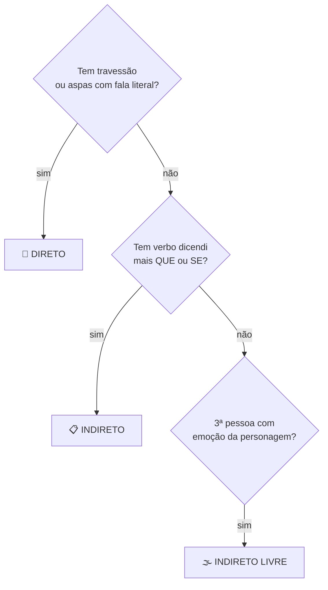
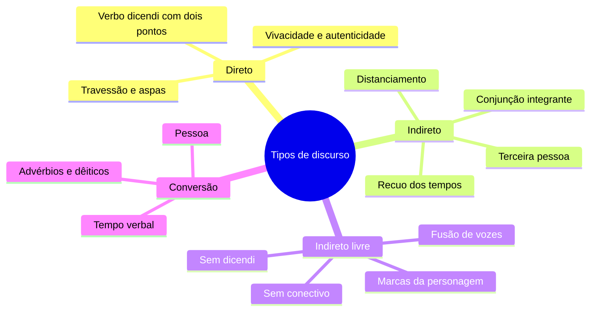

# 💬 Tipos de discurso na banca FGV

> [!abstract] TL;DR — quem está falando ali?
> **Direto** = o narrador cede a palavra (vivacidade). **Indireto** = o narrador incorpora e filtra (distanciamento). **Indireto livre** = as duas vozes se fundem (subjetividade).
>
> A FGV cobra a **conversão** entre eles e, sobretudo, o **efeito de sentido** de cada escolha.

> [!info] De onde veio
> Fonte **"Tipos de discurso"** do notebook *Português para Concursos — Banca FGV*.

---

## 🧠 Os três discursos lado a lado

| | 🎤 Direto | 📋 Indireto | 🌫️ Indireto livre |
|---|---|---|---|
| **Verbo dicendi** | sim, com dois-pontos | sim, com *que* / *se* | **não** |
| **Conectivo** | não | conjunção integrante | **não** |
| **Pessoa** | 1ª e 2ª | 3ª | 3ª (mas com marcas da personagem) |
| **Pontuação** | travessão, aspas, exclamação | some a pontuação expressiva | sem aspas nem travessão |
| **Efeito** | vivacidade, autenticidade | distanciamento, síntese | mergulho na consciência |

---

## 🔁 A tabela de conversão — o que mais cai

Ao passar do **direto** para o **indireto**:

| Muda | De → Para |
|---|---|
| **Presente** | pretérito imperfeito (*não renuncio* → *não renunciava*) |
| **Pretérito perfeito** | mais-que-perfeito (*renunciei* → *renunciara / tinha renunciado*) |
| **Futuro do presente** | futuro do pretérito (*renunciarei* → *renunciaria*) |
| **Imperativo** | presente ou imperfeito do subjuntivo (*Saia!* → *que saísse*) |
| **1ª e 2ª pessoas** | 3ª pessoa (*eu, meu* → *ele, seu*) |
| **este / isto** | aquele / aquilo |
| **aqui** | ali, lá |
| **agora** | então, naquele momento |
| **hoje / ontem / amanhã** | naquele dia / na véspera / no dia seguinte |
| **Pergunta direta** | objetiva direta com **se** (*"— Você vem?"* → *"Perguntou **se** ele vinha"*) |
| **Pontuação expressiva** | **desaparece** — travessão, aspas, exclamação, interrogação |

> [!example] A conversão completa
> **Direto:** *O ministro afirmou: — Não renunciarei ao cargo **hoje**.*
> **Indireto:** *O ministro afirmou **que** não renunciar**ia** ao cargo **naquele dia**.*

---

## 🌫️ O indireto livre por dentro

> [!tip] Como reconhecer
> Está em **3ª pessoa** (narração), mas carrega **marcas subjetivas da personagem**: interjeições, interrogações, exclamações, vocabulário e ritmo próprios, advérbios de proximidade em meio ao pretérito. **Sem** verbo dicendi e **sem** conjunção integrante.

> [!example] Na prática
> *O ministro olhou a janela. Não renunciaria. Que renunciassem os outros, ele havia trabalhado demais para isso.*
>
> A narração é em 3ª pessoa, mas o **julgamento e a indignação** são da personagem. Isso é indireto livre.

> [!quote] Onde ele vive
> Machado de Assis, Clarice Lispector, Graciliano Ramos — e crônicas contemporâneas. O efeito é fluidez psicológica e uma **ambiguidade proposital** entre a voz do narrador e a da personagem.

---

## ⏱️ Como distinguir em dez segundos

---

## 📝 Questões comentadas

> [!example] Cinco no estilo da banca
> **1.** *"Ele perguntou: — Você virá **amanhã**?"* → indireto: *"Ele perguntou **se** eu **iria** **no dia seguinte**."* Três mudanças: conectivo, tempo verbal e advérbio.
>
> **2.** *"Rubião pensou muito. Como poderia recusar? Afinal, era amigo dele."* → **indireto livre**: a interrogação e o *afinal* são da personagem, mas a narração segue em 3ª pessoa.
>
> **3.** *"O prefeito declarou que as obras estavam concluídas."* → **indireto**; o efeito é **distanciamento**: o jornal não afirma que as obras estão prontas, só que ele declarou.
>
> **4.** Por que manter o discurso direto numa crônica? → preserva o **modo de falar** da personagem, cria vivacidade e a **caracteriza socialmente**.
>
> **5.** *"— Que calor! — reclamou."* → convertido em *"Reclamou que estava muito calor"*, some a exclamação e **perde-se a expressividade**. A FGV pergunta justamente por essa perda.

---

## 🎯 Como aplicar

> [!success] Checklist de resolução
> 1. Procure primeiro a **pontuação**: travessão e aspas denunciam discurso direto.
> 2. Procure o **verbo dicendi** e o **conectivo**; sem eles, em 3ª pessoa, suspeite de indireto livre.
> 3. Na conversão, cheque os **três blocos**: pessoa, tempo verbal e advérbios.
> 4. Em questão de efeito: direto = **vivacidade**; indireto = **distanciamento**; indireto livre = **subjetividade**.
> 5. Em texto jornalístico, lembre que o indireto **transfere a responsabilidade** da afirmação ao entrevistado.

---

## 🗺️ Mapa

---

## 📌 Cola rápida

| Pilar | Em uma frase |
|---|---|
| 🎤 **Direto** | Fala literal com travessão ou aspas — vivacidade |
| 📋 **Indireto** | Dicendi mais *que*, 3ª pessoa, tempos recuados — distanciamento |
| 🌫️ **Indireto livre** | 3ª pessoa sem dicendi, mas com a emoção da personagem |
| 🔁 **Converter** | Mexa em pessoa, tempo verbal e advérbios — nessa ordem |
| 📰 **No jornal** | O indireto joga a responsabilidade da afirmação no entrevistado |
