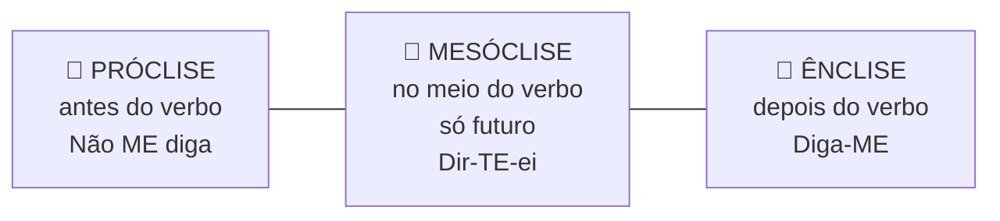
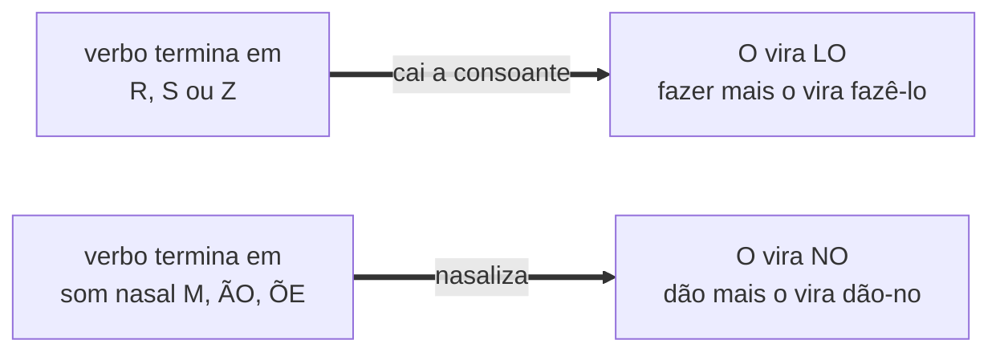
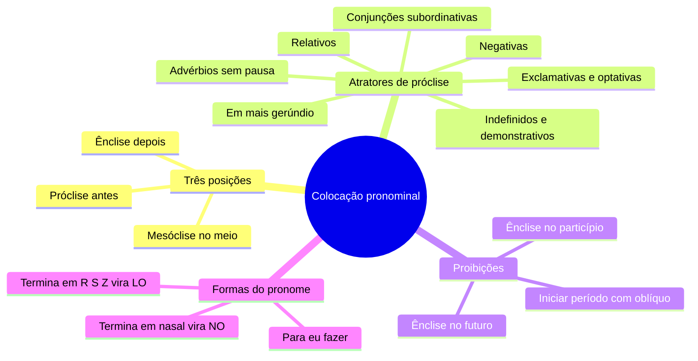

# 📍 Colocação pronominal na banca FGV

> [!abstract] TL;DR — tema de regra fechada, acerto de 100%
> Aqui não há sutileza de sentido: há **regra**. A FGV planta um **atrator de próclise** no meio de um período longo e espera que você não veja.
>
> Decore a lista de atratores e o tema vira ponto garantido.

> [!info] De onde veio
> Fonte **"Colocação pronominal"** do notebook *Português para Concursos — Banca FGV*.

---

## 🧠 As três posições

---

## 🧲 Os oito atratores de próclise

> [!tip] Decore esta lista — ela resolve a questão
> Use **próclise** quando houver, imediatamente antes do verbo:
> 1. **Palavra negativa** — *não, nunca, jamais, nada, ninguém, nenhum, nem*. → *"**Nada** me comove."*
> 2. **Advérbio sem pausa** — *já, sempre, ainda, talvez, aqui, hoje, bem, mal, só, apenas*. → *"**Sempre** se queixou."*
> 3. **Pronome relativo** — *que, quem, o qual, cujo, onde*. → *"O livro **que** me emprestaram."*
> 4. **Conjunção subordinativa** — *que, quando, se, embora, porque, conforme, à medida que*.
> 5. **Pronome indefinido, demonstrativo ou interrogativo** — *alguém, tudo, ninguém, isso, quem, quanto*. → *"**Tudo** se resolve."*
> 6. **Em + gerúndio** — *"**Em se** tratando de prazos…"*
> 7. **Orações exclamativas e optativas** (desejo) — *"Deus **o** abençoe!"*
> 8. **Preposição A + infinitivo** com *o/a* — *"disposto a **o** receber"* (uso mais raro).

> [!warning] A vírgula desarma o atrator
> Se houver **pausa** depois do advérbio, a atração cessa: *"**Aqui,** faz-**se** assim."*

---

## 🚫 As regras inegociáveis

> [!danger] Nunca faça isso
> - **Nunca inicie período** com pronome oblíquo átono. *"Me empresta o livro"* é coloquial; a norma pede *"Empresta-**me** o livro"*.
> - **Nunca use ênclise com verbo no futuro** (do presente ou do pretérito). *"Fará-se"* ❌. Com atrator → próclise (*"**Se** fará"*); sem atrator → **mesóclise** (*"Far-**se**-á"*).
> - **Nunca use ênclise ao particípio**. *"Tinha dito-me"* ❌. O pronome fica **antes** do particípio: *"Tinha **me** dito"* / *"Não **me** tinha avisado"*.

> [!tip] Infinitivo é liberal
> Com verbo no **infinitivo**, a colocação é bastante livre, mesmo havendo atrator:
> *"Não quero incomodá-lo"* ✅ e *"Não o quero incomodar"* ✅.

---

## 🔗 Locuções verbais — o ponto mais cobrado

| Estrutura | O que se pode fazer |
|---|---|
| **auxiliar + infinitivo/gerúndio** | pronome antes do auxiliar, depois do auxiliar ou depois do principal → *"Não **te** vou dizer"* · *"Não vou dizer-**te**"* · *"Não vou **te** dizer"* |
| **auxiliar + particípio** | o pronome **não** pode ficar enclítico ao particípio → *"Tinha-**me** avisado"* ✅ · *"Não **me** tinha avisado"* ✅ · *"Tinha avisado-**me**"* ❌ |

---

## 🔤 Transformações de forma do pronome

> [!example] Na prática
> *fazer + o* → **fazê-lo** · *fizemos + o* → **fizemo-lo** · *fiz + o* → **fi-lo**
> *dão + o* → **dão-no** · *põe + a* → **põe-na**

> [!warning] Para eu × para mim
> Não existe *"para mim fazer"*. Depois de preposição, com o pronome como **sujeito do infinitivo**, use **eu**: *"para **eu** fazer"*. Como objeto, **mim**: *"isto é para **mim**"*.

---

## 📝 Questões comentadas

> [!example] Sete no estilo da banca
> **1.** *"Me parece que houve engano."* → coloquial. Norma: *"Parece-**me** que houve engano."*
> **2.** *"**Nunca** disse-lhe a verdade."* ❌ → *nunca* é atrator: *"Nunca **lhe** disse a verdade."*
> **3.** *"Far-**se**-ão as obras no prazo."* ✅ — futuro sem atrator exige **mesóclise**. Com atrator: *"**Não se** farão as obras."*
> **4.** *"O documento **que** enviou-me chegou tarde."* ❌ → relativo é atrator: *"que **me** enviou"*.
> **5.** *"Quero-lhe dizer algo"* ✅ e *"Quero dizer-lhe algo"* ✅ — locução com infinitivo aceita as duas.
> **6.** *"Deus **lhe** pague!"* ✅ — oração optativa exige próclise.
> **7.** *"Devolveram-**no** ao arquivo."* ✅ — terminação nasal exige a forma **NO**.

---

## 🎯 Como aplicar

> [!success] Checklist de resolução
> 1. Antes de decidir, procure um **atrator** imediatamente antes do verbo.
> 2. Verbo no **futuro**? Elimine de cara qualquer alternativa com **ênclise**.
> 3. O período **começa** com o pronome? Elimine (salvo fala transcrita).
> 4. Locução com **particípio**? Elimine qualquer ênclise ao particípio.
> 5. Confira a **forma** do pronome: *lo* e *no* dependem da terminação do verbo.

---

## 🗺️ Mapa

---

## 📌 Cola rápida

| Pilar | Em uma frase |
|---|---|
| 🧲 **Atrator** | Negativa, advérbio, relativo, conjunção, indefinido → próclise |
| ⏭️ **Futuro** | Nunca ênclise: ou próclise com atrator, ou mesóclise sem ele |
| 🚪 **Início de frase** | Pronome átono nunca abre período na norma-padrão |
| 🧩 **Particípio** | O pronome fica antes dele, jamais colado depois |
| 🔤 **LO e NO** | Termina em R S Z vira *lo*; termina em nasal vira *no* |
