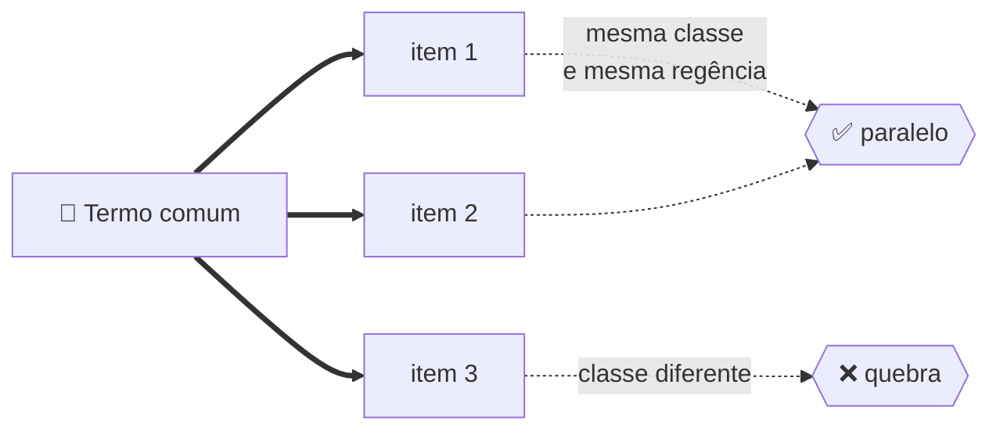
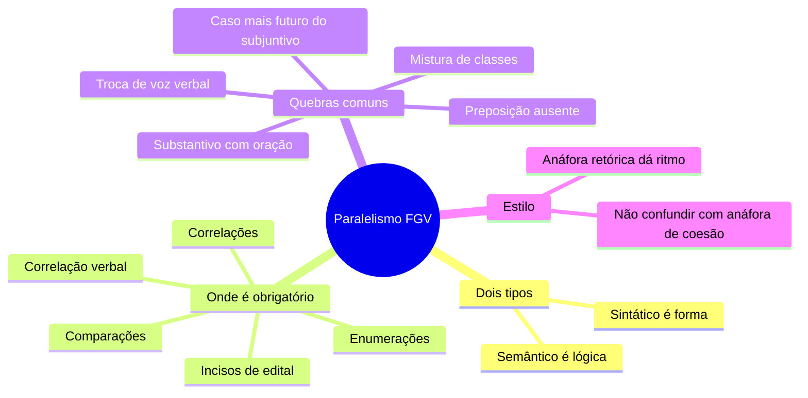

# 🪞 Paralelismo na banca FGV

> [!abstract] TL;DR — mesma função, mesma forma
> Termos que exercem a **mesma função** numa estrutura coordenada precisam ter a **mesma forma gramatical** e pertencer ao **mesmo campo lógico**.
>
> É tema de **alto retorno**: aparece com frequência e a lógica é simples.

> [!info] De onde veio
> Fonte **"Paralelismo sintático e semântico"** do notebook *Português para Concursos — Banca FGV*.

---

## 🧠 Os dois paralelismos

| | 🧱 Sintático | 🧠 Semântico |
|---|---|---|
| **Exige** | igualdade de **estrutura gramatical** | igualdade de **natureza lógica** |
| **Falha típica** | misturar substantivo com oração | coordenar coisas de níveis de generalidade diferentes |
| **Exemplo de quebra** | *"quer o sucesso e **que** todos o respeitem"* | *"Fez três cursos: administração, marketing e **o de segunda à tarde**"* |

---

## 📌 Onde o paralelismo é obrigatório

> [!tip] As cinco estruturas
> 1. **Enumerações e coordenações** com *e, ou, nem* e vírgulas.
> 2. **Correlações**: *não só… mas também · tanto… quanto · não apenas… como também · ora… ora · quer… quer · seja… seja · nem… nem*.
> 3. **Comparações**: *mais… do que · tão… quanto · assim como… também*.
> 4. **Tópicos e incisos** de listas em editais, documentos oficiais e relatórios.
> 5. **Correlação de tempos e modos verbais**: *"**Se** estudasse, passar**ia**"* (imperfeito do subjuntivo + futuro do pretérito).

---

## 🧨 As oito quebras mais comuns

> [!warning] Reconheça cada uma
> **1. Mistura de classes** — *"visa à formação técnica, ao aprimoramento cultural e **desenvolver** a autonomia."* → *"e **ao desenvolvimento** da autonomia"*.
>
> **2. Substantivo + oração** — *"Ele quer o sucesso e **que todos o respeitem**."* → *"o sucesso e **o respeito de todos**"*.
>
> **3. Correlação desalinhada** — *"Não só perdeu o prazo, mas **o aviso não foi dado**."* → muda de voz e de estrutura.
>
> **4. Preposição ausente** — *"Gosto e acredito **na** justiça."* → *"Gosto **da** justiça e acredito **nela**"*.
>
> **5. Troca de voz verbal** — *"A comissão analisou os documentos e **foram emitidos** pareceres."* → *"…e **emitiu** pareceres"*.
>
> **6. Nível de generalidade** (semântico) — misturar categorias com um item concreto e específico.
>
> **7. Infinitivo + substantivo em lista** — *"São objetivos: **ampliar** o acesso, **a redução** de custos e **capacitar** servidores."* → todos no infinitivo **ou** todos substantivados.
>
> **8. Correlação temporal cruzada** — *"**Caso** o prazo **vencer**"* ❌ → *"**Caso** o prazo **vença**"* (presente do subjuntivo) ou *"**Se** o prazo **vencer**"* (futuro do subjuntivo).

---

## ✨ Paralelismo como estilo

> [!tip] Não é só correção — é retórica
> A repetição da **mesma estrutura** no início de períodos sucessivos (**anáfora retórica**) reforça a argumentação e dá ritmo. A FGV pode perguntar pelo **efeito**: ênfase, ritmo, martelamento da tese, organização didática.

> [!danger] Duas anáforas diferentes
> **Anáfora de coesão** = retomada de um termo já dito (pronome que olha para trás).
> **Anáfora retórica** = repetição de estrutura para dar ênfase.
> São homônimos — e a banca já explorou essa distinção.

---

## 📝 Questões comentadas

> [!example] Cinco no estilo da banca
> **1.** *"O edital exige que o candidato **comprove** a escolaridade, **apresente** os documentos e **a entrega** da taxa paga."* → dois subjuntivos e um substantivo. → *"…e **entregue** o comprovante da taxa"*.
>
> **2.** *"Ele não só é **competente**, mas também **dedicação**."* → adjetivo × substantivo. → *"mas também **dedicado**"*.
>
> **3.** *"Precisamos **de investimento** e **apostar** em pesquisa."* → quebra sintática **e** de regência. → *"Precisamos **investir** e **apostar** em pesquisa"*.
>
> **4.** *"**Se** houvesse mais recursos, **teríamos** melhores resultados."* ✅ — correlação correta.
>
> **5.** *"**Quanto mais** se estuda, **mais** se aprende."* ✅ — paralelismo proporcional; trocar o segundo *mais* por *melhor aprende* quebraria a correlação.

---

## 🎯 Como aplicar

> [!success] Checklist de resolução
> 1. Ache o **conectivo coordenativo** ou a **correlação** — é ali que o paralelismo se testa.
> 2. **Repita mentalmente o termo comum** antes de cada item da série; se não encaixar em algum, há quebra.
> 3. Verifique se todos os itens têm a **mesma classe** e a **mesma regência**.
> 4. Em correlações (*não só… mas também*), confira se **os dois blocos** têm a mesma estrutura.
> 5. Em listas de edital, confira se todos os itens **começam com a mesma classe** de palavra.

---

## 🗺️ Mapa

---

## 📌 Cola rápida

| Pilar | Em uma frase |
|---|---|
| 🪞 **Princípio** | Mesma função pede mesma forma e mesma natureza lógica |
| 🔗 **Onde testar** | No conectivo coordenativo e nas correlações |
| 🧪 **Teste do termo comum** | Repita o termo antes de cada item; se um não encaixa, quebrou |
| 🎚️ **Regência também** | *Gosto da justiça e acredito nela* — cada verbo com sua preposição |
| ⏳ **Correlação verbal** | *Caso* pede subjuntivo presente; *se* pede futuro do subjuntivo |
