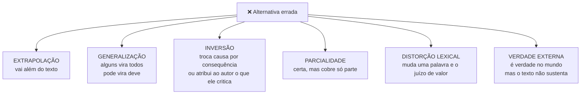
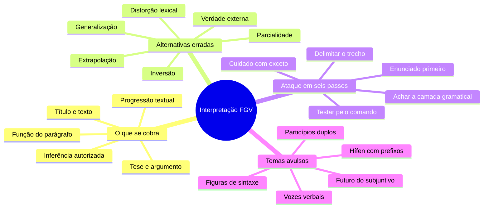

# 🧭 Interpretação e questões mescladas na banca FGV

> [!abstract] TL;DR — a alternativa certa é a mais cautelosa
> Questões mescladas cruzam dois ou mais conteúdos numa só pergunta — e são **a maioria da prova**.
>
> Regra que salva: a resposta correta costuma ser a **mais colada ao texto** e a que exige **menos suposições**. Termos absolutos (*sempre, nunca, todos, exclusivamente*) merecem desconfiança.

> [!info] De onde veio
> Fonte **"Outras questões de Português e questões mescladas"** do notebook *Português para Concursos — Banca FGV*.

---

## 🧠 O que a FGV cobra em interpretação

| Categoria | O que perguntar |
|---|---|
| **Tese** | o que o autor **defende** — assunto é o tema, tese é a posição |
| **Argumento** | como sustenta: exemplificação, autoridade, dados, analogia, causa/consequência, contraste, refutação |
| **Inferência** | conclusão **autorizada pelo texto** — não pelo mundo |
| **Pressuposto × subentendido** | marcado na língua × dependente da situação |
| **Intenção do enunciador** | informar, criticar, ironizar, alertar, persuadir |
| **Progressão textual** | como cada parágrafo se liga ao anterior |
| **Função de um trecho** | apresentar o problema, exemplificar, refutar, concluir |
| **Título × texto** | antecipa a tese, cria expectativa, ironiza, faz intertextualidade |

---

## ❌ Os seis tipos de alternativa errada

> [!danger] A mais traiçoeira é a verdade externa
> A afirmação é **verdadeira**, você concorda com ela, mas **o texto não a sustenta**. Se não está no texto, não é resposta.

---

## 🛠️ Como atacar uma questão mesclada

> [!tip] Os seis passos
> 1. Leia o **enunciado antes** do trecho — descubra o que se pede (sentido, função, correção, efeito).
> 2. Volte ao texto e **delimite o trecho exato**, incluindo o **período inteiro**.
> 3. Identifique a **camada gramatical** envolvida: é vírgula? relativo? concordância?
> 4. Teste cada alternativa com o **critério explícito** do enunciado — se pede "mantém o sentido", não elimine por estilo.
> 5. Em *"exceto"* / *"assinale a incorreta"*, **marque no papel** o que está sendo procurado — a banca inverte o comando com frequência.
> 6. Empate entre duas? Escolha a que precisa de **menos suposições**.

---

## 🧩 Temas avulsos que aparecem como "outras questões"

> [!example] O que costuma cair solto
> - **Futuro do subjuntivo de irregulares**: *se ele **vier, puser, dispuser, propuser, intervier, mantiver***.
> - **Particípios duplos**: *aceito/aceitado, entregue/entregado, pago/pagado* — com **ser/estar** usa-se a **forma curta**.
> - **Hífen com prefixos**: usa-se antes de **H** e de letra **igual** à final do prefixo — *anti-higiênico, micro-ondas, super-resistente*.
> - **Vozes verbais**: ativa, passiva analítica, passiva sintética e reflexiva — e a conversão entre elas.
> - **Infinitivo pessoal × impessoal**: *"é hora de **partirmos**"* × *"é hora de partir"*.
> - **Figuras de sintaxe**: elipse, zeugma, pleonasmo, hipérbato, **anacoluto**, silepse, polissíndeto, assíndeto.
> - **Estrutura do parágrafo**: tópico frasal, desenvolvimento, conclusão.
> - **Pronomes de tratamento** e concordância em 3ª pessoa.

---

## 📝 Questões comentadas

> [!example] Seis no estilo da banca
> **1.** O texto diz *"a medida **pode** reduzir a desigualdade"*. A alternativa *"a medida **reduzirá**"* erra por **generalização**: transforma possibilidade em certeza.
>
> **2.** *"A função do último parágrafo é…"* → resposta típica: **retomar a tese e projetar consequência futura**. Cheque os conectivos iniciais do parágrafo — eles denunciam a função.
>
> **3.** *"Quando ele **intervir** na reunião…"* ❌ → o futuro do subjuntivo de *intervir* é **INTERVIER**.
>
> **4.** *"O documento foi entregue pelo servidor."* → passiva analítica; ativa: *"O servidor entregou o documento."*
>
> **5.** *"Micro-ondas"* leva hífen porque o prefixo termina em **O** e a palavra seguinte começa com **O**.
>
> **6.** Charge em que a legenda contradiz a imagem → **ironia**; a leitura exige integrar o código verbal e o visual.

---

## 🎯 Como aplicar

> [!success] Checklist geral da prova de Português da FGV
> 1. Leia o texto **inteiro uma vez** antes das questões, marcando **tese e conectivos**.
> 2. Leia o enunciado atento ao **comando**: mantém sentido? altera? está incorreta?
> 3. **Volte sempre ao texto** — a banca pune resposta de memória.
> 4. **Elimine absolutos e extrapolações**.
> 5. Em cada questão gramatical, faça a **análise sintática** antes de decidir.
> 6. Reserve os **últimos minutos** para as questões de reescrita: são as que mais exigem releitura.

---

## 🗺️ Mapa

---

## 📌 Cola rápida

| Pilar | Em uma frase |
|---|---|
| 📄 **Cole no texto** | Se o texto não sustenta, não é resposta — mesmo sendo verdade |
| 🚨 **Absolutos** | *Sempre, nunca, todos, exclusivamente* quase sempre denunciam erro |
| 🔄 **Comando invertido** | *Exceto* e *incorreta* derrubam quem lê rápido |
| 🧮 **Menos suposições** | No empate, vence a alternativa que exige menos do leitor |
| ⏳ **Intervier** | Futuro do subjuntivo dos irregulares é armadilha recorrente |
